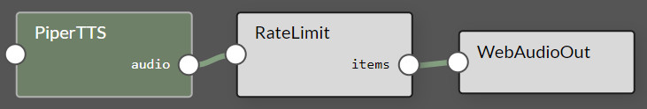

# Agent Studio

Rapidly design and experiment with creating your own automation agents, personal assistants, and edge AI systems in an interactive sandbox for connecting multimodal LLMs, speech and vision transformers, vector databases, prompt templating, and function calling to live sensors and I/O.  Optimized for deployment onboard Jetson with on-device compute, low-latency streaming, and unified memory.

<video controls autoplay muted style="max-width: 900px">
    <source src="images/agent_studio.mp4" type="video/mp4">
</video>

<table>
  <tr>
    <td>• Edge LLM inference with quantization and KV caching (<a href="tutorial_nano-llm.html">NanoLLM</a>)</td>
    <td>• Realtime vision/language models (ala <a href="tutorial_live-llava.html">Live Llava</a> and <a href="tutorial_live-llava.html#video-vila">Video VILA</a>)</td>
  </tr>
  <tr>
    <td>• Speech recognition and synthesis (Whisper ASR, Piper TTS, Riva)</td>
    <td>• Multimodal vector database from <a href="tutorial_nanodb.md">NanoDB</a></td>
  </tr>
  <tr>
    <td>• Audio and video streaming (WebRTC, RTP, RTSP, V4L2)</td>
    <td>• Performance monitoring and profiling</td>
  </tr>
  <tr>
    <td>• Native bot-callable functions and agent tools</td>
    <td>• Extensible plugins with auto-generated UI controls</td>
  </tr>
    <tr>
    <td>• Save, load, and export pipeline presets</td>
    <td>• Native bot-callable functions and agent tools</td>
  </tr>
</table>

## Running Agent Studio

!!! abstract "What you need"

    1. One of the following Jetson devices:

        <span class="blobDarkGreen4">Jetson AGX Orin (64GB)</span>
        <span class="blobDarkGreen5">Jetson AGX Orin (32GB)</span>
        <span class="blobLightGreen3">Jetson Orin NX (16GB)</span>
        <span class="blobLightGreen4">Jetson Orin Nano (8GB)</span>
	   
    2. Running one of the following versions of [JetPack](https://developer.nvidia.com/embedded/jetpack){:target="_blank"}:

        <span class="blobPink2">JetPack 6 (L4T r36.x)</span>

    3. Sufficient storage space (preferably with NVMe SSD).

        - `22GB` for `nano_llm` container image
        - Space for models (`>5GB`)
	
    4. Clone and setup [`jetson-containers`](https://github.com/dusty-nv/jetson-containers/blob/master/docs/setup.md){:target="_blank"}:
    
		```bash
		git clone https://github.com/dusty-nv/jetson-containers
		bash jetson-containers/install.sh
		```  

```bash
jetson-containers run --env HUGGINGFACE_TOKEN=hf_xyz123abc456 \
  $(autotag nano_llm) \
    python3 -m nano_llm.studio
```

This will start the server running on your device.  You can then navigate your browser to `https://IP_ADDRESS:8050`
<table><tr><td>
	<ul>
        <li>You can load a <a href="#save-load">preset</a> at startup with the <code>--load</code> flag (like <code>--load /data/nano_llm/presets/xyz.json</code>)
		<li>The default port is 8050, but can be changed with <code>--web-port</code> (and <code>--ws-port</code> for the websocket port)</li>
		<li>Request access to the <a href="https://huggingface.co/meta-llama" target="_blank">Llama models</a> on HuggingFace and substitute your account's API token above.</li>
	</ul>
</td></tr></table>

<iframe width="720" height="405" src="https://www.youtube.com/embed/9ozwh9EDGhU" title="YouTube video player" frameborder="0" allow="accelerometer; autoplay; clipboard-write; encrypted-media; gyroscope; picture-in-picture; web-share" allowfullscreen></iframe>

#### Dev Mode

To make code changes without rebuilding the container, clone the NanoLLM sources and then mount them over <code>/opt/NanoLLM</code>

```bash
git clone https://github.com/dusty-nv/NanoLLM
jetson-containers run \
  -v ${PWD}/NanoLLM:/opt/NanoLLM \
  $(autotag nano_llm)
```

You can then edit the source from outside the container.  And in the terminal that starts, you can install other packages from apt/pip/ect.

## Plugins

The models, I/O, and logic blocks share a lightweight [plugin](https://dusty-nv.github.io/NanoLLM/plugins.html) interface, exposing a `process()` function and any runtime properties:

```python title="Custom Plugin"
from nano_llm import Plugin

class TextFilter(Plugin):
    def __init__(self, search: str='bad word', replace: str='censored', **kwargs):
        """
        A simple plugin performing text replacement.  Write docs because they're extracted for the UI,
        and for the tool descriptions that go to the bot for function calling (and use the type hints)        
        
        Args:
          search: The string to look for an replace in incoming text.
          replace: What to replace occurances of the search string with.
        """
        super().__init__(inputs=['text'], outputs=['text'])
        
        # set these attributes and register them as configurable
        self.add_parameters(search=search, replace=replace)
        
    def process(self, input, **kwargs):
        """ Substitute the text, and the return value will be sent to the plugins connected to this. """
        return input.replace(self.search, self.replace)
```

Typically each plugin runs asynchronously its own thread and queue of data, although some lightweight routines are executed inline.  Usually they're in the same process, but could make requests to microservices.  Websockets are used for clients and the web UI.

Below are descriptions of commonly-used components. Help text for these is extracted from their Python docs and shown in the UI, along with settings that you can control.  In the node editor, click on a plugin to open its grid widget or configuration window.

#### LLM

=== "NanoLLM"

    ``` title="> <code>nano_llm.plugins.NanoLLM</code> <a href='https://github.com/dusty-nv/NanoLLM/blob/main/nano_llm/plugins/llm/nano_llm.py' target='_blank'><code>(source)</code></a>""
     Load quantized LLM/VLM with MLC (speed), AWQ (quality), or HF Transformers (compatability)
     
     - Inputs
         * str, list[str], np.ndarray, torch.Tensor, cudaImage, PIL.Image  
         
     - Commands     
         * /reset /refresh /generate (these inputs can control the chat)
         
     - Outputs
         * delta    The latest detokenized text to be generated
         * partial  All of the text generated in the response so far
         * final    The complete response sent at the end of the request
         * words    Similar to 'delta', but with at least one word at a time
         * history  A list of the messages in the chat history (as dictionaries)
         * tools    Enable the bot to call functions in plugins connected on this channel
    ```
    
=== "AutoPrompt"

    ``` title="> <code>nano_llm.plugins.AutoPrompt</code> <a href='https://github.com/dusty-nv/NanoLLM/blob/main/nano_llm/plugins/llm/auto_prompt.py' target='_blank'><code>(source)</code></a>""
     Apply a template each time new data comes in, for example '<image> Describe the image' 
     would tag each incoming image along with that text prompt (with images, usually for VLM)
     
     AutoPrompt can be used to compose structured messages that reference prior inputs, 
     like `Image 1: <image>  Image 2:  <image>` or using <text> for last text recieved:  

        The three most recent replies were:
          * <text>
          * <text>
          * <text> 
    ```

=== "UserPrompt"

    ``` title="> <code>nano_llm.plugins.UserPrompt</code> <a href='https://github.com/dusty-nv/NanoLLM/blob/main/nano_llm/plugins/llm/user_prompt.py' target='_blank'><code>(source)</code></a>""
     This plugin is for inputting text on the keyboard, either from the terminal or text box in the UI.
     
     It can also load prompts from a text or json file, and those files can reference other files to load.
    ```
    
=== "TextStream"

    ``` title="> <code>nano_llm.plugins.TextStream</code> <a href='https://github.com/dusty-nv/NanoLLM/blob/main/nano_llm/plugins/llm/text_stream.py' target='_blank'><code>(source)</code></a>""
     Simple plugin for viewing any stream of text from the system in a text box in the UI.  
     
     For sources emanating from ASR or LLM, can apply color highlighting to partial/final responses.
    ```
    
#### Speech
            
=== "Whisper ASR"

    ``` title="> <code>nano_llm.plugins.WhisperASR</code> <a href='https://github.com/dusty-nv/NanoLLM/blob/main/nano_llm/plugins/speech/whisper_asr.py' target='_blank'><code>(source)</code></a>""
     Whisper streaming speech-to-text with TensorRT (github.com/NVIDIA-AI-IOT/whisper_trt)
     
     Supports these Whisper models:  'tiny' (39M), 'base' (74M), 'small' (244M)
     
     - Inputs
         * audio    bytes, list[int], np.ndarray, torch.Tensor (int16, float32)
         
     - Outputs
         * final    The text transcript of the entire segment spoken in the input
         * partial  Rolling partial transcript of the words spoken so far in the audio segment
    ```
        
    The Whisper plugin is designed to be used in a pipeline with the VAD Filter to reduce erroneous output from background noise:
    
    
    
=== "Piper TTS"

    ``` title="> <code>nano_llm.plugins.PiperTTS</code> <a href='https://github.com/dusty-nv/NanoLLM/blob/main/nano_llm/plugins/speech/piper_tts.py' target='_blank'><code>(source)</code></a>""
     Piper text-to-speech using CUDA and onnxruntime (github.com/rhasspy/piper)
     
     Populates a list of the available Piper models that it can download, along with the speaker voices 
     for multi-speaker models.  The default model is 'en_US-libritts-high'.  Has controls for voice speed.
     
     - Inputs
         * str      either individual words, sentences, or an entire passage to synthesize
         
     - Outputs
         * audio    np.ndarray (int16) at 16KHz sample rate (for low-quality models) or 22.5KHz (for medium/high)
    ```
        
    This PiperTTS preset is available, which uses RateLimit to stream the output at 1x realtime factor (so it can be muted later)
    
    
    
=== "VAD Filter"

    ``` title="> <code>nano_llm.plugins.VADFilter</code> <a href='https://github.com/dusty-nv/NanoLLM/blob/main/nano_llm/plugins/speech/vad_filter.py' target='_blank'><code>(source)</code></a>""
     Voice activity detection model using Silero.  Drops incoming audio unless it exceeds the VAD threshold.
     
     Use this on incoming audio before ASR plugins to reduce spurious transcripts produced from background noise.

     - Inputs
         * audio    bytes, list[int], np.ndarray, torch.Tensor (int16, float32)
         
     - Outputs
         * audio    np.ndarray or torch.Tensor (only when VAD confidence > threshold)
    ```

=== "Riva"

    Riva ASR / TTS services - these run in another container over GRPC.  See these resources for setup:
    
    * [`NGC - riva-embedded quickstart guide`](https://catalog.ngc.nvidia.com/orgs/nvidia/teams/riva/resources/riva_quickstart_arm64)
    * [`jetson-containers - riva container setup`](https://github.com/dusty-nv/jetson-containers/tree/master/packages/audio/riva-client)
    * [`JetsonHacks - Speech AI on NVIDIA Jetson Tutorial`](https://jetsonhacks.com/2023/08/07/speech-ai-on-nvidia-jetson-tutorial/)

#### Audio
 
<table> 
<tr><td><a href="https://github.com/dusty-nv/NanoLLM/blob/main/nano_llm/plugins/audio/audio_input.py" target="_blank"><code>AudioInputDevice</code></a></td><td>USB/I2S soundcard input via PulseAudio/PyAudio (for microphone directly attached to system)</td></tr>
<tr><td><a href="https://github.com/dusty-nv/NanoLLM/blob/main/nano_llm/plugins/audio/audio_output.py" target="_blank"><code>AudioOutputDevice</code></a></td><td>USB/I2S soundcard output via PulseAudio/PyAudio (for speakers directly attached to system)</td></tr>
<tr><td><a href="https://github.com/dusty-nv/NanoLLM/blob/main/nano_llm/plugins/audio/audio_output.py" target="_blank"><code>AudioRecorder</code></a></td><td>Save an audio stream to WAV file on the server</td></tr>
<tr><td><a href="https://github.com/dusty-nv/NanoLLM/blob/main/nano_llm/plugins/audio/web_audio.py" target="_blank"><code>WebAudioIn</code></a></td><td>Recieve audio samples streamed from the client over websockets</td></tr>
<tr><td><a href="https://github.com/dusty-nv/NanoLLM/blob/main/nano_llm/plugins/audio/web_audio.py" target="_blank"><code>WebAudioOut</code></a></td><td>Transmit audio samples to the client over websockets</td></tr>
</td></tr></table>

#### Video

<table>
<tr><td><a href="https://github.com/dusty-nv/NanoLLM/blob/main/nano_llm/plugins/video/video_source.py" target="_blank"><code>VideoSource</code></a></td><td>Capture images from camera device (V4L2/CSI), network stream (RTP, RTSP), video file (MP4, MKV, AVI, FLV)</td></tr>
<tr><td><a href="https://github.com/dusty-nv/NanoLLM/blob/main/nano_llm/plugins/video/video_output.py" target="_blank"><code>VideoOutput</code></a></td><td>Output H264/H265-encoded video to network stream (RTP, RTSP, WebRTC), display, or file (MP4, MKV, AVI, FLV)</td></tr>
<tr><td><a href="https://github.com/dusty-nv/NanoLLM/blob/main/nano_llm/plugins/video/video_overlay.py" target="_blank"><code>VideoOverlay</code></a></td><td>Draw text on top of video streams for HUD or OSD-style display</td></tr>
<tr><td><a href="https://github.com/dusty-nv/NanoLLM/blob/main/nano_llm/plugins/video/rate_limit.py" target="_blank"><code>RateLimit</code></a></td><td>Throttle transmission to a specified rate (can also be used with audio)</td></tr>
</table>

#### Database
      
<table>      
<tr><td><a href="https://github.com/dusty-nv/NanoLLM/blob/main/nano_llm/plugins/database/nanodb.py" target="_blank"><code>NanoDB</code></a></td><td>Optimized in-memory multimodal vectorDB for txt2img/img2img similarity search and image tagging [[↗]](tutorial_nanodb.md)</td></tr>
<tr><td><a href="https://github.com/dusty-nv/NanoLLM/blob/main/nano_llm/plugins/database/deduplicate.py" target="_blank"><code>Deduplicate</code></a></td><td>Filter incoming text against previous entries with embedding model and cosine similarity over a timeout period</td></tr>
<tr><td><a href="https://github.com/dusty-nv/NanoLLM/blob/main/nano_llm/plugins/database/event_filter.py" target="_blank"><code>EventFilter</code></a></td><td>Look for keywords or search strings in streams of text, keeping track of the begin/end times that these occur.</td></tr>
</table>
    
## Tips & Tricks

Many of the previous demos (like Llamaspeak and Live Llava) can quickly be recreated in the dynamic environment of Agent Studio without needing to touch any code.  Here are some practical tips as you go about trying different combinations of model pipelines:

#### UI

* To add an element to the agent pipeline, either use the menus in the node editor title bar, or right click inside the editor.  
* Inserting elements via the context menu (right click) will position them at your cursor, so you needn't reposition them.  
* To remove a component from the pipeline, right click on it and then select the little X button in the top right.  
* To remove a connection between components, first select the link and then right click for the X button to appear.  
* Click on a node in the graph to open its grid widget if it implements one.  Click again to open its settings dialog.  

#### Save & Load

* Under the Agent menu, there is a Save button which will serialize the current pipeline to JSON.
* These presets are saved in a mounted directory on the host, under `jetson-containers/data/nano_llm/presets`
* Some commonly-used subgraphs are already included to quickly add and combine (like ASR, TTS, and video VLM)
* You can load these via the Agent menu, by right-clicking inside the node editor, or with the `--load` flag at startup.

#### Memory

* As you are adding models, keep an eye on the system resources in the top right to make sure you don't run out of memory.  
* Due to loading times, the models are cached in memory even after you remove them from the node editor.  
* To actually free the memory, use the `Clear Cache` button in the Agent menu. 

#### Performance

* You can monitor the system's CPU and GPU usage in the top right corner.  
* Various statistics are refreshed in the nodes to see performance of each component.
* Use the `RateLimiter` plugin to throttle data sources and balance resources.
* The `drop_inputs` setting that some plugins expose will always keep them up with the latest request.

#### Templating

* In your prompts and system templates, you can perform variable substitution like `${DATE}` and `${TIME}`
* These can reference plugin attributes and tools by using the class selector:  `${HOMEASSISTANT.DEVICES}`
* AutoPrompt can queue up inputs for structured messages, like `Image 1: <image>  Image 2:  <image>` or:  
   ```
   The three most recent replies were:
       * <text>
       * <text>
       * <text>
   ```

🤖 Have fun bot building!  If you need help, reach out on the [Jetson Forums](https://forums.developer.nvidia.com/c/agx-autonomous-machines/jetson-embedded-systems/jetson-projects/78) or [GitHub Issues](https://github.com/dusty-nv/NanoLLM).