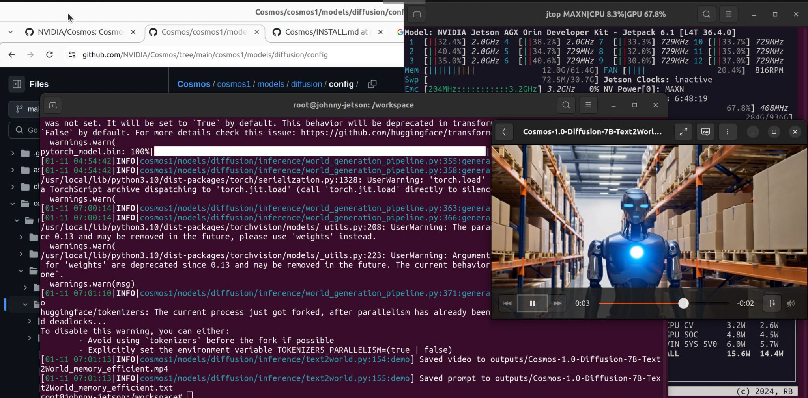

# Cosmos - World Foundation Models

[Cosmos](https://github.com/NVIDIA/Cosmos) is a world model development platform that consists of world foundation
models, tokenizers and video processing pipeline to accelerate the development of Physical AI at Robotics & AV labs.
Cosmos is purpose built for physical AI. The Cosmos repository will enable end users to run the Cosmos models, run
inference scripts and generate videos.



> Special thanks to [Johnny Núñez Cano](https://www.linkedin.com/in/johnnycano/) for porting the Cosmos and Transformer
> Engine Jetson!  
> See [Cosmos Official page](https://www.nvidia.com/en-us/ai/cosmos/) by Nvidia.
> See [Transformer Engine](https://github.com/NVIDIA/TransformerEngine) by Nvidia.

!!! abstract "What you need"

    1. One of the following Jetson devices:

        <span class="blobDarkGreen4">Jetson Thor (XGB)</span>
        <span class="blobDarkGreen4">Jetson AGX Orin (64GB)</span>
        <span class="blobDarkGreen5">Jetson AGX Orin (32GB)</span>

    2. Running one of the following versions of [JetPack](https://developer.nvidia.com/embedded/jetpack):

        <span class="blobPink2">JetPack 6 (L4T r36.x)</span>

    3. Sufficient storage space (preferably with NVMe SSD).

        - `12.26GB` for [`cosmos`](https://hub.docker.com/r/dustynv/cosmos) container image
        - Space for models and datasets (`>50GB`)
		 
    4. Clone and setup [`jetson-containers`](https://github.com/dusty-nv/jetson-containers/blob/master/docs/setup.md){:target="_blank"}:
    
		```bash
		git clone https://github.com/dusty-nv/jetson-containers
		bash jetson-containers/install.sh
		```  

!!! abstract "WARNING"
    [Transformer Engine](https://github.com/NVIDIA/TransformerEngine):  

    - Cosmos is optimized for NVIDIA ADA GPU architecture generations and later due running in FP8.  
    - Jetson AGX Orin is based on Ampere.  
    - Support for optimizations across all precisions (FP16, BF16) on NVIDIA Ampere GPU architecture generations and later.  

## Start Container

Use this command to automatically run, build, or pull a compatible container image for cosmos:

```bash
jetson-containers run $(autotag cosmos)
```

To mount your own directories into the container, use the [
`-v`](https://docs.docker.com/engine/reference/commandline/run/#volume) or [
`--volume`](https://docs.docker.com/engine/reference/commandline/run/#volume) flags:

```bash
jetson-containers run -v /path/on/host:/path/in/container $(autotag cosmos)
```

Recommendation (This download all models outside docker container):

```bash
git clone --recursive https://github.com/NVIDIA/Cosmos.git
cd Cosmos
jetson-containers run -it -v $(pwd):/workspace $(autotag cosmos)
```

## Follow the instructions from Cosmos repository.

Here is the summarized steps to run the Cosmos models:

Generate a [Hugging Face](https://huggingface.co/settings/tokens) access token. Set the access token to 'Read'
permission (default is 'Fine-grained').

```bash
huggingface-cli login
```

Download Models:

```bash 
PYTHONPATH=$(pwd) python3 cosmos1/scripts/download_diffusion.py --model_sizes 7B 14B --model_types Text2World Video2World
```

Run Demo:

```bash 
PROMPT="A sleek, humanoid robot stands in a vast warehouse filled with neatly stacked cardboard boxes on industrial shelves. \
The robot's metallic body gleams under the bright, even lighting, highlighting its futuristic design and intricate joints. \
A glowing blue light emanates from its chest, adding a touch of advanced technology. The background is dominated by rows of boxes, \
suggesting a highly organized storage system. The floor is lined with wooden pallets, enhancing the industrial setting. \
The camera remains static, capturing the robot's poised stance amidst the orderly environment, with a shallow depth of \
field that keeps the focus on the robot while subtly blurring the background for a cinematic effect."
```

```bash 
PYTHONPATH=$(pwd) python3 cosmos1/models/diffusion/inference/text2world.py \
    --checkpoint_dir checkpoints \
    --diffusion_transformer_dir Cosmos-1.0-Diffusion-7B-Text2World \
    --prompt "$PROMPT" \
    --video_save_name Cosmos-1.0-Diffusion-7B-Text2World_memory_efficient \
    --offload_tokenizer \
    --offload_diffusion_transformer \
    --offload_text_encoder_model \
    --offload_prompt_upsampler \
    --offload_guardrail_models
```

It will generate a video file in the `outputs` directory.

<video controls autoplay muted style="max-width: 75%">
    <source src="images/text2world_example.mp4" type="video/mp4">
</video>

Another example:

```bash 
PROMPT="The video showcases a vibrant, magical garden where flowers bloom dynamically, opening and moving as though responding to a gentle rhythm in nature. \
Colorful butterflies glide gracefully through the air, and a small, clear stream winds its way through the scene, reflecting the warm glow of sunlight. \
A curious rabbit hops along a winding path, leading the viewer to a hidden alcove where a tree with golden, shimmering leaves stands, its branches moving slightly as if alive with energy. \
The entire scene radiates tranquility and wonder, inviting viewers to immerse themselves in the beauty of nature and magic combined."
```

```bash 
PYTHONPATH=$(pwd) python3 cosmos1/models/diffusion/inference/text2world.py \
    --checkpoint_dir checkpoints \
    --diffusion_transformer_dir Cosmos-1.0-Diffusion-7B-Text2World \
    --prompt "$PROMPT" \
    --video_save_name Cosmos-1.0-Diffusion-7B-Text2World_memory_efficient \
    --offload_tokenizer \
    --offload_diffusion_transformer \
    --offload_text_encoder_model \
    --offload_prompt_upsampler \
    --offload_guardrail_models
```

<video controls autoplay muted style="max-width: 75%">
    <source src="images/Cosmos-1.0-Diffusion-7B-Text2World_memory_efficient.mp4" type="video/mp4">
</video>