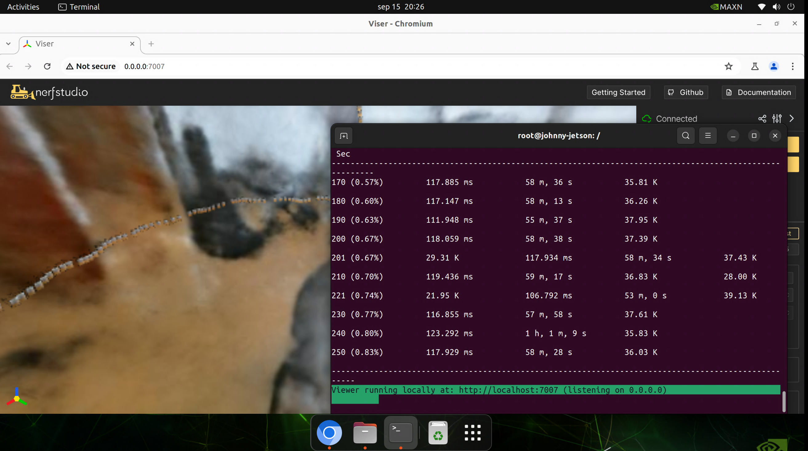
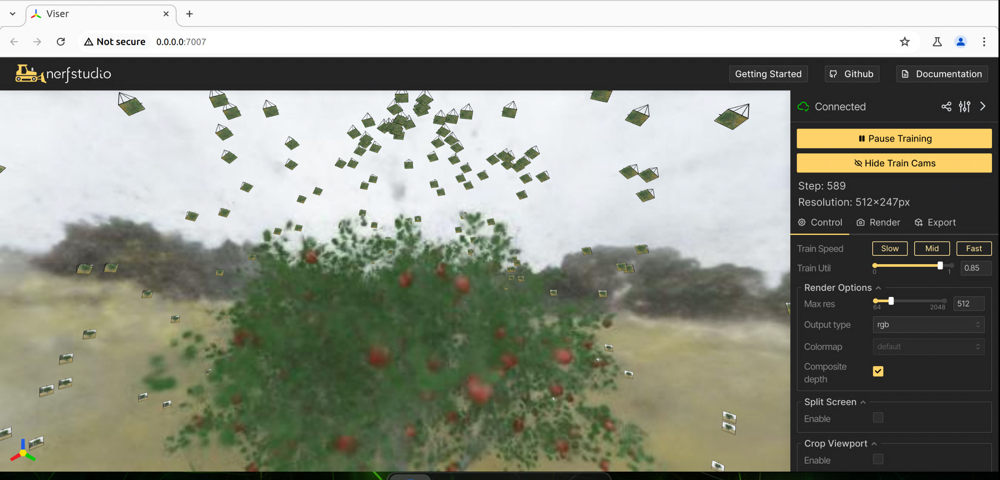

# Tutorial: NeRFStudio 

NeRFStudio is a tool for training and visualizing Neural Radiance Fields (NeRF) models. It is designed to be easy to use, and provides a graphical user interface for training and visualizing models. This tutorial will guide you through the process of training a NeRF model using NeRFStudio.

Let's run [NeRFStudio](https://docs.nerf.studio/index.html) on Jetson!

## Usage of NeRFStudio

The official NeRFStudio repo shows the complete usage information and models: [`NerfStudio`](https://docs.nerf.studio/)


## How to start

Use the `jetson-containers run` and `autotag` commands to automatically pull or build a compatible container image.

```bash
jetson-containers run $(autotag nerfstudio)
```
To mount your own directories into the container, use the [`-v`](https://docs.docker.com/engine/reference/commandline/run/#volume) or [`--volume`](https://docs.docker.com/engine/reference/commandline/run/#volume) flags:
This is important for taking your datasets and models into the container. 
```bash
jetson-containers run -v /path/on/host:/path/in/container $(autotag nerfstudio)
```

## Training your first model

Training your first model with NeRFStudio is easy. Simply follow these steps:
```bash
# Download some test data:
ns-download-data nerfstudio --capture-name=poster
# Train model
ns-train nerfacto --data data/nerfstudio/poster
```


# FruitNerf

Let's run [FruitNeRF](https://meyerls.github.io/fruit_nerf/) on Jetson!

FruitNeRF, a novel framework that counts any type of fruit directly in 3D by leveraging state-of-the-art view synthesis methods and a foundation model for segmentation. By training a semantic neural radiance field using both RGB and semantic data, we generate fruit-only point clouds for precise counting, avoiding double counts and irrelevant fruits. Evaluated on real and synthetic datasets, FruitNeRF outperforms conventional methods by lifting counting into 3D space.

## Usage of FruitNeRF
On official GitHub page of FruitNeRF, you can find the complete usage information and models: [`FruitNeRF`](https://github.com/meyerls/FruitNeRF)


## Data Preparation

To train a NeRF model, you need to prepare a dataset of images and corresponding camera poses. The images should be taken from different viewpoints of the scene you want to model, and the camera poses should be stored in a file in the following format:

Download synthetic data or real from [datasets](https://zenodo.org/records/10869455)
```bash
mkdir -p /data/
wget https://zenodo.org/records/10869455/files/FruitNeRF_Real.zip
unzip FruitNeRF_Real.zip
# or
wget https://zenodo.org/records/10869455/files/FruitNeRF_Synthetic.zip
unzip FruitNeRF_Synthetic.zip
```

## Usage of FruitNeRF
```bash
jetson-containers run -v /data/:/datasets/ $(autotag fruitnerf)
```

## Training your model with FruitNeRF
```bash 
ns-train fruit_nerf --data /datasets/FruitNeRF_Synthetic/01_apple_tree_1024x1024_#300 --output-dir /datasets/FruitNeRF_Synthetic/01_apple_tree_1024x1024_#300
```



**Johnny** 🚀