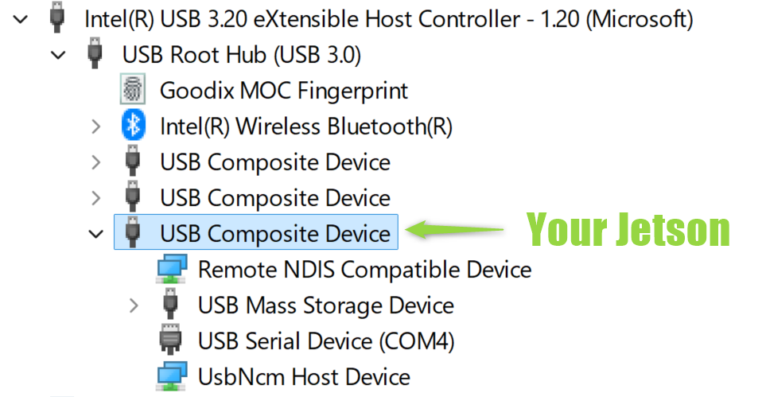

# Hackathon Guide

{ width="30%"  align=right}

The NVIDIA Jetson empowers you to bring your innovative ideas to life.

It’s a powerful, compact edge AI computer with plenty of examples and learning resources to help your team build an impressive AI project at a hackathon. (See [an example of a successful team's project](https://blogs.nvidia.com/blog/pocket-pt/).)

Explore the tips, guides, and resources below to get started and make the most of your Jetson experience.

Good luck, have fun, and happy hacking!👍

## Initial Setup

Ideally, your Jetson developer kit is pre-setup. <br>But you can also set it up by yourself.

=== "Case 1: Jetson comes pre-setup"

    Just check the default username and password with the person/organization who provide the hardware.

    !!! abstract "Treehacks 2025"

        - Login information
            - Username: `jetson`
            - Password: `jetson`
        - JetPack 6.2 is pre-installed and everything is set up on 1TB SSD.

=== "Case 2: You open the box for the first time"

    If the Jetson has not been set up, go through the following initial setup guide that matches your Jetson hardware.

    - Jetson Orin Nano 8GB Developer Kit : [Initial Setup Guide - Jetson Orin Nano](./initial_setup_jon.md)
    - Jetson AGX Orin 64GB Developer Kit : [Initial Setup (SDK Manager method)](./initial_setup_jon_sdkm.md)

## Physical Setup

=== "Headless setup"

    A **headless setup** with Jetson's USB Device Mode provides an easy way to connect your laptop (or a PC) directly to a Jetson with minimal cabling.

    

    Follow these steps:

    1. Take the Jetson developer kit out of the box and connect the bundled power supply.
    1. Find a USB cable to connect the Jetson to your PC (USB-C end goes into the Jetson).
    1. You should see a "L4T-README" drive automatically gets mounted on your PC.
    1. Open a terminal on your PC and SSH into the Jetson using the following command:
        ```bash
        ssh ${JETSON_USERNAME}@192.168.55.1
        ```
    > Replace the above `${JETSON_USERNAME}` with the actual username that you found or set. <br>To log in, you need to input the password.

    ??? info "Some more detail about USB Device Mode"

        This is realized using Jetson's **USB Device Mode** feature.

        When Jetson is connected to a PC, it acts as a USB Composite Device that presents a couple of USB device classes including:

        - USB Ethernet (to provide the virtual NIC)
        - USB Mass Storage (to let the PC mount "L4T-README" drive)
        - USB Serial (to provide serial console access)

        When connected to a Windows PC, "Device Manager" in "Devices by connection" view shows something like following:

        { width="480" .shadow}

    You can also get Jetson on a Wi-Fi network to have the Internet connection and that allows your team members to simultaneously access Jetson to do the work.

=== "Monitor-attached setup"

    If you have a PC monitor, DisplayPort cable, USB keyboard and monitor, you can use Jetson as an independent computer and do all the work on it.


## Wi-Fi connection

Here is a command to connect Jetson to a Wi-Fi network. This comes handy especially when you are operating in headless mode.

```bash
sudo nmcli device wifi connect ${WIFI_SSID} password ${WIFI_PASSWORD}
```

> Replace `${WIFI_SSID}` and `${WIFI_PASSWORD}` with the actual Wi-Fi facility information.

Once you have your Jetson on the Wi-Fi network, you can try connect to the Jetson via Wi-Fi from your PC also connected to the same Wi-Fi network.

First check what IP address your Jetson got assigned on the wireless network interface.

```bash
ip addr
```

Then try to SSH in using the IP address.

```bash
ssh jetson@${JETSON_WIFI_IP}
```

> Replace `${JETSON_WIFI_IP}` with the actual IP address that you found in above step.

!!! tip

    Sometimes, the Wi-Fi network policy is set up in such way that it does not allow device-to-device connection (like blocking SSH port).

    USB Device Mode still allows you to communicate to Jetson via the USB cable from your PC locally, but that would limit only one PC to access Jetson.

    If you want to have multiple PCs (like of your team members) access Jetson as a server at the same time, but the Wi-Fi network does not allow device-to-device connection, one alternative solution is to bring a Wi-Fi router and form a local network.

## Example Projects

Three are many great AI project examples available on this website. Here's a few to get you inspired:

### 🦉 NanoOWL `tree_demo` with Live Camera

[NanoOWL](./vit/tutorial_nanoowl.md) is a project that optimizes [OWN-ViT](https://huggingface.co/docs/transformers/model_doc/owlvit) to run in real-time on Jetson Orin Nano.

The `tree_demo` showcases a hierarchical predictor operating on a live camera feed with dynamically editable text prompts.


For example, a prompt like `[a person (healthy, needing assistance)]` could help create a robot capable of patrolling large event spaces to identify individuals who might need medical attention, such a s someone collapsing or sitting on the floor from exhaustion, etc.

[Go to NanoOWL tutorial](./vit/tutorial_nanoowl.md){ .md-button }

### 🗪 LLMs and OpenAI compatible microservices

Jetson can run various LLMs **locally** using its onboard GPU, enabling you to build a robot or device capable of engaging in conversations without needing an Internet connection.

Ollama, a popular open-source tool for running large language models locally, offers an official installer with Jetson support, allowing LLMs to run efficiently by leveraging the GPU's processing power.

Additionally, you can find pre-build containers built for Jetson that run as microservices, providing OpenAI compatible API endpoints for popular models like **DeepSeek-R1** (distilled). This makes it easy to create LLM application using familiar, standard API.

[Go to Open WebUI tutorial to learn how to use the MLC backend microservice containers](./vit/tutorial_openwebui.md#optional-setup-mlc-backend){ .md-button }

## Troubleshooting

??? warning "Even after connecting USB-C cable, I cannot SSH into Jetson"

    - Is the green LED near USB-C port on Jetson Orin Nano Developer Kit lit (power indicator)
        - If not, check your DC power supply connection (to the wall outlet and to the Jetson carrier board)
    - Check if you see "L4T-README" drive shows up on desktop
        - If not, check your USB-C cable connection on both PC end and Jetson end. Check the cable with other device.

??? warning "I cannot login with `jetson`/`jetson` credential"

    - Check the username and password you typed again.
    - Somebody might have changed the password of the default user. If you cannot find out the updated password, you may need to start from the [initial setup](#__tabbed_1_2).

??? warning "Jetson seems slow"

    - Check your power mode with `nvpmodel` command
        ```bash
        nvpmodel -q
        ```
    - Use `jtop` (explained below)

??? question "How can I check the Jetson's resource utilization in realtime?"
    - Install [`jtop` (or jetson-stats)](https://github.com/rbonghi/jetson_stats) to monitor the resource utilization and control.
        ```bash
        sudo apt install -y pip3-python
        sudo pip3 install -U jetson-stats
        ```
    - `6CTRL` tab allows you to change the power mode (under `NVP modes`)

??? question "How can I power Jetson with a battery"
    - You can use something like the followings:
        - USB power bank that supports 12V output via Power Delivery (PD) ([example](https://www.amazon.com/dp/B0B92JCWJW))
        - USB PD to DC power jack adapter cable ([example](https://www.amazon.com/dp/B0CZF4V746))

## Resources

- [NVIDIA Developer Forum - Jetson category](https://forums.developer.nvidia.com/c/robotics-edge-computing/jetson-embedded-systems/70)
    - [Jetson Orin Nano](https://forums.developer.nvidia.com/c/robotics-edge-computing/jetson-embedded-systems/jetson-orin-nano/632) ... Check if your question is already answered, and if not ask here.
    - [Jetson AGX Orin](https://forums.developer.nvidia.com/c/robotics-edge-computing/jetson-embedded-systems/jetson-agx-orin/486)
    - [Jetson Projects](https://forums.developer.nvidia.com/c/robotics-edge-computing/jetson-embedded-systems/jetson-projects/78) ... See cool projects people built with Jetson!
- [JetsonHacks](https://jetsonhacks.com/) ... A great site with lots of tips for using Jetson
- [Hello AI World / jetson-inference](https://github.com/dusty-nv/jetson-inference)
- [Discord of Jetson AI Lab Research Group](https://discord.gg/BmqNSK4886) ... Learn more about this research group [here](research.html)
    - [#jetson-getting-started](https://discord.gg/kUw358bs)