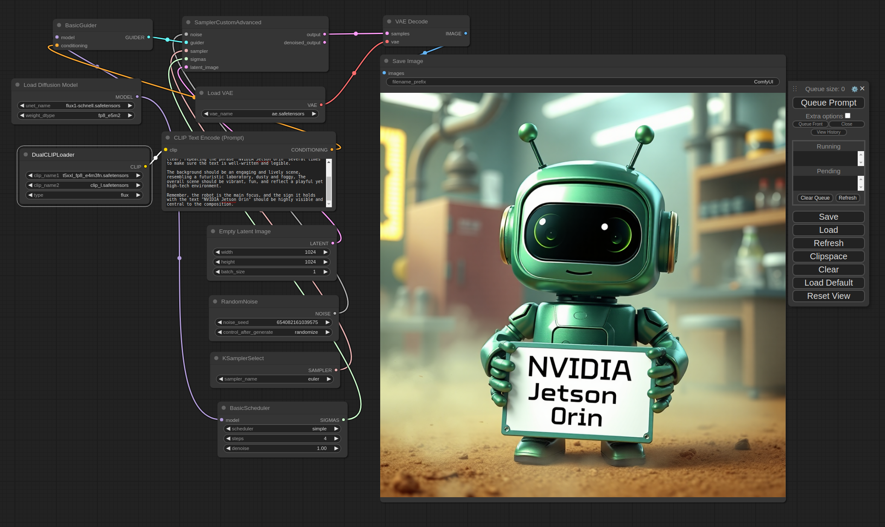
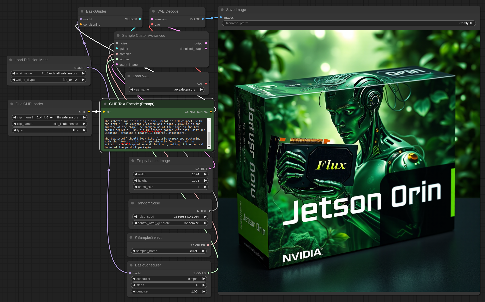
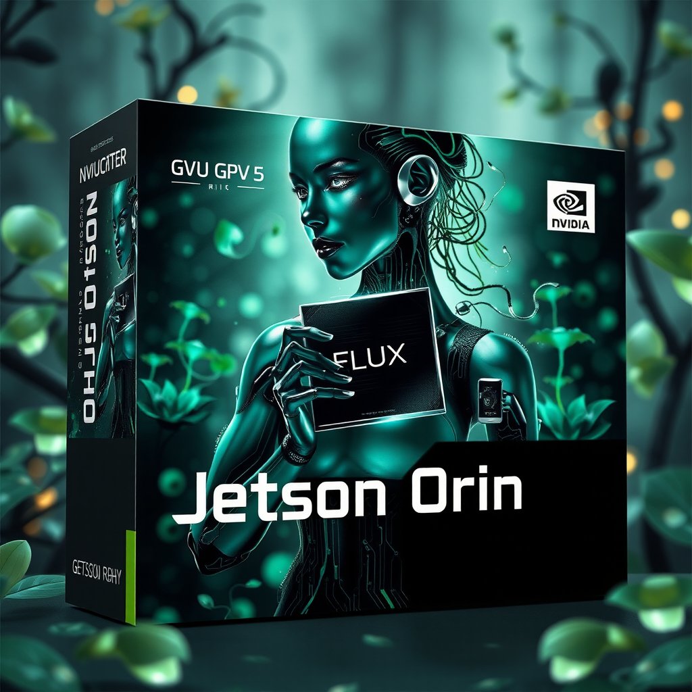

# ComfyUI and Flux on Jetson Orin

Hey there, fellow developer! 👋 I'm excited to share with you our latest project: **Flux**, an open-source model for image generation. Here at NVIDIA, we're pushing the boundaries to make Flux work seamlessly across all platforms, including our Jetson Orin devices. While we're still fine-tuning the model for the Jetson Orin Nano, we've already got it running smoothly on the Jetson AGX Orin.

In this tutorial, I'm going to walk you through every step needed to get Flux up and running on your Jetson Orin, even if you've just flashed your system. Follow along, and you should have no trouble getting everything set up. And hey, if something doesn't work out, reach out to me—I’ll keep this guide updated to make sure it's always on point.



So, let's dive in and get Flux running on your Jetson!

## 1. Install Miniconda and Create a Python 3.10 Environment

First things first, you'll need to install Miniconda on your Jetson Orin and create a Python 3.10 environment called `comfyui`. This will ensure all dependencies are handled properly within an isolated environment.

```sh
wget https://repo.anaconda.com/miniconda/Miniconda3-latest-Linux-aarch64.sh
chmod +x Miniconda3-latest-Linux-aarch64.sh
../Miniconda3-latest-Linux-aarch64.sh

conda update conda

conda create -n comfyui python=3.10
conda activate comfyui
```

## 2. Install CUDA, cuDNN, and TensorRT

Once your environment is set up, install CUDA 12.4 along with the necessary cuDNN and TensorRT libraries to ensure compatibility and optimal performance on your Jetson Orin.

```sh
wget https://developer.download.nvidia.com/compute/cuda/repos/ubuntu2204/arm64/cuda-keyring_1.1-1_all.deb
sudo dpkg -i cuda-keyring_1.1-1_all.deb
sudo apt-get update
sudo apt-get -y install cuda-toolkit-12-4 cuda-compat-12-4
sudo apt-get install cudnn python3-libnvinfer python3-libnvinfer-dev tensorrt
```

## 3. Verify and Configure CUDA

After installing CUDA, you'll want to verify that the correct version (12.4) is being used and make this change permanent in your environment.

```sh
ls -l /usr/local | grep cuda
sudo ln -s /usr/local/cuda-12.4 /usr/local/cuda

export PATH=/usr/local/cuda/bin:$PATH
nvcc --version

echo 'export PATH=/usr/local/cuda/bin:$PATH' >> ~/.bashrc
echo 'export CUDA_HOME=/usr/local/cuda' >> ~/.bashrc
echo 'export CUDA_PATH=/usr/local/cuda' >> ~/.bashrc
source ~/.bashrc
```

## 4. Compile and Install `bitsandbytes` with CUDA Support

Now it’s time to compile and install `bitsandbytes` with CUDA support. This involves cloning the repository, configuring the build with CMake, compiling using all available cores, and installing the resulting package.

```sh
export BNB_CUDA_VERSION=124
export LD_LIBRARY_PATH=/usr/local/cuda-12.4/lib64:$LD_LIBRARY_PATH

git clone https://github.com/timdettmers/bitsandbytes.git
cd bitsandbytes

mkdir -p build
cd build
cmake .. -DCOMPUTE_BACKEND=cuda -DCUDA_TOOLKIT_ROOT_DIR=/usr/local/cuda-12.4
make -j$(nproc)

cd ..
python setup.py install
```

Verify the installation by importing the package in Python:

```sh
python
>>> import bitsandbytes as bnb
>>> print(bnb.__version__)
```

## 5. Install PyTorch, TorchVision, and TorchAudio

Next up, install the essential libraries `PyTorch`, `torchvision`, and `torchaudio` for Jetson Orin. You can always check for the latest links [here](http://jetson.webredirect.org/jp6/cu124).

```sh
pip install http://jetson.webredirect.org/jp6/cu124/+f/5fe/ee5f5d1a75229/torch-2.3.0-cp310-cp310-linux_aarch64.whl
pip install http://jetson.webredirect.org/jp6/cu124/+f/988/cb71323efff87/torchvision-0.18.0a0+6043bc2-cp310-cp310-linux_aarch64.whl
pip install http://jetson.webredirect.org/jp6/cu124/+f/0aa/a066463c02b4a/torchaudio-2.3.0+952ea74-cp310-cp310-linux_aarch64.whl
```

## 6. Clone the ComfyUI Repository

Clone the ComfyUI repository from GitHub to get the necessary source code.

```sh
git clone https://github.com/comfyanonymous/ComfyUI.git
cd ComfyUI
```

## 7. Update Dependencies

Make sure all the necessary dependencies are installed by running the `requirements.txt` file.

```sh
pip install -r requirements.txt
```

## 8. Resolve Issues with NumPy

If you encounter issues with NumPy, downgrade to a version below 2.0 to avoid compatibility problems.

```sh
pip install "numpy<2"
```

## 9. Run ComfyUI

Finally, run ComfyUI to ensure everything is set up correctly.

```sh
python main.py
```


Great! Now that you’ve got ComfyUI up and running, let's load the workflow to start using the Flux model. 

* Download the workflow file using [this link](../assets/workflow_agx_orin_4steps.json). And load it from the ComfyUI interface.
* You’ll need to download the Flux Schnell model `flux1-schnell.safetensors` and vae `ae.safetensors` from [Hugging Face](https://huggingface.co/black-forest-labs/FLUX.1-schnell/tree/main) and place the model in the `models/unet` folder and vae in `models/vae` within ComfyUI.
* Download `clip_l.safetensors` and `t5xxl_fp8_e4m3fn.safetensors` from [Stability's Hugging Face](https://huggingface.co/stabilityai/stable-diffusion-3-medium/tree/main/text_encoders) and place them inside `models/clip` folder.


Alright, you're all set to launch your first run! Head over to the URL provided by ComfyUI ([127.0.0.1:8188](http://127.0.0.1:8188)) on your Jetson AGX Orin, and hit that **Queue Prompt** button. The first time might take a little longer as the model loads, but after that, each generation should take around 21 seconds. Plus, you can queue up multiple prompts and let it generate images for hours!!

Happy generating! 🎉

**ASIER** 🚀

*Some examples:* 






