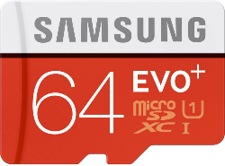
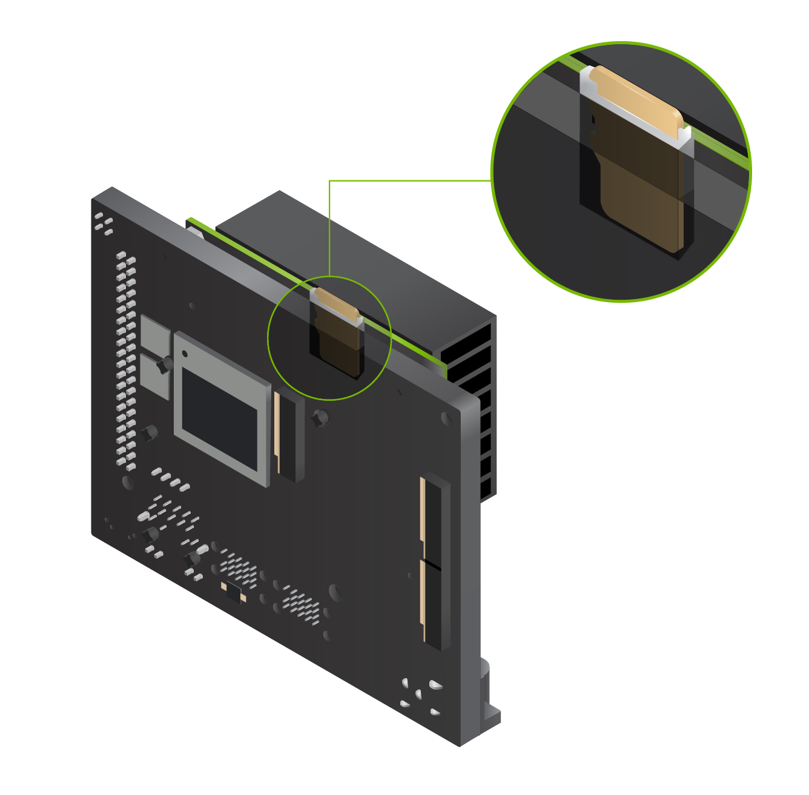
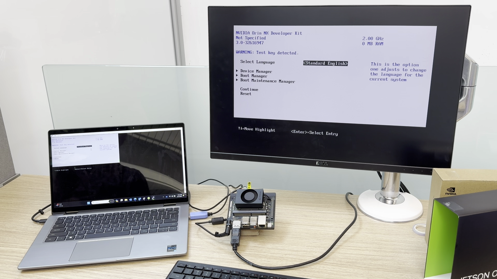
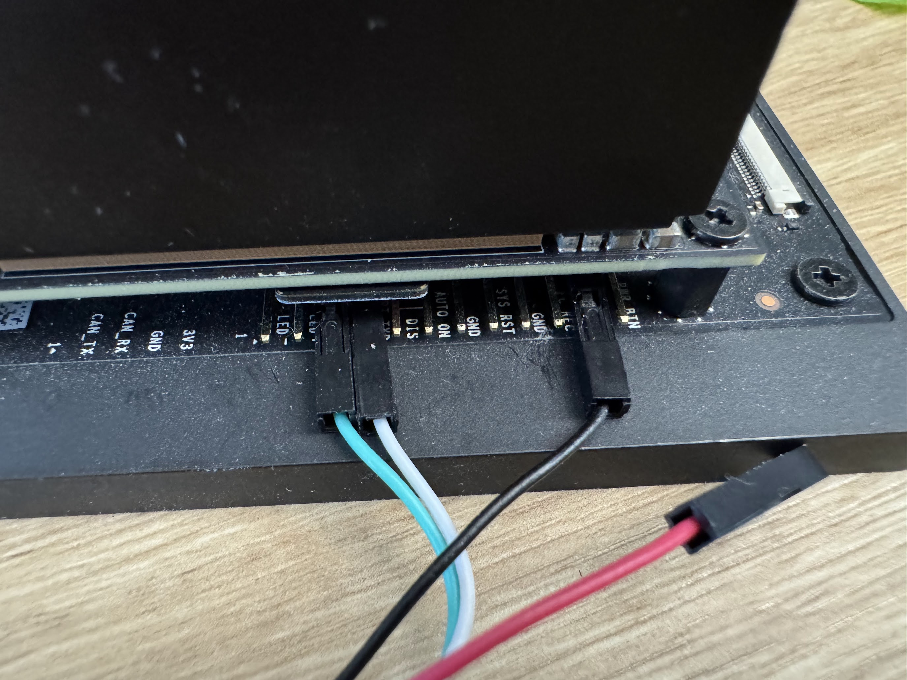
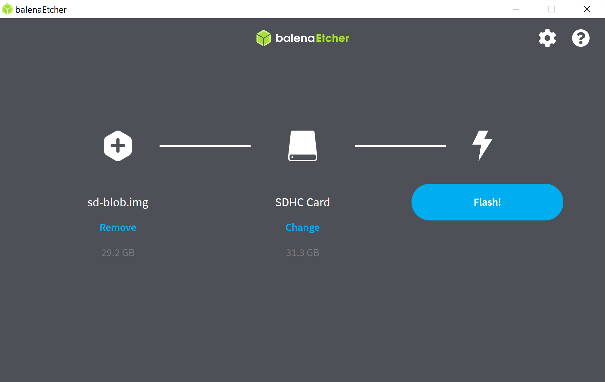
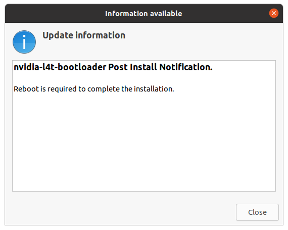
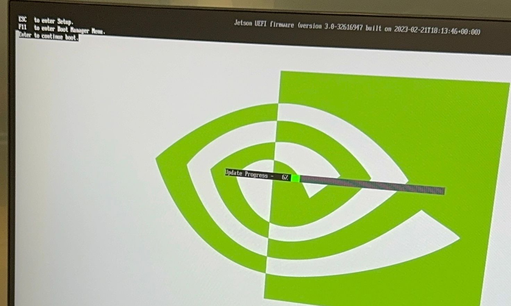
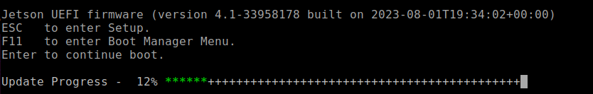

# Initial Setup Guide for Jetson Orin Nano Developer Kit

{ width="300"  align=right}

!!! note
    This guide is to supplement the official [**Jetson Orin Nano Developer Kit Getting Started Guide**](https://developer.nvidia.com/embedded/learn/get-started-jetson-orin-nano-devkit).

The NVIDIA® <span class="blobLightGreen4">Jetson Orin Nano™ Developer Kit</span> is a perfect kit to start your journey of local generative AI evaluation and development.

With the December 2024 software update (JetPack 6.1 (rev.1)), this advanced edge computer delivers up to 70% more performance, making it an even more powerful platform for the era of generative AI.

This guide explains the complete flow from opening the box, updating the firmware if needed, flashing the latest **JetPack 6.2** image on SD card, and the initial software setup, so that you will be ready for tutorials listed on this site and other AI projects.


## Check your inventory

The following item is needed or highly desired to set up your Jetson Orin Nano Developer Kit.<br>
If you don't have them in your inventory, you want to arrange them and return to this guide once they are available.

!!! warning "What not come in the box - What you need/want to prepare"

    ### Storage

    - :material-checkbox-blank-outline: microSD card (64GB or bigger)
    - :material-checkbox-blank-outline: NVMe SSD (Optional, but highly recommended for following tutorials on this site)

      

    ### Mean to access terminal

    You need either of the following set:

    - :material-checkbox-blank-outline: DisplayPort cable,  DisplayPort capable monitor and a USB keyboard
    - :material-checkbox-blank-outline: DisplayPort to HDMI cable and HDMI capable monitor (or TV) and a USB keyboard
    - :material-checkbox-blank-outline: [USB to TTL Serial cable :octicons-link-external-16:](https://www.adafruit.com/product/954) (Advanced)

!!! danger ""

    ## 🛸 Alternative method : SDK Manager

    In case you have an x86 PC running Ubuntu 22.04 or 20.04, then you can flash your Jetson Orin Nano Developer Kit with the latest firmware and JetPack all at once using **NVIDIA SDK Manager**.

    Also, if you wish to not use a microSD card but rather use a large NVMe SSD for the OS and data, then you need to use SDK Manager to flash the latest JetPack on the NVMe SSD.

    ```mermaid
    flowchart LR
        A(start) --> B{Want to ditch microSD<br>and only use NVMe SSD?}
        B --[YES] --> S[🛸 SDK Manager method]
        B --[No] --> C{Have x86 PC running<br> Ubuntu 22.04/20.04?}
        C --[YES] --> S
        C --[No] --> U[🚀 microSD-only method]

        style S stroke-width:3px, fill:#f3e9f2,stroke:#b544c4
        style U stroke-width:3px, fill:#d2e9e5,stroke:#0e7a71
    ```

    Click the button below to jump to a page that explains the alternative setup method using SDK Manager if you want to set your Jetson Orin Nano Developer Kit with an NVMe SSD or just want to flash all at once with your Ubuntu PC.

    [🛸 SDK Manager method](./initial_setup_jon_sdkm.md){ .md-button .md-button--darkpurple }

    Otherwise, continue reading on this page for the microSD-only setup method.

<!-- ## Open the box

!!! info "What you find in the box"

    

    ### :material-checkbox-marked-outline: Jetson Orin Nano Developer Kit

    The Jetson Orin Nano Developer Kit consists of Jetson Orin Nano module (enlarged SO-DIMM form factor), and the reference carrier board.

    It is designed to use a **microSD** card as the primary storage, thus the module (that has a big black heat sink with a fan) has a microSD card slot at the bottom side of the module.

    ### :material-checkbox-marked-outline: 19V DC power supply -->

## Overall flow (microSD-only method)

!!! info "Jetson Orin Nano Initial Setup Flowchart (microSD-only method)"

    ```mermaid
    flowchart
        A(start) --> B{1️⃣ Check if Jetson UEFI Firmware<br>is newer than version 36.0}
        B --[YES] --> O[6️⃣ Boot with JetPack 6.2 microSD card<br> to schedule firmware update]
        B --[No] --> C[2️⃣ Boot with JetPack 5.1.3 microSD card<br>to schedule firmware update]
        C --> D[3️⃣ Reboot] --> E{{Firmware update to 5.0 during reboot}}
        E --> F[4️⃣ Run QSPI updater] --> G[5️⃣ Reboot] --> H{{QSPI update during reboot - Firmware 36.4.0}}
        H --> O
        O --> P[7️⃣ Reboot]
        P --> Q{{Firmware update to 36.4.3 during reboot}}
        Q --> R[8️⃣ Unlock super performance]
        R --> S(👍 Start developing on JetPack 6.2)


        style C fill:#fee
        style D fill:#DEE,stroke:#333
        style E stroke-width:2px,stroke-dasharray: 5 5
        style F stroke-width:4px
        style G fill:#DEE,stroke:#333
        style H stroke-width:2px,stroke-dasharray: 5 5
        style O fill:#fee
        style P fill:#DEE,stroke:#333
        style Q stroke-width:2px,stroke-dasharray: 5 5
        style R fill:#f2d5ff
    ```
Note that it will undergo a total of **three (3)** reboot cycles.

### Walk-through Video

??? info "Click here to expand and watch video"

    <iframe width="960" height="480" src="https://www.youtube.com/embed/7-U_zGUwAPQ?si=_BumnsGFGWm5Bpjz" title="YouTube video player" frameborder="0" allow="accelerometer; autoplay; clipboard-write; encrypted-media; gyroscope; picture-in-picture; web-share" referrerpolicy="strict-origin-when-cross-origin" allowfullscreen></iframe>


## 1️⃣ Check if Jetson UEFI Firmware version > `36.0`

Your Jetson Orin Nano Developer Kit may have the latest firmware ("Jetson UEFI firmware" on QSPI-NOR flash memory) flashed at the factory.

If not, we need to go through a set of procedures to upgrade to the latest firmware. (Luckily, we can now do this all just on Jetson, meaning we don't need to use a host Ubuntu PC any more!)

So let's first check the version of your Jetson UEFI Firmware.<br>
You can take one of the following methods.

=== ":material-monitor: Monitor-attached"

    1. Connect your monitor and USB keyboard to your developer kit.
    2. Turn on the developer kit by plugging in the bundled DC power supply
    3. Repeatedly press ++esc++ key on the keyboard, especially after NVIDIA logo boot splash screen first appears on the monitor
    4. You should see UEFI setup menu screen
    5. Check the third line from the top (below "Not specified"), which should be the version number of Jetson UEFI firmware

    > Below image shows that this Jetson Orin Nano Developer Kit unit has the old UEFI firmware, indicating that the unit first needs its firmware/QSPI updated in order to run JetPack 6.x.
    { width="960" }

=== ":material-monitor-off: Headless"

    1. Connect USB to TTL Serial cable onto the following pins on `J14` "button" header of carrier board located under the Jetson module.
          - `RXD` (Pin 3) :fontawesome-solid-arrows-left-right: Adafruit adaptor cable <span class="blobGreen">Green</span>
          - `TXD` (Pin 4) :fontawesome-solid-arrows-left-right: Adafruit adaptor cable <span class="blobWhite">White</span>
          - `GND` (Pin 7) :fontawesome-solid-arrows-left-right: Adafruit adaptor cable <span class="blobBlack">Black</span>

        [{ width="640" }](./images/jon_adafruit_uart_cable.jpg)
        > For the detail, refer to [Jetson Orin Nano Developer Kit Carrier Board Specification](https://developer.nvidia.com/embedded/downloads#?search=Carrier%20Board%20Specification&tx=$product,jetson_orin_nano).
    1. On your PC, run your console monitor program and open the USB serial port.
    2. Power on the developer kit by plugging in the bundled DC power supply
    3. On the PC console, repeatedly press ++esc++ key on the keyboard, especially after NVIDIA logo boot splash screen first appears on the monitor
    4. You should see UEFI setup menu screen
    5. Check the third line from the top (below "Not specified"), which should be the version number of Jetson UEFI firmware

=== "😁I'm feeling lucky"

    !!! danger "Warning"

        <B>Avoid leaving the device in a black screen state for extended periods or attempting to boot repeatedly with an SD card containing an incompatible JetPack version.</B>

        There is a chance that accumulated boot failures may trigger the L4T launcher to always boot into recovery kernel.

        If this happens, even after switching to the proper JetPack 5.1.3 SD card, it won't boot from the SD card until we manually change the L4T Launcher setting.

    Although we don't recommend for the above stated reason, you could skip to [***6️⃣ Boot with JetPack 6.x SD card***](#6-boot-with-jetpack-6x-sd-card), and try your luck to see if your Jetson just boots with the JetPack 6.x SD card.

    If the Ubuntu desktop does not appear within 3 minutes and the screen remains black (as shown below), it indicates that the unit is running an older UEFI firmware version that is incompatible with the JetPack 6.x SD card.

    { width="640" }

    Turn the unit off, and skip to the next section ([2️⃣ Boot with JetPack 5.1.3 SD card to schedule firmware update](#2-boot-with-jetpack-513-sd-card-to-schedule-firmware-update)).


## Determine QSPI update is necessary or not

!!! warning "Attention"

    Select the appropriate tab below based on your firmware version you found in the above step.

    If you found your Jetson Orin Nano needs its firmware updated to run JetPack 6.x, click [":material-update: Firmware < 36.0"](#__tabbed_2_1) tab, and then additional step 2 to 5 will appear for you to follow.

    If you know your Jetson Orin Nano has the latest firmware, stay on [":fontawesome-solid-forward-fast: Firmware 36.x"](#__tabbed_2_2) tab, and skip to the next section ([***6️⃣ Boot with JetPack 6.x SD card***](#6-boot-with-jetpack-6x-sd-card))

=== ":material-update: Firmware < 36.0"

    Your Jetson Orin Nano **needs** its firmware updated in order to make JetPack 6.x SD card work.

    Perform the following steps (2 to 5).

    ## 2️⃣ Boot with JetPack 5.1.3 SD card to schedule firmware update

    First, we need to run JetPack 5.1.3 in order to let its `nvidia-l4t-bootloader` package get its bootloader/firmware updater activated, so that the firmware update automatically runs the next time it reboots.

    1. Download SD card image on to your PC

        On your PC, download JetPack 5.1.3 image for Jetson Orin Nano Developer Kit from the official [JetPack 5.1.3 page](https://developer.nvidia.com/embedded/jetpack-sdk-513) or from the below direct link button.

        !!! warning

            NVIDIA had updated the JetPack 5.1.3 image on 5/28/2024, as the old version had some issue and the following process did not work.<br>So please download and use the latest image (the new file name is **`JP513-orin-nano-sd-card-image_b29.zip`**).

        [Jetson Orin Nano Developer Kit<br>JetPack 5.1.3 image](https://developer.nvidia.com/downloads/embedded/l4t/r35_release_v5.0/jp513-orin-nano-sd-card-image.zip){ .md-button .md-button--primary }

    2. Use Balena Etcher to flash image to SD card

        If you don't have Balena Etcher on your PC, download from [Balena official site](https://etcher.balena.io/).

        { width="360" }

    3. Insert the flashed microSD card into the slot on Jetson module

        { width="360" }

    4. Power-on

        Turn on the Jetson Orin Nano Developer Kit **with JetPack 5.1.3 SD card inserted** by plugging in the DC power supply.

    5. Complete the initial software setup (`oem-config`)

        !!! info

            There is a chance that JetPack 5.1.3 SD card does not show any desktop UI on the attached display (the display remains black).

            It would still schedule the UEFI firmware update in the background, so when you power cycle the unit, most likely it will perform the firmware update on the next boot up.

            So if this happens, skip to the next step ([Step 3️⃣](#3-reboot-and-observe-firmware-update-to-50)'s bullet point `2`.).

    6. Ensure firmware update is scheduled.

        Once Jetson boots into Jetson Linux system, a background service automatically runs to schedule a firmware update (if needed) to be performed during the next boot-up process.

        Once you see the following, or just wait about 5 minutes after powering on to ensure the scheduling is done, reboot.

        === ":material-monitor: GUI"

            

        === ":material-monitor-off: CUI"

            ```bash
            $ sudo systemctl status nv-l4t-bootloader-config
            [sudo] password for jetson:
            ● nv-l4t-bootloader-config.service - Configure bootloader service
                Loaded: loaded (/etc/systemd/system/nv-l4t-bootloader-config.service; enabled; vendor preset: enabled)
                Active: inactive (dead) since Fri 2024-05-03 13:36:13 PDT; 1min 57s ago
                Process: 11439 ExecStart=/opt/nvidia/l4t-bootloader-config/nv-l4t-bootloader-config.sh -v (code=exited, status=0/SUCCESS)
            Main PID: 11439 (code=exited, status=0/SUCCESS)
            ```

    ## 3️⃣ Reboot and observe firmware update to `5.0`

    1. Reboot

        Reboot your Jetson Orin Nano Developer Kit.

        === ":material-monitor: GUI"

            On the Ubuntu desktop click the power icon (:material-power:) and select "**Restart...**".

        === ":material-monitor-off: CUI"

            ```bash
            $ sudo reboot
            ```

    2. Observe firmware update

        You should see the following during the boot up process.

        === ":material-monitor: With monitor"

            

        === ":material-monitor-off: Headless (serial)"

            

        Once done, you will boot into JetPack 5.1.3 (again), with underlying firmware updated to `5.0-35550185`.

    ## 4️⃣ Run QSPI Updater package to schedule QSPI update

    Now that your UEFI firmware is updated to 35.5.0 ( = JetPack 5.1.3 ), it is capable of updating the entire QSPI content to make it ready for JetPack 6.x.

    We will run a special tool so that the entire QSPI update is scheduled to run automatically on the next boot-up.

    1. Double-check your firmware version is up to date (`35.5.0` = JetPack 5.1.3)

        Once it reboots back into Jetson Linux system, on Jetson terminal, run the following:

        ```bash
        sudo nvbootctrl dump-slots-info
        ```

        You should see something like the following, with the **Current version** indicating `35.5.0`.

        ``` { .yaml .no-select }
        Current version: 35.5.0
        Capsule update status: 0
        Current bootloader slot: A
        Active bootloader slot: A
        num_slots: 2
        slot: 0,             status: normal
        slot: 1,             status: normal
        ```

    2. Install QSPI Updater Debian package to trigger the entire QSPI update

        !!! note

            An Internet connection is required to download the QSPI updater package.

        On Jetson terminal, run the following:

        ```bash
        sudo apt-get install nvidia-l4t-jetson-orin-nano-qspi-updater
        ```

        Installing the `nvidia-l4t-jetson-orin-nano-qspi-updater` automatically runs its script to schedule the entire QSPI update to be performed during the next boot process, so that the firmware is ready for JetPack 6.x.

    ## 5️⃣ Reboot, observe QSPI update, and power off

    1. Reboot

        Once the QSPI update is scheduled, reboot your Jetson Orin Nano Developer Kit.

    2. Observe update

        You can observe the QSPI update during the boot up process.

    3. Power off

        Once the update is done, it reboots and tries to boot, however it will get stuck **UNLESS you change the SD card to JetPack 6.x one**.

        Therefore you should just power off the developer kit simply by disconnecting the DC power supply.

        !!! danger "Attention"

            This part may look very confusing as neither the attached monitor nor the debug UART shows any explicit message on what action to take next.

            What is going on here is that the Jetson's firmware (inside the QSPI-NOR flash memory) is now updated, ready for the JetPack 6.x SD card, however it is now incompatible with JetPack 5.1.3 SD card left in the Jetson module's slot, so after the reboot it gets stuck in the boot process.

            So there is no issue with this boot halt (or endless rebooting). <br>
            Simply power off the device and insert the new SD card.

=== ":fontawesome-solid-forward-fast: Firmware 36.x"

    > Your Jetson Orin Nano has the latest firmware that is ready for JetPack 6.x SD card.

    > Skip to the next section ([***6️⃣ Boot with JetPack 6.x SD card***](#6-boot-with-jetpack-6x-sd-card))


## 6️⃣ Boot with JetPack 6.x SD card

Once we know the onboard firmware is up-to-date and ready for JetPack 6.x, we can boot Jetson Orin Nano Developer Kit with a microSD card for JetPack 6.2.

1. Download SD card image on to your PC

    On your PC, download the latest JetPack 6.x image for Jetson Orin Nano Developer Kit from the official [JetPack page](https://developer.nvidia.com/embedded/jetpack) or from the below direct link button.

    [Jetson Orin Nano Developer Kit<br>JetPack 6.2.1](https://developer.nvidia.com/downloads/embedded/L4T/r36_Release_v4.4/jp62-r1-orin-nano-sd-card-image.zip){ .md-button .md-button--primary }

2. Use Balena Etcher to flash image to SD card

    Insert your microSD card into your PC's SD card slot, and use Balena Etcher to flash the SD card with the image you just downloaded.

    If you don't have Balena Etcher on your PC, download from [Balena official site](https://etcher.balena.io/).

    { width="540" }

3. Insert the **JetPack 6.2** microSD card into the slot on Jetson module

    { width="360" }

4. Power-on by plugging the DC power supply

5. Complete the initial software setup (`oem-config`)

6. Ensure firmware update is scheduled.

    JetPack 6.2 SD card will automatically schedule another firmware/bootloader update in the next (3rd and final) reboot cycle.

    === ":material-monitor: GUI"

        

    === ":material-monitor-off: CUI"

        ```bash
        $ sudo systemctl status nv-l4t-bootloader-config
        [sudo] password for jetson:
        ● nv-l4t-bootloader-config.service - Configure bootloader service
            Loaded: loaded (/etc/systemd/system/nv-l4t-bootloader-config.service; enabled; vendor preset: enabled)
            Active: inactive (dead) since Fri 2024-05-03 13:36:13 PDT; 1min 57s ago
            Process: 11439 ExecStart=/opt/nvidia/l4t-bootloader-config/nv-l4t-bootloader-config.sh -v (code=exited, status=0/SUCCESS)
        Main PID: 11439 (code=exited, status=0/SUCCESS)
        ```

## 7️⃣ Reboot and observe firmware update to `36.4.3`

1. Reboot your Jetson Orin Nano Developer Kit on JetPack 6.2 SD card to trigger the final firmware update (to `36.4.3`).

    === ":material-monitor: GUI"

        On the Ubuntu desktop click the power icon (:material-power:) and select "**Restart...**".

    === ":material-monitor-off: CUI"

        ```bash
        $ sudo reboot
        ```

2. Observe firmware update

    You should see the following during the boot up process.

    === ":material-monitor: With monitor"

        { width="800" }

    === ":material-monitor-off: Headless (serial)"

        ```text
        Jetson System firmware version 36.3.0-gcid-36106755 date 2025-04-25T02:38:25+00:

        ESC   to enter Setup.
        F11   to enter Boot Manager Menu.
        Enter to continue boot.

        Update Progress - 10% *****++++++++++++++++++++++++++++++++++++++++++++++++++
        ```

Once done, you will boot into JetPack 6.2 again, with the underlying firmware updated to `36.4.3`, which unlock the Super performance.

## 8️⃣ Unlock Super Performance

!!! warning "Attention"

    If your are booting with ***JetPack 6.1 (rev.1)*** SD card instead of JetPack 6.2 SD card, you may need to execute the following command after the final login and reboot your device.

    This ensures that the **MAXN** performance mode becomes available on your system.

    ```bash
    sudo rm -rf /etc/nvpmodel.conf
    ```

### Switch to MAXN SUPER mode

Note that the default power mode on JetPack 6.2 on Jetson Orin Nano Developer Kit is **25W**. <br>
To switch to the **MAXN SUPER** mode and unlock the unregulated performance, follow below steps:

1. Click on the current power mode (**25W**) by clicking the NVIDIA icon on the right side of the Ubuntu desktop’s top bar.
2. Select **Power mode** from the menu.
3. Choose **MAXN SUPER** to enable maximum performance.


## 👍 Start developing on JetPack 6.2

🎊 **Congratulations!** <br>
Your Jetson Orin Nano Developer Kit is set up with JetPack 6.2 and you are ready to develop on JetPack 6.2.

## Next step

### NVMe SSD installation

Take a look at [this page](./tips_ssd-docker.md) for installing NVMe SSD and setting up Docker with it.
