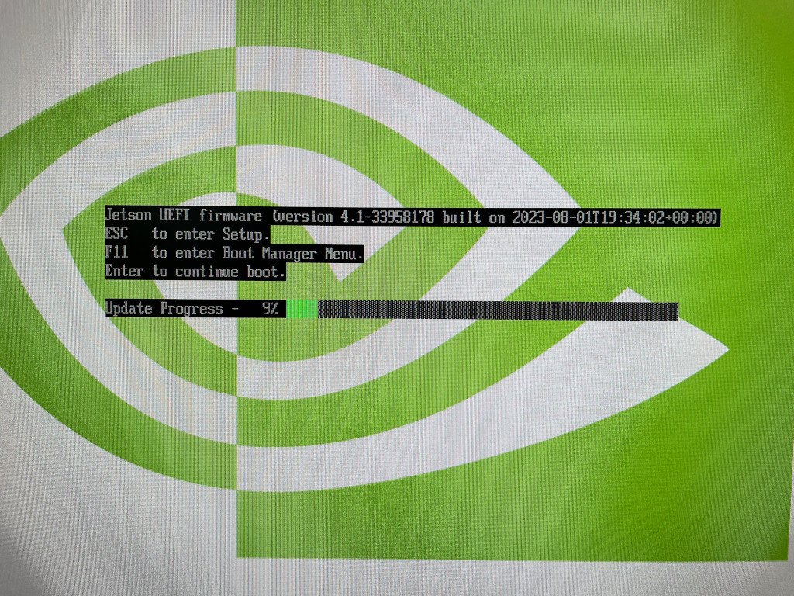

# Initial Setup Guide for Jetson Orin Nano Developer Kit

{ width="300"  align=right}

!!! note
    This guide is to supplement the official [**Jetson Orin Nano Developer Kit Getting Started Guide**](https://developer.nvidia.com/embedded/learn/get-started-jetson-orin-nano-devkit).

The NVIDIA® <span class="blobLightGreen4">Jetson Orin Nano™ Developer Kit</span> is a perfect kit to start your journey of local generative AI evaluation and development.

This guide explains the complete flow from opening the box, updating the firmware if needed, flashing the latest JetPack 6.0 GA image on SD card, and the initial software setup, so that you will be ready for tutorials listed on this site and other AI projects.


## Check your inventory

Following item is needed or highly desired to set up your Jetson Orin Nano Developer Kit.<br>
If you don't have them in your inventory, you want to arrange them and come back to this guide once they are available.

!!! warning "What not come in the box - What you need/want to prepare"   

    ### Storage
    
    - :material-checkbox-blank-outline: microSD card (64GB or bigger) 
    - :material-checkbox-blank-outline: NVMe SSD (Optional, but highly recommended for following tutorials on this site)

      

    ### Mean to access terminal

    You need either of the following set:

    - :material-checkbox-blank-outline: DisplayPort cable,  DisplayPort capable monitor and an USB keyboard
    - :material-checkbox-blank-outline: DisplayPort to HDMI cable and HDMI capable monitor (or TV) and an USB keyboard
    - :material-checkbox-blank-outline: [USB to TTL Serial cable :octicons-link-external-16:](https://www.adafruit.com/product/954) (Advanced)

## Open the box

!!! info "What you find in the box"

    

    ### :material-checkbox-marked-outline: Jetson Orin Nano Developer Kit

    The Jetson Orin Nano Developer Kit consists of Jetson Orin Nano module (enlarged SO-DIMM form factor), and the reference carrier board.

    It is designed to use a **microSD** card as the primary storage, thus the module (that has a big black heat sink with a fan) has a microSD card slot at the bottom side of the module.

    ### :material-checkbox-marked-outline: 19V DC power supply

## Overall flow

!!! info "Jetson Orin Nano Initial Setup Flowchart (Click to expand)"

    ```mermaid
    flowchart
        A(start) --> B{1. Check<br>Manufactured after May 2024?<br>i.e. Jetson UEFI Firmware<br>newer than version 36.0}
        B --[YES] --> O[6. Flash JetPack 6.0 GA image on microSD card]
        B --[No] --> C[2. Flash JetPack 5.1.3 image on microSD card]
        C --> D[3. Reboot] --> E{{Firmware update during reboot}}
        E --> F[4. Run QSPI updater] --> G[5. Reboot] --> H{{Firmware update during reboot}}
        H --> O
        O --> P(7. Start developing on JetPack 6.0) 

        style C fill:#fee
        style D fill:#DEE,stroke:#333
        style G fill:#DEE,stroke:#333
        style F stroke-width:4px
        style E stroke-width:2px,stroke-dasharray: 5 5
        style H stroke-width:2px,stroke-dasharray: 5 5
        style O fill:#fee
    ```

<!-- ??? example "Even more detailed flowchart (for all firmware versions)"

    Another image. -->


## 1. Check if Jetson UEFI Firmware version > `36.3`

Your Jetson Orin Nano Developer Kit may have the latest firmware ("Jetson UEFI firmware" on QSPI-NOR flash memory) flashed at the factory.

If not, we need to go through a set of procedures to upgrade to the latest firmware. (Luckily, we can now do this all just on Jetson, meaning we don't need to use a host Ubuntu PC any more!)

So let's first check the version of your Jetson UEFI Firmware.<br>
You can take one of the following methods.

=== ":material-monitor: Monitor-attached"

    1. Connect your monitor and USB keyboard to your developer kit.
    2. Turn on the developer kit by plugging in the bundled DC power supply
    3. Repeatedly press ++esc++ key on the keyboard, especially after NVIDIA logo boot splash screen first appears on the monitor
    4. You should see UEFI setup menu screen
    5. Check the third line from the top (below "Not specified"), which should be the version number of Jetson UEFI firmware

=== ":material-monitor-off: Headless"

    1. Connect USB to TTL Serial cable onto the following pins on `J14` "button" header of carrier board located under the Jetson module. 
          - `RXD` (Pin 3) :fontawesome-solid-arrows-left-right: Adafruit adaptor cable <span class="blobGreen">Green</span> 
          - `TXD` (Pin 4) :fontawesome-solid-arrows-left-right: Adafruit adaptor cable <span class="blobWhite">White</span> 
          - `GND` (Pin 7) :fontawesome-solid-arrows-left-right: Adafruit adaptor cable <span class="blobBlack">Black</span> 
        > For the detail, refer to [Jetson Orin Nano Developer Kit Carrier Board Specification](https://developer.nvidia.com/embedded/downloads#?search=Carrier%20Board%20Specification&tx=$product,jetson_orin_nano).
    1. On your PC, run your console monitor program and open the USB serial port.
    2. Power on the developer kit by plugging in the bundled DC power supply
    3. On the PC console, repeatedly press ++esc++ key on the keyboard, especially after NVIDIA logo boot splash screen first appears on the monitor
    4. You should see UEFI setup menu screen
    5. Check the third line from the top (below "Not specified"), which should be the version number of Jetson UEFI firmware
   
=== "😁I'm feeling lucky"

    > You could skip to [***6. Flash JetPack 6.0 GA image onto your microSD card***](#6-flash-jetpack-60-ga-image-onto-your-microsd-card), and try your luck to see if your Jetson just boots your Jetson Orin Nano Developer Kit up to the initial software set up (OEM-config).


## [< 36.0] Upgrade the Jetson UEFI firmware to 36.x

!!! warning "Attention"

    Select the appropriate tab below based on your firmware version you found in the above step.

    If you found your Jetson Orin Nano needs its firmware updated to run JetPack 6, click [":material-update: Firmware < 36.0"](#__tabbed_2_2) tab, and then additional step 2 to 5 will appear for you to follow.

    If you know your Jetson Orin Nano has the latest firmware, stay on [":fontawesome-solid-forward-fast: Firmware 36.x"](#__tabbed_2_1) tab, and skip to the next section ([***6. Flash JetPack 6.0 GA image onto your microSD card***](#6-flash-jetpack-60-ga-image-onto-your-microsd-card))

=== ":fontawesome-solid-forward-fast: Firmware 36.x"

    > Your Jetson Orin Nano has the latest firmware that is ready for JetPack 6 SD card.

    > Skip to the next section ([***6. Flash JetPack 6.0 GA image onto your microSD card***](#6-flash-jetpack-60-ga-image-onto-your-microsd-card))

=== ":material-update: Firmware < 36.0"

    > Your Jetson Orin Nano needs its firmware updated in order to make JetPack 6 SD card work.
    >
    > Perform the following steps (2 to 5).

    ## 2. Flash JetPack 5.1.3 image onto your microSD card

    First we need to run JetPack 5.1.3 in order let its `nvidia-l4t-bootloader` package to get its bootloader/firmware updater activated, so that the firmware update automatically runs the next time it reboots.

    1. Download SD card image on to your PC

        On your PC, download JetPack 5.1.3 image for Jetson Orin Nano Developer Kit from the official [JetPack 5.1.3 page](https://developer.nvidia.com/embedded/jetpack-sdk-513) or from the below direct link button.

        !!! warning

            NVIDIA had updated the JetPack 5.1.3 image on 5/28/2024, as the old version had some issue and the following process did not work.<br>So please download and use the latest image (the new file name is **`JP513-orin-nano-sd-card-image_b29.zip`**).

        [Jetson Orin Nano Developer Kit<br>JetPack 5.1.3 image](https://developer.nvidia.com/downloads/embedded/l4t/r35_release_v5.0/jp513-orin-nano-sd-card-image.zip){ .md-button .md-button--primary }

    2. Use Balena Etcher to flash image to SD card

        If you don't have Balena Etcher on your PC, download from [Balena official site](https://etcher.balena.io/).

        { width="360" }

    3. Insert the flashed microSD card into the slot on Jetson module
   
        { width="360" }

    ## 3. Power-on and reboot to ensure firmware gets updated to 5.0 (JetPack 5.1.3)

    4. Power-on
   
        Turn on the Jetson Orin Nano Developer Kit **with JetPack 5.1.3 SD card inserted** by plugging in the DC power supply.

    5. Complete the initial software setup (`oem-config`)
    6. Ensure firmware update is scheduled.
    
        Once Jetson boots into Jetson Linux system, a background service automatically runs to schedule a firmware update (if needed) to be performed during the next boot-up process.

        Once you see the following, or just wait about 5 minutes after powering on to ensure the scheduling is done, reboot.

        === ":material-monitor: GUI"

            

        === ":material-monitor-off: CUI"

            ```bash
            $ sudo systemctl status nv-l4t-bootloader-config
            [sudo] password for jetson: 
            ● nv-l4t-bootloader-config.service - Configure bootloader service
                Loaded: loaded (/etc/systemd/system/nv-l4t-bootloader-config.service; enabled; vendor preset: enabled)
                Active: inactive (dead) since Fri 2024-05-03 13:36:13 PDT; 1min 57s ago
                Process: 11439 ExecStart=/opt/nvidia/l4t-bootloader-config/nv-l4t-bootloader-config.sh -v (code=exited, status=0/SUCCESS)
            Main PID: 11439 (code=exited, status=0/SUCCESS)
            ```

    7. Reboot
   
        Reboot your Jetson Orin Nano Developer Kit.
        
        You should see the following during the boot up process.
        
        === ":material-monitor: With monitor"

            

        === ":material-monitor-off: Headless (serial)"

            

        Once done, you will boot into JetPack 5.1.3 (again), with underlying firmware updated to `5.0-35550185`.

    ## 4. Install and run QSPI Updater package 

    8. Double-check your firmware version is up to date (`35.5.0` = JetPack 5.1.3)
    
        Once it reboots back into Jetson Linux system, on Jetson terminal, run the following:
        
        ```bash
        sudo nvbootctrl dump-slots-info
        ```
        
        You should see something like the following, with the **Current version** indicating `35.5.0`.

        ``` { .yaml .no-select }
        Current version: 35.5.0
        Capsule update status: 0
        Current bootloader slot: A
        Active bootloader slot: A
        num_slots: 2
        slot: 0,             status: normal
        slot: 1,             status: normal
        ```

    9. Install QSPI Updater Debian package to trigger another (final) firmware update
   
        On Jetson terminal, run the following:

        ```bash
        sudo apt-get install nvidia-l4t-jetson-orin-nano-qspi-updater
        ```

        Installing the `nvidia-l4t-jetson-orin-nano-qspi-updater` automatically runs its script to schedule another (final) firmware update to be performed during the next boot process, so that the firmware is ready for JetPack 6.

    ## 5. Reboot and power-off the developer kit

    10. Reboot 
    
        Once the QSPI update is scheduled, reboot your Jetson Orin Nano Developer Kit.

    11. Observe update

        You can observe the update during the boot up process.

    12. Power off

        Once the update is done, it reboots and tries to boot, however it will get stuck **UNLESS you change the SD card to JetPack 6 one**. 
        
        Therefore you should just power off the developer kit by disconnecting the DC power supply.

        !!! danger "Attention"

            This part may look very confusing as neither the attached monitor nor the debug UART shows any explicit message on what action to take next.

            What is going on here is that the Jetson's firmware (inside the QSPI-NOR flash memory) is now updated, ready for the JetPack 6 SD card, however it is now incompatible with JetPack 5.1.3 SD card left in the Jetson module's slot, so after the reboot it gets stuck in the boot process.

            So there is nothing problematic with this boot halt (or endless rebooting). We just need to power-off and insert a new SD card.


## 6. Flash JetPack 6.0 GA image onto your microSD card

Once we know the onboard firmware is up-to-date and ready for JetPack 6, we can boot Jetson Orin Nano Developer Kit with a microSD card for JetPack 6.

1. Download SD card image on to your PC

    On your PC, download JetPack 6.0 GA image for Jetson Orin Nano Developer Kit from the official [JetPack 6.0 page](https://developer.nvidia.com/embedded/jetpack-sdk-60) or from the below direct link button.

    [Jetson Orin Nano Developer Kit<br>JetPack 6.0 GA image](https://developer.nvidia.com/downloads/embedded/l4t/r36_release_v3.0/jp60-orin-nano-sd-card-image.zip){ .md-button .md-button--primary }

2. Use Balena Etcher to flash image to SD card

    Insert your microSD card into your PC's SD card slot, and use Balena Etcher to flash the SD card with the image you just downloaded.

    If you don't have Balena Etcher on your PC, download from [Balena official site](https://etcher.balena.io/).

    { width="540" }


## 7. Power on to start developing on JetPack 6

1. Insert the **JetPack 6** microSD card into the slot on Jetson module
   
    { width="360" }

2. Power-on by plugging the DC power supply

3. Complete the initial software setup (`oem-config`)

🎊 **Congratulations!** <br>
Your Jetson Orin Nano Developer Kit is set up with JetPack 6 SD card and you are ready to develop on JetPack 6.


## Next step

### NVMe SSD installation

Take a look at [this page](./tips_ssd-docker.md) for installing NVMe SSD and setting up Docker with it.
