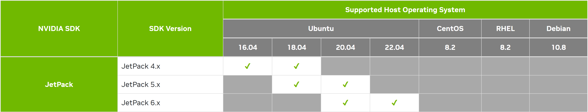
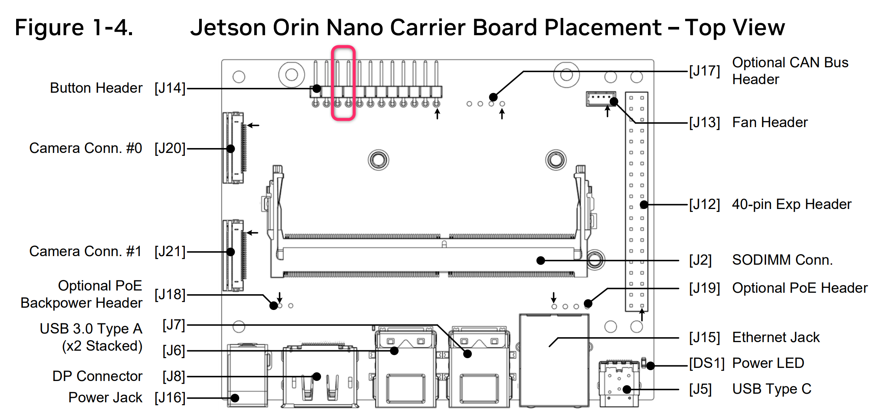
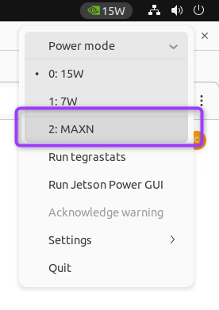

# 🛸 Initial Setup using SDK Manager 

{ width="256"  align=right}

!!! note
    This guide is to supplement the official [**Jetson Orin Nano Developer Kit Getting Started Guide**](https://developer.nvidia.com/embedded/learn/get-started-jetson-orin-nano-devkit).

The NVIDIA® <span class="blobLightGreen4">Jetson Orin Nano™ Developer Kit</span> is a perfect kit to start your journey of local generative AI evaluation and development.

This guide explains the **alternative method** for setting up Jetson Orin Nano Developer Kit by flashing both the latest firmware (QSPI image) and the latest JetPack all at once, using a host x86 PC.

## Check your toolbox

The following item is needed or highly desired for flashing your Jetson Orin Nano Developer Kit using your host PC.

If you don't have them, check the [default microSD-only setup instruction](./initial_setup_jon.md) or you want to arrange them first then return to this guide once they are available. 

!!! warning "What not come in the box - What you need/want to prepare"   

    ### Host PC

    - :material-checkbox-intermediate: x86 PC running **Ubuntu 22.04** or **Ubuntu 20.04**

    > 
    > Source: :octicons-link-external-16: [NVIDIA SDK Manager :material-chevron-double-right: Host Operating System Compatibility Matrix](https://developer.nvidia.com/sdk-manager#host_os_comp_matrix)

    ### Storage
    
    Either of the following.

    - :material-checkbox-blank-outline: microSD card (64GB or bigger) 
    - :material-checkbox-blank-outline: NVMe SSD (Recommended for better performance)

      

    ### Flashing supply

    - :material-checkbox-blank-outline: USB cable (USB-C plug for Jetson Orin Nano Developer Kit side, other end depends on your PC)
    - :material-checkbox-blank-outline: jumper pin (or metal paper clip)

    ### Mean to access terminal

    You need either of the following set:

    - :material-checkbox-blank-outline: DisplayPort cable,  DisplayPort capable monitor and a USB keyboard
    - :material-checkbox-blank-outline: DisplayPort to HDMI cable and HDMI capable monitor (or TV) and a USB keyboard
    - :material-checkbox-blank-outline: [USB to TTL Serial cable :octicons-link-external-16:](https://www.adafruit.com/product/954) (Advanced)

!!! danger ""

    ## 🚀 Default method : microSD card only setup method

    In case you **do NOT** have an x86 PC running Ubuntu 22.04 or 20.04, you can fall back to the default "microSD card only" setup method that does not require any host PC.

    The decision process can look like this.

    ```mermaid
    flowchart LR
        A(start) --> B{Want to ditch microSD<br>and only use NVMe SSD?}
        B --[YES] --> S[🛸 SDK Manager method]
        B --[No] --> C{Have x86 PC running<br> Ubuntu 22.04/20.04?}
        C --[YES] --> S
        C --[No] --> U[🚀 microSD-only method]

        style S stroke-width:3px, fill:#f3e9f2,stroke:#b544c4
        style U stroke-width:3px, fill:#d2e9e5,stroke:#0e7a71
    ```

    Click the button below to jump to the default setup page.

    [🚀 microSD-only method](./initial_setup_jon.md){ .md-button .md-button--darkgreen }

    Otherwise, continue reading on this page for the SDK Manager method.


## Overall flow (SDK Manager method)

!!! info "Jetson Orin Nano Initial Setup Flowchart (microSD-only method)"

    ```mermaid
    flowchart
        A(start) --> B[0️⃣ Install SDK Manager]
        B --> C[1️⃣ Connect Target Hardware] 
        C --> D[2️⃣ Select Software Components to Install]
        D --> E[3️⃣ Download on Host PC]
        E --> F[4️⃣ Flash]
        F --> G[5️⃣ Boot and initial setup]
        G --> P(👍 Start developing on JetPack 6.x) 
    ```


## 0️⃣ Install SDK Manager

!!! info "Reference"

    :octicons-link-external-16: [NVIDIA SDK Manager Documentation](https://docs.nvidia.com/sdk-manager/){:target="_blank"} : <br> :material-chevron-double-right: **Download and Install** :material-chevron-double-right: [Download and Run SDK Manager](https://docs.nvidia.com/sdk-manager/download-run-sdkm/index.html){:target="_blank"}

On your Ubuntu 22.04 / 20.04 PC, open a terminal and execute the following command.

Select the tab that matches your Ubuntu version.

=== ":simple-ubuntu: Ubuntu 22.04"

    ```bash
    wget https://developer.download.nvidia.com/compute/cuda/repos/ubuntu2204/x86_64/cuda-keyring_1.1-1_all.deb
    sudo dpkg -i cuda-keyring_1.1-1_all.deb
    sudo apt-get update
    sudo apt-get -y install sdkmanager
    ```

=== ":simple-ubuntu: Ubuntu 20.04"

    ```bash
    wget https://developer.download.nvidia.com/compute/cuda/repos/ubuntu2004/x86_64/cuda-keyring_1.1-1_all.deb
    sudo dpkg -i cuda-keyring_1.1-1_all.deb
    sudo apt-get update
    sudo apt-get -y install sdkmanager
    ```

Then launch SDK Manager with the following command.

```bash
sdkmanager
```

??? note "First time using SDK Manager"

    When using SDK Manager for the first time, log in with your NVIDIA Developer credentials.

    Remember to tick the checkbox for "**Stay logged in**" and click "**LOGIN**" button.

    { width="480" }

    A browser window opens. Input your email address that is registered as NVIDIA Developer.

    { width="480" }

    Two factor authentication prompt may pop up.

    { width="480" }

    Once authenticated, the browser windows opens back the SDK Manager app window.

    { width="480" }

    SDK Manager continues to log you in.

    { width="480" }

SDK Manager launched and the login completed.


## 1️⃣ Connect the Target Hardware

Once SDK Manager is launched, connect your Jetson developer kit to your Ubuntu PC and power it on in Forced Recovery mode.

1. Connect your Jetson Orin Nano Developer Kit to your PC with a USB cable.<br>Note that the USB cable goes into the USB-C port of the carrier board of the developer kit.

2. While shorting `pin 9` and `pin 10` of `J14` header located below the Jetson module using a jumper pin, insert the DC power supply plug into the DC jack of the carrier board to power it on.

    { width="640" }

    You can use a paper clip like a photo below as well. 

    { width="640" }

3. Select "**Jetson Orin Nano \[8GB developer kit version\]**" and hit "**OK**"

    { width="480" }

4. Uncheck "**Host Machine**" and it should now look like this

    

5. Click "**Continue**" button to proceed to the next step.

## 2️⃣ Select Software Components to Install]

1. Leave the only "**Jetson Linux**" component checked, and uncheck everything.

    

2. Remember to also check "**I accept the terms and conditions of the license agreements**".

3. Click "**Continue**" button to proceed to the next step.

4. It will prompt for the `sudo` command password.

    { width="480" }

## 3️⃣ Download on Host PC

1. It will start downloading the "BSP" package and "RootFS" package.

    

2. Once downloads are complete, it will untar the package and start generating the images to flash in the background.

    

3. Once images are ready, SDK it will open the prompt for flashing.

    

## 4️⃣ Flash

1. On the flashing prompt, select "**Runtime**" for "OEM Configuration".

    { width="480" }

2. On the flashing prompt, select "**NVMe**" if you want to flash Jetson Linux (BSP) to NVMe SSD. 

    { width="480" }

3. Click "Flash" and the prompt popup will change like this.

    { width="480" }

4. Flash progress.

    === "Details"

        

    === "Terminals"

        

5. Flash successfully completes.

    === "Details"

        
    
    === "Terminals"

        

## 5️⃣ Boot and Initial Setup

1. If still plugged, remove the jumper from header (that was used to put it in Forced Recovery mode)

2. Connect the DisplayPort cable or adapter and USB keyboard and mouse to Jetson Orin Nano Developer Kit, or hook up the USB to TTL Serial cable.

3. Unplug the power supply and put back in to power cycle.

4. Jetson should now boot into the Jetson Linux (BSP) of your selected JetPack version from the storage of your choice.

5. Complete the initial software setup (`oem-config`)

### Switch to MAXN mode

Note that the default power mode is **15W**. <br>
To switch to the new power mode and unlock the increased performance, follow below steps:

1. Click on the current power mode (**15W**) by clicking the NVIDIA icon on the right side of the Ubuntu desktop’s top bar.
2. Select **Power mode** from the menu.
3. Choose **MAXN** to enable maximum performance.



🎊 **Congratulations!** <br>
Your Jetson Orin Nano Developer Kit is set up with JetPack 6.x image and you are ready to develop on JetPack 6.x.

## Next step

Check [this page](./tips_ssd-docker.md) for "SSD" and/or "Docker" set up.