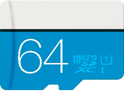
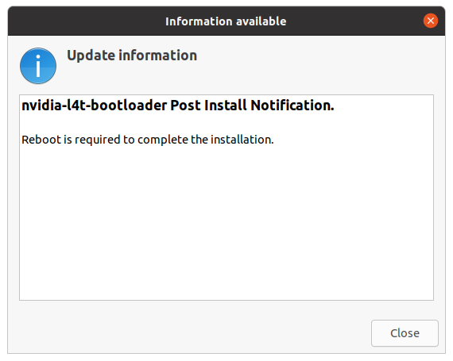

# 🛸 Initial Setup using SDK Manager 

{ width="256"  align=right}

!!! note
    This guide is to supplement the official [**Jetson Orin Nano Developer Kit Getting Started Guide**](https://developer.nvidia.com/embedded/learn/get-started-jetson-orin-nano-devkit).

The NVIDIA® <span class="blobLightGreen4">Jetson Orin Nano™ Developer Kit</span> is a perfect kit to start your journey of local generative AI evaluation and development.

This guide explains the alternative setup method of flashing Jetson Orin Nano Developer Kit with both the latest firmware (QSPI image) and the latest JetPack all at once using a host x86 PC.

## Check your toolbox

The following item is needed or highly desired flash your Jetson Orin Nano Developer Kit using your host PC.<br>
If you don't have them, check the [default microSD-only setup instruction](./initial_setup_jon.md) or you want to arrange them first then return to this guide once they are available. 

!!! warning "What not come in the box - What you need/want to prepare"   

    ### Host PC

    - :material-checkbox-intermediate: x86 PC running **Ubuntu 22.04** or **Ubuntu 20.04**

    ### Storage
    
    Either of the following.

    - :material-checkbox-blank-outline: microSD card (64GB or bigger) 
    - :material-checkbox-blank-outline: NVMe SSD (Recommended for better performance)

      

    ### Flashing supply

    - :material-checkbox-blank-outline: USB cable (USB-C plug for Jetson Orin Nano Developer Kit side, other end depends on your PC)
    - :material-checkbox-blank-outline: jumper pin (or metal paper clip)

    ### Mean to access terminal

    You need either of the following set:

    - :material-checkbox-blank-outline: DisplayPort cable,  DisplayPort capable monitor and a USB keyboard
    - :material-checkbox-blank-outline: DisplayPort to HDMI cable and HDMI capable monitor (or TV) and a USB keyboard
    - :material-checkbox-blank-outline: [USB to TTL Serial cable :octicons-link-external-16:](https://www.adafruit.com/product/954) (Advanced)

!!! danger ""

    ## 🚀 Default method : microSD card only setup method

    In case you **do NOT** have an x86 PC running Ubuntu 22.04 or 20.04, you can fall back to the default "microSD card only" setup method that does not require any host PC.

    The decision process can look like this.

    ```mermaid
    flowchart
        A(start) --> B[0️⃣ Install SDK Manager]
        B --> C[1️⃣ Select Target Hardware] 
        C --> D[2️⃣ Select Software Component(s) to Install]
        D --> E[3️⃣ Download on Host PC]
        E --> F[4️⃣ Flash]


        style S stroke-width:3px, fill:#f3e9f2,stroke:#b544c4
        style U stroke-width:3px, fill:#d2e9e5,stroke:#0e7a71
    ```

    Click the button below to jump to the default setup page.

    [🚀 microSD-only method](./initial_setup_jon.md){ .md-button .md-button--darkgreen }

    Otherwise, continue reading on this page for the SDK Manager method.


## Overall flow (SDK Manager method)

!!! info "Jetson Orin Nano Initial Setup Flowchart (microSD-only method)"

    ```mermaid
    flowchart
        A(start) --> B{1️⃣ Check if Jetson UEFI Firmware<br>is newer than version 36.0}
        B --[YES] --> O[6️⃣ Flash JetPack 6.x image on microSD card]
        B --[No] --> C[2️⃣ Boot with JetPack 5.1.3 microSD card<br>to schedule firmware update]
        C --> D[3️⃣ Reboot] --> E{{Firmware update during reboot}}
        E --> F[4️⃣ Run QSPI updater] --> G[5️⃣ Reboot] --> H{{QSPI update during reboot}}
        H --> O
        O --> P(7️⃣ Start developing on JetPack 6.x) 

        style C fill:#fee
        style D fill:#DEE,stroke:#333
        style G fill:#DEE,stroke:#333
        style F stroke-width:4px
        style E stroke-width:2px,stroke-dasharray: 5 5
        style H stroke-width:2px,stroke-dasharray: 5 5
        style O fill:#fee
    ```

<!-- ??? example "Even more detailed flowchart (for all firmware versions)"

    Another image. -->


## 1️⃣ Check if Jetson UEFI Firmware version > `36.3`

Your Jetson Orin Nano Developer Kit may have the latest firmware ("Jetson UEFI firmware" on QSPI-NOR flash memory) flashed at the factory.

If not, we need to go through a set of procedures to upgrade to the latest firmware. (Luckily, we can now do this all just on Jetson, meaning we don't need to use a host Ubuntu PC any more!)

So let's first check the version of your Jetson UEFI Firmware.<br>
You can take one of the following methods.

=== ":material-monitor: Monitor-attached"

    1. Connect your monitor and USB keyboard to your developer kit.
    2. Turn on the developer kit by plugging in the bundled DC power supply
    3. Repeatedly press ++esc++ key on the keyboard, especially after NVIDIA logo boot splash screen first appears on the monitor
    4. You should see UEFI setup menu screen
    5. Check the third line from the top (below "Not specified"), which should be the version number of Jetson UEFI firmware

=== ":material-monitor-off: Headless"

    1. Connect USB to TTL Serial cable onto the following pins on `J14` "button" header of carrier board located under the Jetson module. 
          - `RXD` (Pin 3) :fontawesome-solid-arrows-left-right: Adafruit adaptor cable <span class="blobGreen">Green</span> 
          - `TXD` (Pin 4) :fontawesome-solid-arrows-left-right: Adafruit adaptor cable <span class="blobWhite">White</span> 
          - `GND` (Pin 7) :fontawesome-solid-arrows-left-right: Adafruit adaptor cable <span class="blobBlack">Black</span> 
        > For the detail, refer to [Jetson Orin Nano Developer Kit Carrier Board Specification](https://developer.nvidia.com/embedded/downloads#?search=Carrier%20Board%20Specification&tx=$product,jetson_orin_nano).
    1. On your PC, run your console monitor program and open the USB serial port.
    2. Power on the developer kit by plugging in the bundled DC power supply
    3. On the PC console, repeatedly press ++esc++ key on the keyboard, especially after NVIDIA logo boot splash screen first appears on the monitor
    4. You should see UEFI setup menu screen
    5. Check the third line from the top (below "Not specified"), which should be the version number of Jetson UEFI firmware
   
=== "😁I'm feeling lucky"

    > You could skip to [***6️⃣ Boot with JetPack 6.x SD card***](#6-boot-with-jetpack-6x-sd-card), and try your luck to see if your Jetson just boots your Jetson Orin Nano Developer Kit up to the initial software set up (OEM-config).

## Determine QSPI update is necessary or not

!!! warning "Attention"

    Select the appropriate tab below based on your firmware version you found in the above step.

    If you found your Jetson Orin Nano needs its firmware updated to run JetPack 6.x, click [":material-update: Firmware < 36.0"](#__tabbed_2_2) tab, and then additional step 2 to 5 will appear for you to follow.

    If you know your Jetson Orin Nano has the latest firmware, stay on [":fontawesome-solid-forward-fast: Firmware 36.x"](#__tabbed_2_1) tab, and skip to the next section ([***6️⃣ Boot with JetPack 6.x SD card***](#6-boot-with-jetpack-6x-sd-card))

=== ":material-update: Firmware < 36.0"

    Your Jetson Orin Nano **needs** its firmware updated in order to make JetPack 6.x SD card work.
        
    Perform the following steps (2 to 5).

    ## 2️⃣ Boot with JetPack 5.1.3 SD card to schedule firmware update

    First, we need to run JetPack 5.1.3 in order to let its `nvidia-l4t-bootloader` package get its bootloader/firmware updater activated, so that the firmware update automatically runs the next time it reboots.

    1. Download SD card image on to your PC

        On your PC, download JetPack 5.1.3 image for Jetson Orin Nano Developer Kit from the official [JetPack 5.1.3 page](https://developer.nvidia.com/embedded/jetpack-sdk-513) or from the below direct link button.

        !!! warning

            NVIDIA had updated the JetPack 5.1.3 image on 5/28/2024, as the old version had some issue and the following process did not work.<br>So please download and use the latest image (the new file name is **`JP513-orin-nano-sd-card-image_b29.zip`**).

        [Jetson Orin Nano Developer Kit<br>JetPack 5.1.3 image](https://developer.nvidia.com/downloads/embedded/l4t/r35_release_v5.0/jp513-orin-nano-sd-card-image.zip){ .md-button .md-button--primary }

    2. Use Balena Etcher to flash image to SD card

        If you don't have Balena Etcher on your PC, download from [Balena official site](https://etcher.balena.io/).

        { width="360" }

    3. Insert the flashed microSD card into the slot on Jetson module
   
        { width="360" }

    4. Power-on
   
        Turn on the Jetson Orin Nano Developer Kit **with JetPack 5.1.3 SD card inserted** by plugging in the DC power supply.

    5. Complete the initial software setup (`oem-config`)
    6. Ensure firmware update is scheduled.
    
        Once Jetson boots into Jetson Linux system, a background service automatically runs to schedule a firmware update (if needed) to be performed during the next boot-up process.

        Once you see the following, or just wait about 5 minutes after powering on to ensure the scheduling is done, reboot.

        === ":material-monitor: GUI"

            

        === ":material-monitor-off: CUI"

            ```bash
            $ sudo systemctl status nv-l4t-bootloader-config
            [sudo] password for jetson: 
            ● nv-l4t-bootloader-config.service - Configure bootloader service
                Loaded: loaded (/etc/systemd/system/nv-l4t-bootloader-config.service; enabled; vendor preset: enabled)
                Active: inactive (dead) since Fri 2024-05-03 13:36:13 PDT; 1min 57s ago
                Process: 11439 ExecStart=/opt/nvidia/l4t-bootloader-config/nv-l4t-bootloader-config.sh -v (code=exited, status=0/SUCCESS)
            Main PID: 11439 (code=exited, status=0/SUCCESS)
            ```

    ## 3️⃣ Reboot and observe firmware update (to `5.0`)

    1. Reboot
   
        Reboot your Jetson Orin Nano Developer Kit.
        
        === ":material-monitor: GUI"

            On the Ubuntu desktop click the power icon (:material-power:) and select "**Restart...**".

        === ":material-monitor-off: CUI"

            ```bash
            $ sudo reboot
            ```

    2. Observe firmware update
        
        You should see the following during the boot up process.
        
        === ":material-monitor: With monitor"

            

        === ":material-monitor-off: Headless (serial)"

            

        Once done, you will boot into JetPack 5.1.3 (again), with underlying firmware updated to `5.0-35550185`.

    ## 4️⃣ Run QSPI Updater package to schedule QSPI update 

    Now that your UEFI firmware is updated to 35.5.0 ( = JetPack 5.1.3 ), it is capable of updating the entire QSPI content to make it ready for JetPack 6.x.  

    We will run a special tool so that the entire QSPI update is scheduled to run automatically on the next boot-up.

    1. Double-check your firmware version is up to date (`35.5.0` = JetPack 5.1.3)
    
        Once it reboots back into Jetson Linux system, on Jetson terminal, run the following:
        
        ```bash
        sudo nvbootctrl dump-slots-info
        ```
        
        You should see something like the following, with the **Current version** indicating `35.5.0`.

        ``` { .yaml .no-select }
        Current version: 35.5.0
        Capsule update status: 0
        Current bootloader slot: A
        Active bootloader slot: A
        num_slots: 2
        slot: 0,             status: normal
        slot: 1,             status: normal
        ```

    2. Install QSPI Updater Debian package to trigger the entire QSPI update
   
        On Jetson terminal, run the following:

        ```bash
        sudo apt-get install nvidia-l4t-jetson-orin-nano-qspi-updater
        ```

        Installing the `nvidia-l4t-jetson-orin-nano-qspi-updater` automatically runs its script to schedule another (final) firmware update to be performed during the next boot process, so that the firmware is ready for JetPack 6.x.

    ## 5️⃣ Reboot, observe QSPI update, and power off

    1. Reboot 
    
        Once the QSPI update is scheduled, reboot your Jetson Orin Nano Developer Kit.

    2. Observe update

        You can observe the QSPI update during the boot up process.

    3. Power off

        Once the update is done, it reboots and tries to boot, however it will get stuck **UNLESS you change the SD card to JetPack 6.x one**. 
        
        Therefore you should just power off the developer kit simply by disconnecting the DC power supply.

        !!! danger "Attention"

            This part may look very confusing as neither the attached monitor nor the debug UART shows any explicit message on what action to take next.

            What is going on here is that the Jetson's firmware (inside the QSPI-NOR flash memory) is now updated, ready for the JetPack 6.x SD card, however it is now incompatible with JetPack 5.1.3 SD card left in the Jetson module's slot, so after the reboot it gets stuck in the boot process.

            So there is no issue with this boot halt (or endless rebooting). <br>
            Simply power off the device and insert the new SD card.

=== ":fontawesome-solid-forward-fast: Firmware 36.x"

    > Your Jetson Orin Nano has the latest firmware that is ready for JetPack 6.x SD card.

    > Skip to the next section ([***6️⃣ Boot with JetPack 6.x SD card***](#6-boot-with-jetpack-6x-sd-card))


## 6️⃣ Boot with JetPack 6.x SD card

Once we know the onboard firmware is up-to-date and ready for JetPack 6.x, we can boot Jetson Orin Nano Developer Kit with a microSD card for JetPack 6.

1. Download SD card image on to your PC

    On your PC, download the latest JetPack 6.x image for Jetson Orin Nano Developer Kit from the official [JetPack page](https://developer.nvidia.com/embedded/jetpack) or from the below direct link button.

    [Jetson Orin Nano Developer Kit<br>JetPack 6.1 image](https://developer.nvidia.com/downloads/embedded/l4t/r36_release_v4.0/jp61-orin-nano-sd-card-image.zip){ .md-button .md-button--primary }

2. Use Balena Etcher to flash image to SD card

    Insert your microSD card into your PC's SD card slot, and use Balena Etcher to flash the SD card with the image you just downloaded.

    If you don't have Balena Etcher on your PC, download from [Balena official site](https://etcher.balena.io/).

    { width="540" }

3. Insert the **JetPack 6.x** microSD card into the slot on Jetson module
   
    { width="360" }

4. Power-on by plugging the DC power supply

5. Complete the initial software setup (`oem-config`)

## 7️⃣ Start developing on JetPack 6.x

🎊 **Congratulations!** <br>
Your Jetson Orin Nano Developer Kit is set up with JetPack 6.x SD card and you are ready to develop on JetPack 6.x.

## Next step

### NVMe SSD installation

Take a look at [this page](./tips_ssd-docker.md) for installing NVMe SSD and setting up Docker with it.
