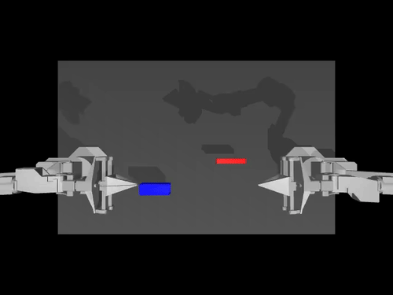

# HuggingFace LeRobot

Let's run HuggingFace [`LeRobot`](https://github.com/huggingface/lerobot/) to train Transformer-based [action diffusion](https://diffusion-policy.cs.columbia.edu/) policies and [ACT](https://github.com/tonyzhaozh/act) onboard NVIDIA Jetson.  These models learn to predict actions for a particular task from visual inputs and prior trajectories, typically collected during teleoperation or in simulation.



!!! abstract "What you need"

    1. One of the following Jetson devices:

        <span class="blobDarkGreen4">Jetson AGX Orin (64GB)</span>
        <span class="blobDarkGreen5">Jetson AGX Orin (32GB)</span>
        <span class="blobLightGreen3">Jetson Orin NX (16GB)</span>
        <span class="blobLightGreen4">Jetson Orin Nano (8GB)</span><span title="Orin Nano 8GB can run Llava-7b, VILA-7b, and Obsidian-3B">⚠️</span>
	   
    2. Running one of the following versions of [JetPack](https://developer.nvidia.com/embedded/jetpack):

        <span class="blobPink2">JetPack 6 (L4T r36.x)</span>

    3. Sufficient storage space (preferably with NVMe SSD).

        - `16.5GB` for [`lerobot`](https://hub.docker.com/r/dustynv/lerobot) container image
        - Space for models (`>2GB`)
		 
    4. Clone and setup [`jetson-containers`](https://github.com/dusty-nv/jetson-containers/blob/master/docs/setup.md){:target="_blank"}:
    
		```bash
		git clone https://github.com/dusty-nv/jetson-containers
		bash jetson-containers/install.sh
		```  
        
## Visualize Datasets

Outside of container, first launch the [rerun.io](https://rerun.io/) visualization tool that LeRobot uses <sup>[[↗]](https://github.com/huggingface/lerobot/?tab=readme-ov-file#visualize-datasets)</sup>

```bash
pip3 install rerun-sdk
rerun
```

Then, start the docker container to playback one of [these](https://huggingface.co/datasets?other=LeRobot) LeRobot datasets.

```bash
jetson-containers run -w /opt/lerobot $(autotag lerobot) \
  python3 lerobot/scripts/visualize_dataset.py \
    --repo-id lerobot/pusht \
    --episode-index 0
```

## Evaluate a Pretrained Diffusion Policy

This will download and run a pre-trained [diffusion model](https://huggingface.co/lerobot/diffusion_pusht) on the [PushT](https://github.com/huggingface/gym-pusht) environment <sup>[[↗]](https://github.com/huggingface/lerobot/?tab=readme-ov-file#evaluate-a-pretrained-policy)</sup>

```bash
jetson-containers run -w /opt/lerobot $(autotag lerobot) \
  python3 lerobot/scripts/eval.py \
    -p lerobot/diffusion_pusht \
    eval.n_episodes=10 \
    eval.batch_size=10
```


## Train your own ACT Policy

Next, train [ACT](https://github.com/tonyzhaozh/act) on the [Aloha](https://github.com/huggingface/gym-aloha) manipulation environment <sup>[[↗]](https://github.com/huggingface/lerobot/?tab=readme-ov-file#train-your-own-policy)</sup>

```bash
jetson-containers run -w /opt/lerobot $(autotag lerobot) \
  python3 lerobot/scripts/train.py \
    policy=act \
    env=aloha \
    env.task=AlohaInsertion-v0 \
    dataset_repo_id=lerobot/aloha_sim_insertion_human 
```

See [Trossen Robotics](https://www.trossenrobotics.com/aloha-kits) for dual-arm ALOHA kits, and [Robotis](https://www.robotis.us/project-bundles/) for the low-cost [Koch v1.1](https://github.com/jess-moss/koch-v1-1) kit used in the [LeRobot tutorial](https://github.com/huggingface/lerobot/blob/main/examples/7_get_started_with_real_robot.md):

<a href="https://github.com/huggingface/lerobot/blob/main/examples/7_get_started_with_real_robot.md"></a>
> HuggingFace LeRobot - Get Started with Real-World Robots ([YouTube Playlist](https://www.youtube.com/playlist?list=PLo2EIpI_JMQu5zrDHe4NchRyumF2ynaUN))
  
