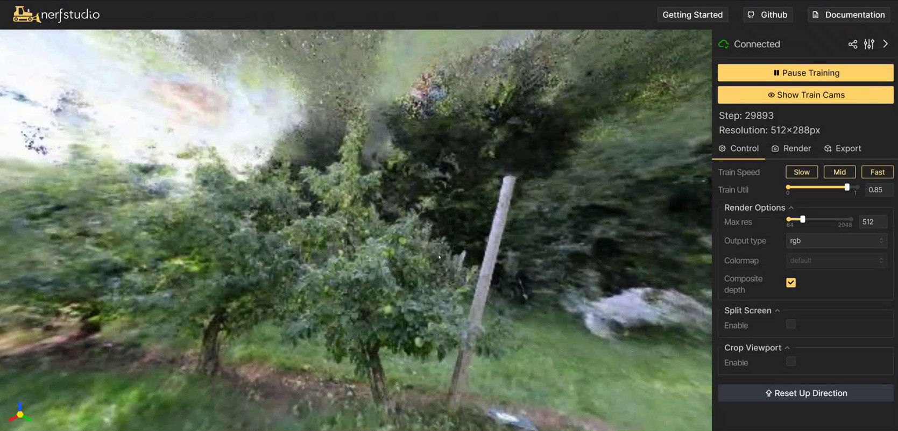
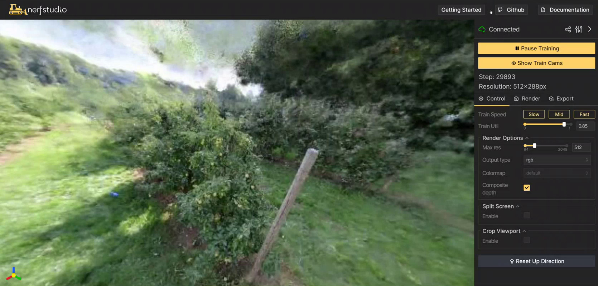

# Nerfstudio - Neural Reconstruction

[Nerfstudio](https://github.com/nerfstudio-project/nerfstudio/) is a tool for training and visualizing [Neural Radiance Fields](https://developer.nvidia.com/blog/getting-started-with-nvidia-instant-nerfs/) (NeRF) models for 3D volumetric reconstruction from a collection of images taken of a scene or environment. It's designed to be easy to use and starts generating imagery at the outset, which becomes further refined as training progresses. Neural reconstruction is being applied to edge devices and robotics like with [FruitNeRF](#fruitnerf). This tutorial will guide you through the process of training high-quality NeRF models using nerfstudio on Jetson.



> Special thanks to [Johnny Núñez Cano](https://www.linkedin.com/in/johnnycano/) for porting the NeRF stack to Jetson!  
> See [NeRF in 2023: Theory and Practice](https://www.it-jim.com/blog/nerf-in-2023-theory-and-practice) by It-Jim for useful background info.

!!! abstract "What you need"

    1. One of the following Jetson devices:

        <span class="blobDarkGreen4">Jetson AGX Orin (64GB)</span>
        <span class="blobDarkGreen5">Jetson AGX Orin (32GB)</span>
        <span class="blobLightGreen3">Jetson Orin NX (16GB)</span>

    2. Running one of the following versions of [JetPack](https://developer.nvidia.com/embedded/jetpack):

        <span class="blobPink2">JetPack 6 (L4T r36.x)</span>

    3. Sufficient storage space (preferably with NVMe SSD).

        - `17.6GB` for [`nerfstudio`](https://hub.docker.com/r/dustynv/nerfstudio) container image
        - Space for models and datasets (`>5GB`)
		 
    4. Clone and setup [`jetson-containers`](https://github.com/dusty-nv/jetson-containers/blob/master/docs/setup.md){:target="_blank"}:
    
		```bash
		git clone https://github.com/dusty-nv/jetson-containers
		bash jetson-containers/install.sh
		```  
     
## Start Container

Use this command to automatically run, build, or pull a compatible container image for nerfstudio:

```bash
jetson-containers run $(autotag nerfstudio)
```
To mount your own directories into the container, use the [`-v`](https://docs.docker.com/engine/reference/commandline/run/#volume) or [`--volume`](https://docs.docker.com/engine/reference/commandline/run/#volume) flags:

```bash
jetson-containers run -v /path/on/host:/path/in/container $(autotag nerfstudio)
```

Later a webserver will be reachable at `http://localhost:7007`.  The official docs include [command-line usage](https://docs.nerf.studio/quickstart/first_nerf.html) and models <sup>[[↗]](https://docs.nerf.studio/)</sup>

## Training Your First Model

It's recommended to train a test scene first by following these steps from the [getting started](https://docs.nerf.studio/quickstart/first_nerf.html) tutorial:

```bash
# Download some test data
ns-download-data nerfstudio --capture-name=poster

# Train model
ns-train nerfacto --data /data/nerfstudio/models
```

After it loads, you can navigate your browser to `http://localhost:7007` (or substitute your Jetson's IP address)


The 3D visualizations will begin rendering after the first training step, and progressively become more refined.  This process typically takes an hour on Jetson AGX Orin to complete the default setting of 30,000 training steps.  The model checkpoints are saved under the mounted `jetson-containers/data/nerfstudio` directory, and generate the same output quality as before.

## FruitNeRF

The creators behind [FruitNeRF](https://meyerls.github.io/fruit_nerf/) fused NeRFs with segmentation for more accurate counting of fruits in 3D.  By training a semantic neural radiance field on both RGB and segmentation labels from [SAM](vit/tutorial_sam.md), the model is robust to occlusions, double-counting, and mistaken or undesirable fruits. 

<video class="video" controls autoplay muted playsinline="" width="70%" src="https://meyerls.github.io/fruit_nerf/static/videos/rgb_semantic_mask.mp4"></video>

Extended sampling of the volumetric grid can then blob objects for pose estimation, occupancy mapping, and navigation. Such approaches are promising for combining the strengths of NeRFs for 3D reconstruction, segmentation VITs for open-vocabulary classification, and Jetson's onboard compute for high-definition environmental scanning and perception while in the field.

## Data Preparation

We'll use the FruitNeRF [datasets](https://zenodo.org/records/10869455) as an example of training NeRFs on custom data with nerfstudio.  To train a NeRF model on a different scene, you first need to capture a set of images and corresponding camera poses (which can be estimated with the included photogrammetry and image registration tools like COLMAP and OpenSFM as shown [here](https://docs.nerf.studio/quickstart/custom_dataset.html))
  
The images should be taken from different viewpoints of the scene you want to model, structured in the nerfstudio [dataset format](https://docs.nerf.studio/quickstart/data_conventions.html).  For FruitNeRF, you can just download and extract pre-recorded real or synthetic data from [here](https://zenodo.org/records/10869455):

=== "Real Data"

    ```bash
    cd /data/nerfstudio
    wget https://zenodo.org/records/10869455/files/FruitNeRF_Real.zip
    unzip FruitNeRF_Real.zip
    mv FruitNeRF_Dataset/tree_01/semantics_sam FruitNeRF_Dataset/tree_01/semantics
    ```

=== "Synthetic data"

    ```bash
    cd /data/nerfstudio
    wget https://zenodo.org/records/10869455/files/FruitNeRF_Synthetic.zip
    unzip FruitNeRF_Synthetic.zip
    mv FruitNeRF_Dataset/tree_01/semantics_sam FruitNeRF_Dataset/tree_01/semantics
    ```

## Training a FruitNeRF Model 

This command will generate a NeRF on the first tree (there are multiple trees to try from each dataset).  You can find the complete usage information and models on the official GitHub repo: [`github.com/meyerls/FruitNeRF`](https://github.com/meyerls/FruitNeRF)

```bash 
ns-train nerfacto \
  --data /data/nerfstudio/FruitNeRF_Dataset/tree_01 \
  --output-dir /data/nerfstudio/models \
  --pipeline.datamanager.camera-res-scale-factor 0.5
```

The memory usage depends on the number of images in the dataset and their resolution, so if you're running low on memory try adjusting the scaling factors and image sampling parameters. The simulated data has a lower resolution and can run at full size.




