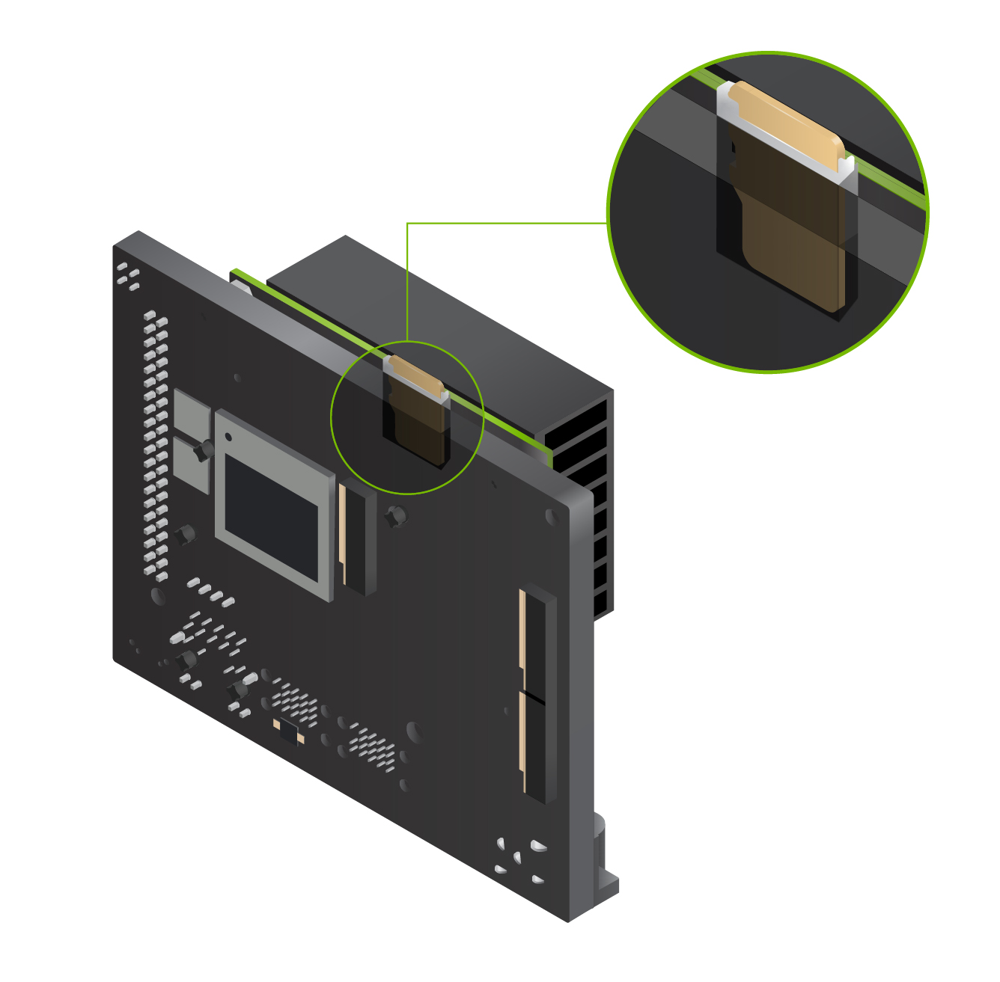

# Initial Setup Guide for Jetson Orin Nano Developer Kit

{ width="300"  align=right}

!!! note
    This guide is to supplement the officieal [**Jetson Orin Nano Deve3loper Kit Getting Started Guide**](https://developer.nvidia.com/embedded/learn/get-started-jetson-orin-nano-devkit).

The NVIDIA® Jetson Orin Nano™ Developer Kit is a perfect kit to start your journey of local generative AI evaluation and development.

This guide explains the complete flow from opening the box, flashing SD card, and the initial software setup, so that you will be ready for tutorials listed on this site.

## Check your inventory

Following item is needed or highlighly desired to set up your Jetson Orin Nano Developer Kit. 
If you don't have them in your inventory, you want to arrange them and come back to this guide once they are available.

!!! warning "What not come in the box - What you need/want to prepare"   

    ### Storage
    
    - :material-checkbox-blank-outline: microSD card (64GB or bigger) 
    - :material-checkbox-blank-outline: NVMe SSD (Optional, but highly recommended for following tutorials on this site)

      

    ### Mean to access terminal

    You need to at either of the following.

    - :material-checkbox-blank-outline: DisplayPort cable and DisplayPort capable monitor
    - :material-checkbox-blank-outline: DisplayPort to HDMI cable and HDMI capable monitor or TV
    - :material-checkbox-blank-outline: USB to TTL Serial cable (Advanced)

    You will need to 

## Open the box

!!! info "What you find in the box"

    
    ### :material-checkbox-marked-outline: Jetson Orin Nano Developer Kit

    The Jetson Orin Nano Developer Kit consists of Jetson Orin Nano module (enlarged SO-DIMM form factor), and the reference carrier board.

    It is designed to use a microSD card as the primary storage, thus the module (that has a big black heatsink with a fan) has a microSD card slot at the bottom side of the module.

    ### :material-checkbox-marked-outline: 19V DC power supply

## Download the SD card image

