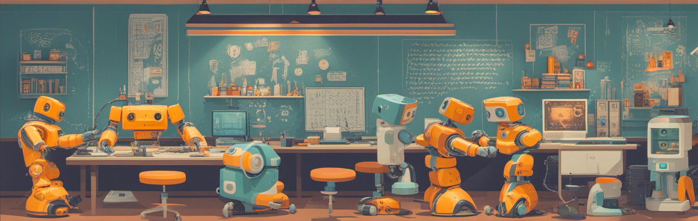
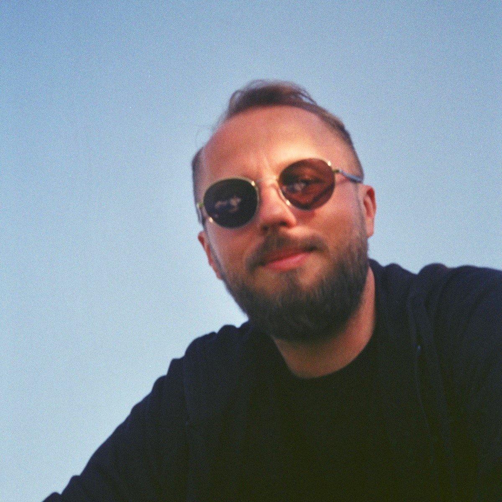
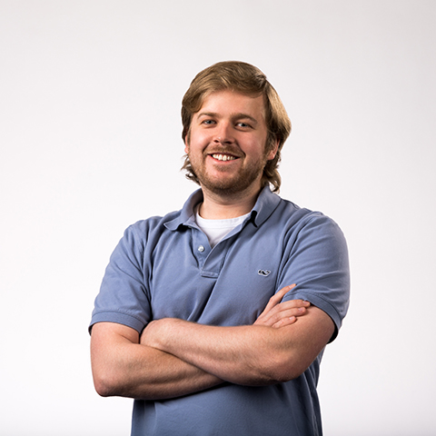
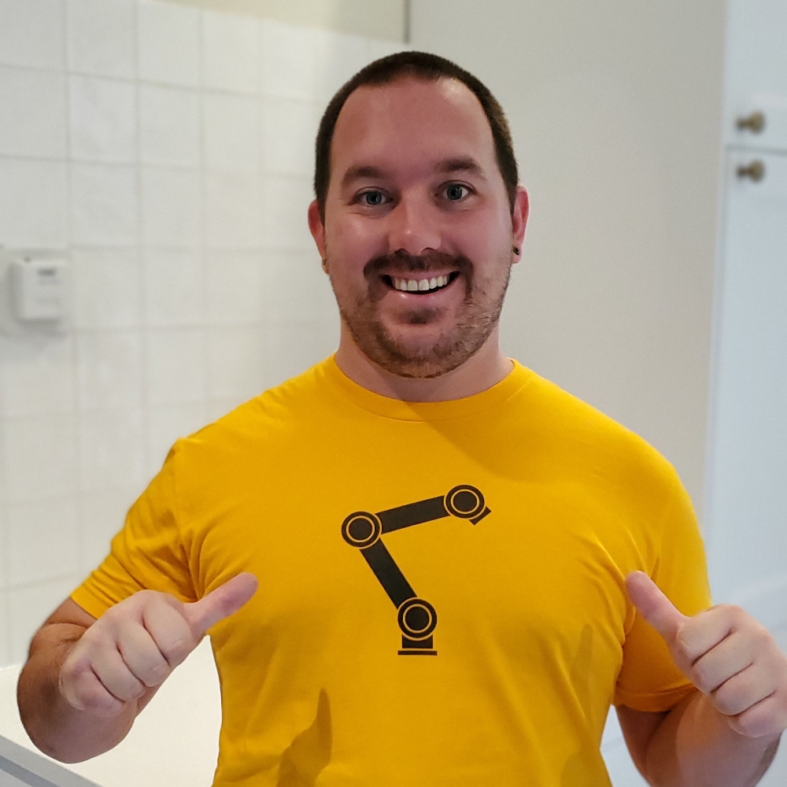
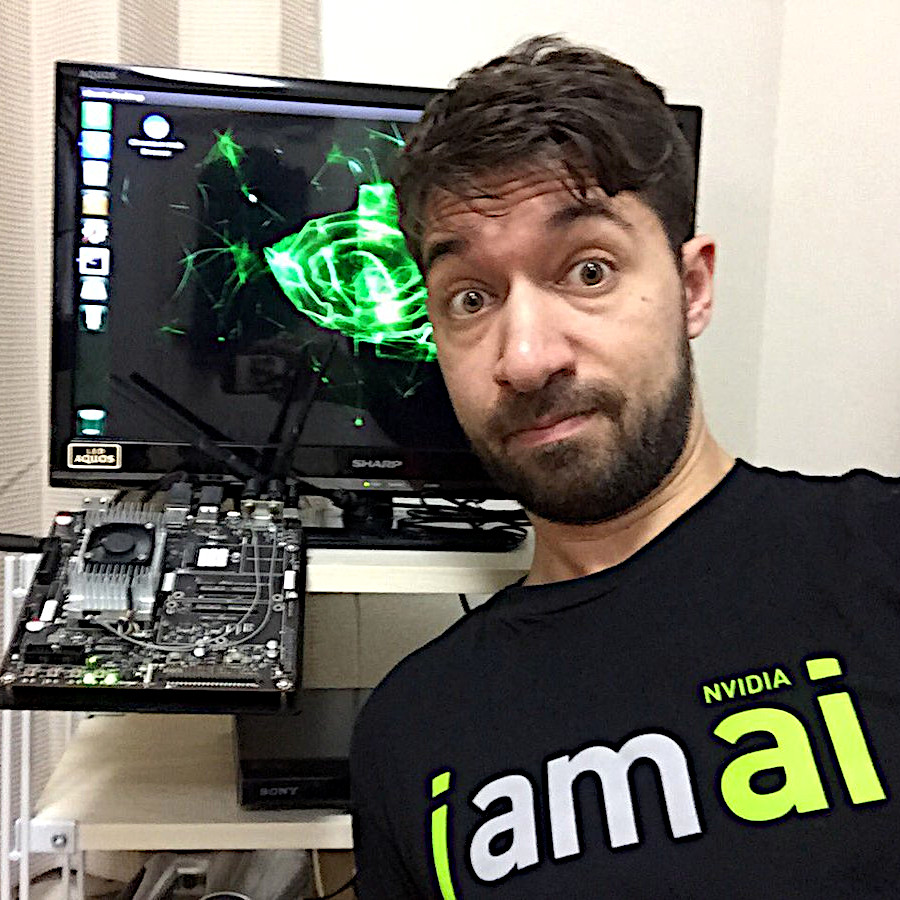

# Jetson AI Lab Research Group

The Jetson AI Lab Research Group is a global collective for advancing open-source Edge ML, open to anyone to join and collaborate with others from the community and leverage each other's work. Our goal is using advanced AI for good in real-world applications in accessible and responsible ways. By coordinating together as a group, we can keep up with the rapidly evolving pace of AI and more quickly arrive at deploying intelligent multimodal agents and autonomous robots into the field.

There are virtual [meetings](#meeting-schedule) that anyone is welcome to join, offline discussion on the [Jetson Projects](https://forums.developer.nvidia.com/c/agx-autonomous-machines/jetson-embedded-systems/jetson-projects/78){:target="_blank"} forum, and guidelines for upstreaming open-source [contributions](#contribution-guidelines). 

!!! abstract "Upcoming Meetings"
    **Regular Series Begins: 2nd Tuesday of every month starting September 9, 2025**
    
    We are pleased to announce the resumption of the Jetson AI Lab Research Group Community calls. The primary objective of these calls remains consistent with our past meetings. We aim to discuss emerging trends, share insights on exciting projects undertaken by members of this group, address any issues or roadblocks, and explore new frameworks and libraries, among other topics.
    
    We will share more details during the call. We look forward to reconnecting with all of you.
    
    Join the [Discord](https://discord.gg/BmqNSK4886){:target="_blank"} server to stay involved and receive the latest updates.

## Research Topics

Our group explores cutting-edge research areas in edge AI and robotics. These topics represent our current focus areas and will evolve as the state-of-the-art progresses and new challenges emerge:

<table>
  <tr>
    <td>• Controller LLMs for dynamic pipeline code generation</td>
    <td>• Fine-tuning LLM/VLM onboard Jetson AGX Orin 64GB</td>
  </tr>
  <tr>
    <td>• HomeAssistant.io integration for smart home [<a href="https://www.home-assistant.io" target="_blank">1</a>] [<a href="https://github.com/dusty-nv/jetson-containers/pull/442" target="_blank">2</a>]</td>
    <td>• Continuous multi-image VLM streaming and change detection</td>
  </tr>
  <tr>
    <td>• Recurrent LLM architectures (Mamba, RKVW, etc) [<a href="https://github.com/dusty-nv/jetson-containers/issues/447" target="_blank">1</a>]</td>
    <td>• Lightweight low-memory streaming ASR/TTS models</td>
  </tr>
  <tr>
    <td>• Diffusion models for image processing and enhancement</td>
    <td>• Time Series Forecasting with Transformers [<a href="https://huggingface.co/blog/autoformer" target="_blank">1</a>] [<a href="https://github.com/time-series-foundation-models/lag-llama" target="_blank">2</a>]</td>
  </tr>
  <tr>
    <td>• Guidance, grammars, and guardrails for constrained output</td>
    <td>• Inline LLM function calling / plugins from API definitions</td>
  </tr>
  <tr>
    <td>• ML DevOps, edge deployment, and orchestration</td>
    <td>• Robotics, IoT, and cyberphysical systems integration</td>
  </tr>
</table>

## Contribution Guidelines

When experiments are successful, we package the results in ways that make them easily reusable for others to integrate into their own projects. We encourage contributions through multiple channels:

	
		<ul>
			<li>Open-source libraries & code on GitHub</li>
			<li>Models on <a href="https://huggingface.co/models" target="_blank">HuggingFace Hub</a></li>
			<li>Containers provided by <a href="https://github.com/dusty-nv/jetson-containers" target="_blank">jetson-containers</a></li>
			<li>Discussions on the <a href="https://forums.developer.nvidia.com/c/agx-autonomous-machines/jetson-embedded-systems/jetson-projects/78" target="_blank">Jetson Projects</a> forum</li>
			<li>Documentation & tutorials on Jetson AI Lab</li>
			<li><a href="https://www.hackster.io/" target="_blank">Hackster.io</a> for hardware-centric builds</li>
		</ul>
	
	
		
	

Ongoing technical discussions are encouraged to occur on the forums, Discord, or GitHub Issues, with status updates on projects given during the meetings.

## Meeting Schedule

**Regular Series: 2nd Tuesday of every month starting September 9, 2025**

We hold virtual meetings that anyone is welcome to join and speak during. We discuss the latest updates and experiments that we want to explore. Please remain courteous to others during the calls. We'll stick around after for anyone who has questions or didn't get the chance to be heard.

!!! abstract "Next Meeting: Tuesday, September 9th, 2025"

	- **Time:** 9:00 AM PST / 12:00 PM EST / 5:00 PM GMT
	- **Platform:** Microsoft Teams
	- **Meeting Link:** [Join Meeting](https://teams.microsoft.com/l/meetup-join/19%3ameeting_ZWUwNTIxYmQtNGJmZC00MDA1LTkzN2MtYmFmMzJjZWUxNDFh%40thread.v2/0?context=%7b%22Tid%22%3a%2243083d15-7273-40c1-b7db-39efd9ccc17a%22%2c%22Oid%22%3a%223e5863c5-26ea-489e-a546-cdc43df532ed%22%7d){:target="_blank"}
	- **Meeting ID:** `288 976 487 014 3`
	- **Passcode:** `6oG2uK2A`

!!! abstract "Future Meetings"

	- **October 14th, 2025** - 2nd Tuesday
	- **November 11th, 2025** - 2nd Tuesday  
	- **December 9th, 2025** - 2nd Tuesday
	- **January 13th, 2026** - 2nd Tuesday

Please join the `#events` channel on the [Discord](https://discord.gg/BmqNSK4886){:target="_blank"} server for the latest info. The meetings will be recorded so anyone unable to attend live can watch them after.

## Past Meetings

Our meeting recordings and resources are available for review and reference.

Recordings Archive

<h3><strong>Microsoft Teams:</strong> (August 2025 - present)</h3>
<table>
  <thead>
    <tr><th>Date</th><th>Topic</th><th>Link</th></tr>
  </thead>
  <tbody>
    <tr>
      <td>Sep 9, 2025</td>
      <td>Jetson Community Back-to-School call</td>
      <td>TBD</td>
    </tr>
    <tr>
      <td>Aug 13, 2025</td>
      <td>Jetson Community Q3 Kick-of call & new format</td>
      <td><a href="https://nvidia-my.sharepoint.com/personal/zlo_nvidia_com/_layouts/15/stream.aspx?id=%2fpersonal%2fzlo_nvidia_com%2fDocuments%2fRecordings%2fJetson+AI+Lab+Research+Group+Call+-+One-time+kickoff+Wed+Aug+13%2c+2025-20250813_090244-Meeting+Recording.mp4&referrer=StreamWebApp.Web&referrerScenario=AddressBarCopied.view.31c337e8-488b-47c0-b4f8-c597d7a99728&xsdata=MDV8MDJ8YXNpZXJAbnZpZGlhLmNvbXxjODRmODZiNTcyMTc0ZGIwNzQ3YjA4ZGRkYzJkODVjM3w0MzA4M2QxNTcyNzM0MGMxYjdkYjM5ZWZkOWNjYzE3YXwwfDB8NjM4OTA4ODEwMjU4NzE2MjE5fFVua25vd258VFdGcGJHWnNiM2Q4ZXlKRmJYQjBlVTFoY0draU9uUnlkV1VzSWxZaU9pSXdMakF1TURBd01DSXNJbEFpT2lKWGFXNHpNaUlzSWtGT0lqb2lUV0ZwYkNJc0lsZFVJam95ZlE9PXwwfHx8&sdata=eUFzVHB1emtCd0ZPYUJ2KzBwTHcwYmFjRCs2bTFFZkl5aVF0d01FUDRyYz0%3d" target="_blank">Recording</a></td>
    </tr>
  </tbody>
</table>
<h3><strong>Google Drive:</strong> (October 2024 - August 2025)</h3>

<a href="https://drive.google.com/drive/folders/18BC7o32jorx_LzZXx5wW0Io_nf1ZwO6X?usp=sharing" target="_blank">Jetson AI Lab Research Group Recordings</a>

<h3><strong>Youtube Developer Channel:</strong> (April 2024 - October 2024)</h3>

October 15, 2024

		
<iframe width="850" height="476" src="https://www.youtube.com/embed/Dpe48AVKc4c" style="margin-top: 1em;" title="YouTube video player" frameborder="0" allow="accelerometer; autoplay; clipboard-write; encrypted-media; gyroscope; picture-in-picture; web-share" allowfullscreen></iframe>

Topics Covered:

<ul>
    <li><a href="./lerobot" target="_blank">HuggingFace LeRobot</a> (Chitoku Yato)</li>
    <li><a href="https://www.davesarmoury.com/" target="_blank">Stanley H1 Humanoid</a> (Dave Niewinski)</li>
</ul>

October 1, 2024

		
<iframe width="850" height="476" src="https://www.youtube.com/embed/HfJR3NwsM4M" style="margin-top: 1em;" title="YouTube video player" frameborder="0" allow="accelerometer; autoplay; clipboard-write; encrypted-media; gyroscope; picture-in-picture; web-share" allowfullscreen></iframe>

Topics Covered:

<ul>
    <li><a href="https://nvidia-ai-iot.github.io/remembr/" target="_blank">ReMEmbR: Long-Horizon Memory for Navigation</a> (Abrar Anwar)</li>
    <li><a href="https://3d-diffusion-policy.github.io/" target="_blank">Diffusion Policies</a>, <a href="https://github.com/qizekun/ShapeLLM" target="_blank">Shape LLM</a>, <a href="https://paperswithcode.com/sota/3d-point-cloud-classification-on-scanobjectnn" target="_blank">3D Encoders</a></li>
</ul>

September 17, 2024

		
<iframe width="850" height="476" src="https://www.youtube.com/embed/Gys_AUOYZ4c" style="margin-top: 1em;" title="YouTube video player" frameborder="0" allow="accelerometer; autoplay; clipboard-write; encrypted-media; gyroscope; picture-in-picture; web-share" allowfullscreen></iframe>

Topics Covered:

<ul>
    <li><a href="https://github.com/nasa-jpl/rosa" target="_blank">NASA JPL - ROSA</a> (Rob Royce & Shehryar Khattak)</li>
    <li><a href="https://www.jetson-ai-lab.com/lerobot.html" target="_blank">LeRobot Walkthrough</a> (Chitoku Yato)</li>
	<li><a href="https://medium.com/@kabilankb2003/building-a-multimodal-ai-agent-integrating-vision-language-models-in-nvidia-isaac-sim-with-jetson-20592d4ef6c5" target="_blank">VLM Agent in Isaac Sim/ROS</a> (Kabilan Kb)</li>
</ul>

September 3, 2024

		
<iframe width="850" height="476" src="https://www.youtube.com/embed/r1i3QQrRnfI" style="margin-top: 1em;" title="YouTube video player" frameborder="0" allow="accelerometer; autoplay; clipboard-write; encrypted-media; gyroscope; picture-in-picture; web-share" allowfullscreen></iframe>

Topics Covered:

<ul>
    <li><a href="https://github.com/dusty-nv/jetson-containers/tree/master/packages/nerf/nerfstudio" target="_blank">Edge NeRF's and nerfstudio</a> (Johnny Núñez Cano)</li>
    <li>Review of <a href="https://www.jetson-ai-lab.com/openvla.html" target="_blank">OpenVLA results</a> (Dustin Franklin)</li>
	<li><a href="https://github.com/tekntrash/oculusdobotcontrol/" target="_blank">Oculus Interface for Jetson</a> (Al Costa)</li>
	<li><a href="https://developer.nvidia.com/blog/new-foundational-models-and-training-capabilities-with-nvidia-tao-5-5/" target="_blank">TAO Toolkit 5.5</a></li>
</ul>

August 20, 2024

		
<iframe width="850" height="476" src="https://www.youtube.com/embed/WOv_GymDDNs" style="margin-top: 1em;" title="YouTube video player" frameborder="0" allow="accelerometer; autoplay; clipboard-write; encrypted-media; gyroscope; picture-in-picture; web-share" allowfullscreen></iframe>

Topics Covered:

<ul>
    <li><a href="https://www.jetson-ai-lab.com/ros.html" target="_blank">GenAI ROS Nodes for VLM</a> (Khannah Shaltiel)</li>
	<li><a href="https://github.com/kabilan2003/NVIDIA-Isaac-Sim-and-Isaac-ROS-Integration-on-Jetson-Orin-Nano" target="_blank">Isaac Sim and Orin Nano with Hardware-in-the-Loop</a> (Kabilan Kb)</li>
	<li><a href="https://www.miruml.com/" target="_blank">Miru Edge Deployment Infrastructure</a> (Vedant Nair)</li>
</ul>

August 6, 2024

		
<iframe width="850" height="476" src="https://www.youtube.com/embed/W1o-9MZQYMA" style="margin-top: 1em;" title="YouTube video player" frameborder="0" allow="accelerometer; autoplay; clipboard-write; encrypted-media; gyroscope; picture-in-picture; web-share" allowfullscreen></iframe>

Topics Covered:

<ul>
    <li>OpenVLA Fine-Tuning</li>
	<li>Gemma-2-2b (Asier Arranz)</li>
	<li>Ultralytics YOLOv8 (Lakshantha Dissanayake)</li>
</ul>

July 23, 2024

		
<iframe width="850" height="476" src="https://www.youtube.com/embed/pURku7OAWuo" style="margin-top: 1em;" title="YouTube video player" frameborder="0" allow="accelerometer; autoplay; clipboard-write; encrypted-media; gyroscope; picture-in-picture; web-share" allowfullscreen></iframe>

Topics Covered:

<ul>
    <li><a href="https://huggingface.co/blog/llama31" target="_blank">Llama-3</a> Function & Specs</a></li>
	<li>OpenVLA with <a href="https://mimicgen.github.io/" target="_blank">MimicGen</a></li>
	<li><a href="https://techcommunity.microsoft.com/t5/educator-developer-blog/running-phi-3-vision-via-onnx-on-jetson-platform/ba-p/4195041" target="_blank">Phi-3 Vision via ONNX</a> (Jambo Chen)</li>
    <li><a href="https://genainerds.com/#/Gapi" target="_blank">OStream GenRunner</a> (Kerry Shih)</li>
</ul>

July 9, 2024

		
<iframe width="850" height="476" src="https://www.youtube.com/embed/Ngaq2WCDlZM" style="margin-top: 1em;" title="YouTube video player" frameborder="0" allow="accelerometer; autoplay; clipboard-write; encrypted-media; gyroscope; picture-in-picture; web-share" allowfullscreen></iframe>

Topics Covered:

<ul>
	<li>OpenVLA Quantization (<a href="https://openvla.github.io/" target="_blank">openvla.github.io</a>)</li>
	<li>visualnav-transformer (<a href="https://github.com/robodhruv/visualnav-transformer" target="_blank">robodhruv/visualnav-transformer</a>)</li>
    <li>Florence-2, Holoscan, Grammars (Nigel Nelson, <a href="https://github.com/nvidia-holoscan/holohub/tree/main/applications/florence-2-vision" target="_blank">florence-2-vision</a>)</li>
    <li>LLaMa-Factory (<a href="https://github.com/hiyouga/LLaMA-Factory" target="_blank">hiyouga/LLaMA-Factory</a>)</li>
</ul>

June 25, 2024

		
<iframe width="850" height="476" src="https://www.youtube.com/embed/mIrxJiF1NiI" style="margin-top: 1em;" title="YouTube video player" frameborder="0" allow="accelerometer; autoplay; clipboard-write; encrypted-media; gyroscope; picture-in-picture; web-share" allowfullscreen></iframe>

Topics Covered:

<ul>
	<li>Function Calling in Agent Studio</li>
	<li><a href="https://www.jetson-ai-lab.com/tutorial_jetson-copilot.html">Jetson Copilot</a> (Chitoku Yato)</li>
    <li><a href="https://docs.nvidia.com/jetson/jps/moj-overview.html" target="_blank">Jetson Platform Services</a> (Sammy Ochoa)</li>
    <li><a href="https://www.hackster.io/shahizat/fine-tuning-llms-using-nvidia-jetson-agx-orin-b17c4d" target="_blank">On-device Fine-tuning</a> (Nurgaliyev Shakhizat)</li>
</ul>

June 11, 2024

		
<iframe width="850" height="476" src="https://www.youtube.com/embed/0GV5cYKz7Rc" style="margin-top: 1em;" title="YouTube video player" frameborder="0" allow="accelerometer; autoplay; clipboard-write; encrypted-media; gyroscope; picture-in-picture; web-share" allowfullscreen></iframe>

Topics Covered:

<ul>
	<li>Agent Studio</li>
	<li>HomeAssistant 2024.6</li>
	<li>AWS IoT Greengrass (Romil Shah)</li>
</ul>

May 29, 2024

		
<iframe width="850" height="476" src="https://www.youtube.com/embed/aq7QS9AtwE8" style="margin-top: 1em;" title="YouTube video player" frameborder="0" allow="accelerometer; autoplay; clipboard-write; encrypted-media; gyroscope; picture-in-picture; web-share" allowfullscreen></iframe>

Topics Covered:

<ul>
	<li>OpenAI-style Tools with <a href="https://huggingface.co/NousResearch/Hermes-2-Pro-Llama-3-8B" target="_blank">NousResearch/Hermes-2-Pro-Llama-3-8B</a></li>
	<li>Jetson Copilot with <a href="https://github.com/dusty-nv/jetson-containers/tree/master/packages/rag/jetrag" target="_blank">jetrag</a></li>
	<li><a href="https://github.com/NVIDIA-AI-IOT/whisper_trt" target="_blank">whisper_trt</a> for Orin Nano</li>
</ul>

May 15, 2024

		
<iframe width="850" height="476" src="https://www.youtube.com/embed/zoyONbiHd14" style="margin-top: 1em;" title="YouTube video player" frameborder="0" allow="accelerometer; autoplay; clipboard-write; encrypted-media; gyroscope; picture-in-picture; web-share" allowfullscreen></iframe>

Topics Covered:

<ul>
	<li><a href="https://forums.developer.nvidia.com/t/new-vila-1-5-multimodal-vision-language-models-released-in-3b-8b-13b-40b/291784" target="_blank">VILA-1.5 on Video Sequences</a></li>
	<li>Voicecraft Container (<a href="https://github.com/dusty-nv/jetson-containers/pull/498" target="_blank">Martin Cerven</a>)</li>
	<li>JetBot / Nanosaur Updates for Orin Nano (Chitoku Yato & Raffaello Bonghi)</li>
	<li>Controller LLM & Advanced Function Calling (<a href="https://huggingface.co/NousResearch/Hermes-2-Pro-Llama-3-8B" target="_blank"><code>NousResearch/Hermes-2-Pro-Llama-3-8B</code></a>)</li>
	<li>RAG Samples with LlamaIndex (Chitoku Yato)</li>
</ul>

May 1, 2024

		
<iframe width="850" height="476" src="https://www.youtube.com/embed/L4i5x8zzyNc" style="margin-top: 1em;" title="YouTube video player" frameborder="0" allow="accelerometer; autoplay; clipboard-write; encrypted-media; gyroscope; picture-in-picture; web-share" allowfullscreen></iframe>

Topics Covered:

<ul>
	<li><a href="https://forums.developer.nvidia.com/t/jetson-ai-lab-agent-controller-llm/288229/2" target="_blank">Function Calling with Llama-3</a></li>
	<li><a href="https://forums.developer.nvidia.com/t/jetson-ai-lab-home-assistant-integration/288225" target="_blank">Home Assistant / Wyoming (Mieszko Syty)</a></li>
	<li><a href="https://forums.developer.nvidia.com/t/system-to-capture-consumption-data-measuring-weight-and-temperature-of-products-disposed/290402" target="_blank">Smart Sorting / Recycling (Alvaro Costa)</a></li>
</ul>

April 17, 2024

		
<iframe width="850" height="476" src="https://www.youtube.com/embed/F0v0OsqGsVw" style="margin-top: 1em;" title="YouTube video player" frameborder="0" allow="accelerometer; autoplay; clipboard-write; encrypted-media; gyroscope; picture-in-picture; web-share" allowfullscreen></iframe>

Topics Covered:

<ul>
	<li><a href="https://forums.developer.nvidia.com/t/introducing-ollama-support-for-jetson-devices/289333" target="_blank">Ollama Support for Jetson Devices</li>
	<li><a href="https://forums.developer.nvidia.com/t/jetson-ai-lab-homeassistant-io-integration/288225" target="_blank">Home Assistant Integration</a></li>
	<li><a href="https://forums.developer.nvidia.com/t/jetson-ai-lab-ml-devops-containers-core-inferencing/288235/15?u=dusty_nv" target="_blank"><code>jetson-container</code> Updates</a></li>
	<li>Upgrading JetBot with Orin Nano</a></li>
</ul>

April 3, 2024

		
<iframe width="850" height="476" src="https://www.youtube.com/embed/7w3RHoIIkNE" style="margin-top: 1em;" title="YouTube video player" frameborder="0" allow="accelerometer; autoplay; clipboard-write; encrypted-media; gyroscope; picture-in-picture; web-share" allowfullscreen></iframe>

Project Kickoffs:

<ul>
	<li><a href="https://forums.developer.nvidia.com/t/jetson-ai-lab-homeassistant-io-integration/288225" target="_blank">Home Assistant Integration</a></li>
	<li><a href="https://forums.developer.nvidia.com/t/jetson-ai-lab-controller-agent-llm/288229" target="_blank">Agent Controller LLM</li>
	<li><a href="https://forums.developer.nvidia.com/t/jetson-ai-lab-ml-devops-containers-core-inferencing/288235" target="_blank">ML DevOps, Containers, Core Inferencing</a></li>
</ul>

		

## Team Members

Our research group brings together experts from academia, industry, and the open-source community who are passionate about advancing edge AI and robotics. Below are some of our sustaining members who have been actively contributing to generative AI in edge computing:

### Core Contributors

	

		

			<a href="https://www.linkedin.com/in/dustin-franklin-b3aaa173/" target="_blank"></img></a> 
			<a href="https://www.linkedin.com/in/dustin-franklin-b3aaa173/" target="_blank"></img></a>
			<a href="https://www.youtube.com/playlist?list=PL5B692fm6--sdf3tQk-1kp9T65y8p-D5u" target="_blank"></img></a>
			<a href="https://www.github.com/dusty-nv" target="_blank"></img></a>
			Dustin Franklin, NVIDIA 
			<small>
				Principal Engineer | Pittsburgh, PA 
				(<a href="https://github.com/dusty-nv/jetson-inference" target="_blank">jetson-inference</a>, <a href="https://github.com/dusty-nv/jetson-containers" target="_blank">jetson-containers</a>)
			</small>
		

	

	

		

			<a href="https://www.hackster.io/shahizat" target="_blank"></img></a> 
			<a href="https://www.linkedin.com/in/shakhizat-nurgaliyev/" target="_blank"></img></a>
			<a href="https://www.hackster.io/shahizat" target="_blank"></img></a>
			Nurgaliyev Shakhizat 
			<small>
				Institute of Smart Systems and AI | Kazakhstan 
				(<a href="https://www.hackster.io/shahizat/ai-powered-application-for-the-blind-and-visually-impaired-df3f9e" target="_blank">Assistive Devices</a>, <a href="https://www.hackster.io/shahizat/vision2audio-giving-the-blind-an-understanding-through-ai-33f929" target="_blank">Vision2Audio</a>, <a href="https://www.hackster.io/shahizat/running-a-chatgpt-like-llm-llama2-on-a-nvidia-jetson-cluster-cbc7d4" target="_blank">HPC</a>)
			</small>
		

	

	

		

            <a href="https://www.youtube.com/@kerseyfabs" target="_blank"></img></a> 
			<a href="https://www.linkedin.com/in/kriskersey/" target="_blank"></img></a>
			<a href="https://www.youtube.com/@kerseyfabs" target="_blank"></img></a>
			Kris Kersey, <small>Kersey Fabrications</small> 
			<small>
				Embedded Software Engineer | Atlanta, GA 
				(<a href="https://www.youtube.com/@oasis-project" target="_blank">The OASIS Project</a>, AR/VR, 3D Fabrication)
			</small>
		

	

	

		

			<a href="https://www.linkedin.com/in/johnnycano/" target="_blank"></img></a> 
			<a href="https://www.linkedin.com/in/johnnycano/" target="_blank"></img></a>
			<a href="https://github.com/johnnynunez" target="_blank"></img></a>
			Johnny Núñez Cano 
			<small>
				PhD Researcher in CV/AI | Barcelona, Spain 
				(Recurrent LLMs, Pose & Behavior Analysis)
			</small>
		

	

	

		

			<a href="https://www.linkedin.com/in/doruk-sonmez/" target="_blank"></img></a> 
			<a href="https://www.linkedin.com/in/doruk-sonmez/" target="_blank"></img></a>
			<a href="https://github.com/doruksonmez" target="_blank"></img></a>
			Doruk Sönmez, <a href="https://connecttech.com/jetson/" target="_blank">ConnectTech</a> 
			<small>
				Intelligent Video Analytics Engineer | Turkey 
				(NVIDIA DLI Certified Instructor, IVA, VLM)
			</small>
		

	

	

		

			<a href="https://github.com/kingardor" target="_blank"></img></a> 
			<a href="https://www.linkedin.com/in/akashjames/" target="_blank"></img></a>
			<a href="https://www.youtube.com/channel/UCgJZkbxrBpbuHv4jOFuR8zQ" target="_blank"></img></a>
			<a href="https://github.com/kingardor" target="_blank"></img></a>
			Akash James, <a href="https://www.sparkcognition.com/" target="_blank"><small>Spark Cognition</small></a> 
			<small>
				AI Architect, UC Berkeley Researcher | Oakland 
				(NVIDIA AI Ambassador, <a href="https://www.youtube.com/channel/UCgJZkbxrBpbuHv4jOFuR8zQ" target="_blank">Personal Assistants</a>)
			</small>
		

	

	

		

			<a href="https://www.linkedin.com/in/mieszkosyty/" target="_blank"></img></a> 
			<a href="https://www.youtube.com/@FutureProofHomes" target="_blank"></img></a>
			<a href="https://www.linkedin.com/in/mieszkosyty/" target="_blank"></img></a>
			<a href="https://github.com/ms1design" target="_blank"></img></a>
			Mieszko Syty, <a href="https://futureproofhomes.net/" target="_blank">FutureProofHomes</a> 
			<small>
				AI/ML Engineer | Warsaw, Poland 
				(LLM, ML DevOps, Edge AI, Home Assistant, <a href="https://futureproofhomes.net/pages/ai-base-station" target="_blank">Nexus: AI Home Assistant</a>, <a href="https://github.com/dusty-nv/jetson-containers" target="_blank">jetson-containers</a>)
			</small>
		

	
	
	

		

			<a href="https://jetsonhacks.com/" target="_blank"></img></a> 
			<a href="https://www.youtube.com/@JetsonHacks" target="_blank"></img></a>
			<a href="https://github.com/jetsonhacks" target="_blank"></img></a>
			Jim Benson, <a href="https://jetsonhacks.com/" target="_blank">JetsonHacks</a> 
			<small>
				DIY Extraordinaire | Los Angeles, CA 
				(AI in Education, <a href="https://racecarj.com/" target="_blank">RACECAR/J</a>)
			</small>
		

	

	

		

			<a href="https://www.linkedin.com/in/chitoku-yato-01ba304/" target="_blank"></img></a> 
			<a href="https://www.linkedin.com/in/chitoku-yato-01ba304/" target="_blank"></img></a>
			<a href="https://github.com/tokk-nv" target="_blank"></img></a>
			Chitoku Yato, NVIDIA 
			<small>
				Jetson AI DevTech | Santa Clara, CA 
				(<a href="https://jetbot.org/master/" target="_blank">JetBot</a>, <a href="https://github.com/NVIDIA-AI-IOT/jetracer" target="_blank">JetRacer</a>, <a href="https://nvidia-ai-iot.github.io/jetson-min-disk/" target="_blank">MinDisk</a>, Containers)
			</small>
		

	

	

		

			<a href="https://www.linkedin.com/in/danasheahen/" target="_blank"></img></a> 
			<a href="https://www.linkedin.com/in/danasheahen/" target="_blank"></img></a>
			Dana Sheahen, NVIDIA 
			<small>
				DLI Curriculum Developer | Santa Clara, CA 
				(AI in Education, <a href="https://developer.nvidia.com/embedded/learn/jetson-ai-certification-programs" target="_blank">Jetson AI Fundamentals</a>)
			</small>
		

	
	
	

		

			<a href="https://www.linkedin.com/in/sammy-ochoa/" target="_blank"></img></a> 
			<a href="https://www.linkedin.com/in/sammy-ochoa/" target="_blank"></img></a>
			<a href="https://github.com/NVIDIA-AI-IOT/mmj_genai" target="_blank"></img></a>
			Sammy Ochoa, NVIDIA 
			<small>
				Jetson AI DevTech | Austin, TX 
				(<a href="https://developer.nvidia.com/metropolis-microservices" target="_blank">Metropolis Microservices</a>)
			</small>
		

	

	

		

			<a href="https://www.linkedin.com/in/john-w-213126183/" target="_blank"></img></a> 
			<a href="https://www.linkedin.com/in/john-w-213126183/" target="_blank"></img></a>
			<a href="https://github.com/jaybdub" target="_blank"></img></a>
			John Welsh, NVIDIA 
			<small>
				(<a href="https://www.jetson-ai-lab.com/vit/tutorial_nanoowl.html" target="_blank">NanoOWL</a>, <a href="https://www.jetson-ai-lab.com/vit/tutorial_nanosam.html" target="_blank">NanoSAM</a>, <a href="https://jetbot.org/master/" target="_blank">JetBot</a>, <a href="https://github.com/NVIDIA-AI-IOT/jetracer" target="_blank">JetRacer</a>, <a href="https://github.com/NVIDIA-AI-IOT/torch2trt" target="_blank">torch2trt</a>, <a href="https://github.com/NVIDIA-AI-IOT/trt_pose" target="_blank">trt_pose</a>, <a href="https://github.com/NVIDIA-AI-IOT/jetson-intro-to-distillation" target="_blank">Knowledge Distillation</a>)
			</small>
		

	

	

		

			<a href="https://www.davesarmoury.com/" target="_blank"></img></a> 
			<a href="https://www.linkedin.com/in/dave-niewinski-b5691132/" target="_blank"></img></a>
			<a href="https://www.youtube.com/davesarmoury" target="_blank"></img></a>
			<a href="https://github.com/dniewinski" target="_blank"></img></a>
			Dave Niewinski 
			<small>
				<a href="https://www.davesarmoury.com/" target="_blank">Dave's Armoury</a> | Waterloo, Ontario 
				(<a href="https://youtu.be/yNcKTZsHyfA" target="_blank">GLaDOS</a>, <a href="https://youtu.be/yNozb8ljpgI" target="_blank">Fetch</a>, <a href="https://youtu.be/h0uvkaR6fvo" target="_blank">Offroad La-Z-Boy</a>, <a href="https://www.youtube.com/watch?v=agUdUvgV-A8" target="_blank">KUKA Bot</a>)
			</small>
		

	

	

		

			<a href="https://rebotnix.com/" target="_blank"></img></a> 
			<a href="https://www.linkedin.com/in/gary-hilgemann-84423a6b/" target="_blank"></img></a>
			<a href="https://www.youtube.com/channel/UCJv_UknY5ueEjbko2M2Iv4Q" target="_blank"></img></a>
			<a href="https://github.com/rebotnix" target="_blank"></img></a>
			Gary Hilgemann, <a href="https://rebotnix.com/" target="_blank">REBOTNIX</a> 
			<small>
				CEO & AI Roboticist | Lünen, Germany 
				(<a href="https://rebotnix.com/gustav/" target="_blank">GUSTAV</a>, <a href="https://rebotnix.com/spike/" target="_blank">SPIKE</a>, <a href="https://rebotnix.com/visiontools/" target="_blank">VisionTools</a>, <a href="https://rebotnix.com/genai/" target="_blank">GenAI</a>)
			</small>
		

	

	

		

			<a href="https://www.seeedstudio.com/tag/nvidia.html" target="_blank"></img></a> 
			<a href="https://www.linkedin.com/in/elaine1994/" target="_blank"></img></a>
			<a href="https://www.youtube.com/channel/UCJv_UknY5ueEjbko2M2Iv4Q" target="_blank"></img></a>
			<a href="https://github.com/Seeed-Projects" target="_blank"></img></a>
			Elaine Wu, <a href="https://www.seeedstudio.com/tag/nvidia.html" target="_blank">Seeed Studio</a> 
			<small>
				AI & Robotics Partnerships | Shenzhen, China 
				(<a href="https://www.seeedstudio.com/Nvidia-Jetson-c-2016.html" target="_blank">reComputer</a>, <a href="https://wiki.seeedstudio.com/YOLOv8-TRT-Jetson/" target="_blank">YOLOv8</a>, <a href="https://github.com/Seeed-Projects/LocalJARVIS" target="_blank">LocalJARVIS</a>, <a href="https://wiki.seeedstudio.com/Local_Voice_Chatbot/" target="_blank">Voice Bot</a>)
			</small>
		

	

	

		

			<a href="https://www.linkedin.com/in/pattydelafuente/" target="_blank"></img></a> 
			<a href="https://www.linkedin.com/in/pattydelafuente/" target="_blank"></img></a>
			Patty Delafuente, NVIDIA 
			<small>
				Data Scientist & UMBC PhD Student | MD 
				(AI in Education, <a href="https://www.nvidia.com/en-us/training/teaching-kits/" target="_blank">DLI Robotics Teaching Kit</a>)
			</small>
		

	

	

		

			<a href="https://hanlab.mit.edu/songhan" target="_blank"></img></a> 
			<a href="https://www.linkedin.com/in/songhanmit/" target="_blank"></img></a>
			<a href="https://github.com/mit-han-lab" target="_blank"></img></a>
            Song Han, <a href="https://hanlab.mit.edu/" target="_blank">MIT HAN Lab</a> 
			<small>
				<a href="https://research.nvidia.com/person/song-han" target="_blank">NVIDIA Research</a> | Cambridge, MA 
				(<a href="https://github.com/Efficient-Large-Model" target="_blank">Efficient Large Models</a>, <a href="https://github.com/mit-han-lab/llm-awq" target="_blank">AWQ</a>, <a href="https://github.com/Efficient-Large-Model/VILA" target="_blank">VILA</a>)
			</small>
		

	

	

		

			<a href="https://www.linkedin.com/in/bhughes/" target="_blank"></img></a> 
			<a href="https://www.linkedin.com/in/bhughes/" target="_blank"></img></a>
			<a href="https://github.com/bryanhughes" target="_blank"></img></a>
			Bryan Hughes, Mimzy AI 
			<small>
				Founder, Entrepreneur | SF Bay Area 
				(Multimodal Assistants, AI at the Edge)
			</small>
		

	

	

		

			<a href="https://tqchen.com/" target="_blank"></img></a> 
			<a href="https://www.linkedin.com/in/tianqi-chen-679a9856/" target="_blank"></img></a>
			<a href="https://github.com/mlc-ai/mlc-llm" target="_blank"></img></a>
            Tianqi Chen, <a href="https://catalyst.cs.cmu.edu/" target="_blank">CMU Catalyst</a> 
			<small>
				<a href="https://octo.ai/" target="_blank">OctoML</a>, CTO | Seattle, WA 
				(<a href="https://llm.mlc.ai/" target="_blank">MLC</a>, <a href="https://tvm.apache.org/" target="_blank">Apache TVM</a>, <a href="https://xgboost.ai/" target="_blank">XGBoost</a>)
			</small>
		

	

	

		

			<a href="https://www.linkedin.com/in/michael-gr%C3%BCner-9249562a/" target="_blank"></img></a> 
			<a href="https://www.linkedin.com/in/michael-gr%C3%BCner-9249562a/" target="_blank"></img></a>
			<a href="https://github.com/michaelgruner" target="_blank"></img></a>
            Michael Grüner, <a href="https://www.ridgerun.com/" target="_blank">RidgeRun</a> 
			<small>
				Team Lead / Architect | Costa Rica 
				(Embedded Vision & AI, Multimedia)
			</small>
		

	

	

		

			<a href="https://www.linkedin.com/in/jesse-flot-51b50bb9/" target="_blank"></img></a> 
			<a href="https://www.linkedin.com/in/jesse-flot-51b50bb9/" target="_blank"></img></a>
            Jesse Flot, <a href="https://www.cmu.edu/roboticsacademy/" target="_blank">CMU Robotics Academy</a> 
			<small>
				Co-Director | Pittsburgh, PA 
				(<a href="https://www.cmu.edu/roboticsacademy/roboticscurriculum/nvidia_curriculum/applied_ai.html" target="_blank">Applied AI & Robotics</a>, <a href="https://www.cmu.edu/roboticsacademy/roboticscurriculum/nvidia_curriculum/autonomy_foundations.html" target="_blank">Autonomy Foundations</a>)
			</small>
		

	

	

		

			<a href="https://www.linkedin.com/in/pjdecarlo/" target="_blank"></img></a> 
			<a href="https://www.linkedin.com/in/pjdecarlo/" target="_blank"></img></a>
			<a href="https://www.hackster.io/pjdecarlo" target="_blank"></img></a>
			<a href="https://github.com/toolboc" target="_blank"></img></a>
			Paul DeCarlo, <a href="https://azure.microsoft.com/en-us/solutions/iot">Microsoft</a> 
			<small>
				Professor | University of Houston 
				(<a href="https://www.hackster.io/pjdecarlo/nvidia-deepstream-integration-with-azure-iot-central-d9f834">Azure IoT</a>, <a href="https://github.com/toolboc/Intelligent-Video-Analytics-with-NVIDIA-Jetson-and-Microsoft-Azure" target="_blank">Video Analytics</a>, <a href="https://www.hackster.io/pjdecarlo/llm-based-multimodal-ai-w-azure-open-ai-nvidia-jetson-135ff2" target="_blank">Microsoft JARVIS</a>)
			</small>
		

	

	

		

			<a href="https://www.linkedin.com/in/michael-hansen-9885b2105/" target="_blank"></img></a> 
			<a href="https://www.linkedin.com/in/michael-hansen-9885b2105/" target="_blank"></img></a>
			<a href="https://github.com/synesthesiam" target="_blank"></img></a>
            Mike Hansen, <a href="https://www.nabucasa.com/" target="_blank">Nabu Casa</a> 
			<small>
				Voice Engineering Lead | Urbandale, Iowa 
				(<a href="https://www.home-assistant.io" target="_blank">Home Assistant</a>, <a href="https://github.com/rhasspy/piper" target="_blank">Piper TTS</a>, <a href="https://github.com/rhasspy/wyoming" target="_blank">Wyoming</a>)
			</small>
		

	

	

		

			<a href="https://www.linkedin.com/in/lakshanthad/" target="_blank"></img></a> 
			<a href="https://www.linkedin.com/in/lakshanthad/" target="_blank"></img></a>
			<a href="https://github.com/lakshanthad" target="_blank"></img></a>
			<small>Lakshantha Dissanayake, <a href="https://www.ultralytics.com/" target="_blank">Ultralytics</a></small> 
			<small>
				Embedded CV Engineer | Vancouver, BC 
				(<a href="https://github.com/ultralytics/ultralytics" target="_blank">YOLOv8</a>, <a href="https://docs.ultralytics.com/integrations/tensorrt/" target="_blank">TensorRT</a>, <a href="https://docs.ultralytics.com/yolov5/tutorials/running_on_jetson_nano/" target="_blank">DeepStream</a>)
			</small>
		

	

	

		

			<a href="https://www.linkedin.com/in/kerryshih" target="_blank"></img></a> 
			<a href="https://www.linkedin.com/in/kerryshih" target="_blank"></img></a>
			<a href="https://www.youtube.com/channel/UCpxVxnt4KO2AzuV_XOE-97Q" target="_blank"></img></a>
			Kerry Shih, <a href="https://GenAINerds.com/" target="_blank">GenAI Nerds</a> 
			<small>
				Founder, CEO | Los Angeles, CA 
				(<a href="https://GenAINerds.com/#/Gapi" target="_blank">Gapi</a>)
			</small>
		

	

	

		

			<a href="https://www.ece.cmu.edu/directory/bios/Ziad%20Youssfi.html" target="_blank"></img></a> 
			<a href="https://www.linkedin.com/in/ziadyoussfi/" target="_blank"></img></a>
			Ziad Youssfi, <a href="https://www.ece.cmu.edu/directory/bios/Ziad%20Youssfi.html" target="_blank">CMU</a> 
			<small>
				ECE Professor | Pittsburgh, PA 
				(ML in Robotics & Embedded Systems)
			</small>
		

	

	

		

			<a href="https://www.linkedin.com/in/walterlucetti/" target="_blank"></img></a> 
			<a href="https://www.linkedin.com/in/walterlucetti/" target="_blank"></img></a>
			<a href="https://github.com/Myzhar" target="_blank"></img></a>
			Walter Lucetti, <a href="https://www.stereolabs.com" target="_blank">Stereolabs</a> 
			<small>
				Robotics & Vision Engineer | Paris, France 
				(<a href="https://www.myzhar.com" target="_blank">MyzharBot</a>, <a href="https://github.com/stereolabs/zed-ros2-wrapper" target="_blank">ROS2</a>, <a href="https://github.com/stereolabs/zed-gstreamer" target="_blank">GStreamer</a>)
			</small>
		

	

	

		

			<a href="https://rnext.it/" target="_blank"></img></a> 
			<a href="https://www.linkedin.com/in/raffaello-bonghi/" target="_blank"></img></a>
			<a href="https://github.com/rbonghi" target="_blank"></img></a>
			<a href="https://www.youtube.com/@rbonghi" target="_blank"></img></a>
			Raffaello Bonghi, NVIDIA 
			<small>
				AI & Robotics Engineer | Manchester, UK 
				(<a href="https://nanosaur.ai/" target="_blank">Nanosaur</a>, <a href="https://rpanther.github.io/" target="_blank">Panther</a>, <a href="https://rnext.it/jetson_stats/" target="_blank">jetson-stats</a>)
			</small>
		

	

	

		

			<a href="https://www.linkedin.com/in/alvaro01/" target="_blank"></img></a> 
			<a href="https://www.linkedin.com/in/alvaro01/" target="_blank"></img></a>
			Alvaro Costa, <a href="https://www.tekntrash.com/" target="_blank">TeknTrash</a> 
			<small>
				CEO & Founder | Epsom, UK 
				(<a href="https://huggingface.co/datasets/TeknTrash/Stipra" target="_blank">Stipra Dataset</a>, Industrial Automation)
			</small>
		

	

    

		

			<a href="https://www.linkedin.com/in/dvdprsn/" target="_blank"></img></a> 
			<a href="https://www.linkedin.com/in/dvdprsn/" target="_blank"></img></a>
			David Pearson, <a href="https://connecttech.com/jetson/" target="_blank">ConnectTech</a> 
			<small>
				Embedded Systems Engineer | Ontario, CA 
				(Edge AI Systems, Vision/Language Models)
			</small>
		

	

	

		

			<a href="https://www.linkedin.com/in/jason-seawall-65313a11/" target="_blank"></img></a> 
			<a href="https://www.linkedin.com/in/jason-seawall-65313a11/" target="_blank"></img></a>
			<a href="https://www.youtube.com/@Numurus-NEPI" target="_blank"></img></a>
			<a href="https://github.com/nepi-engine" target="_blank"></img></a>
			Jason Seawall, <a href="https://numurus.com/" target="_blank">Numurus</a> 
			<small>
				CEO | Seattle, WA 
				(<a href="https://nepi.com/" target="_blank">NEPI</a>, Edge AI & Automation)
			</small>
		

	

    

		

			<a href="https://www.linkedin.com/in/martincerven/" target="_blank"></img></a> 
			<a href="https://www.linkedin.com/in/martincerven/" target="_blank"></img></a>
			<a href="https://www.youtube.com/c/martincerven/featured" target="_blank"></img></a>
			<a href="https://github.com/martincerven" target="_blank"></img></a>
			Martin Cerven 
			<small>
				AI Researcher | Germany 
				(Autonomous Robotics, Voicecraft)
			</small>
		

	

    

		

			<a href="https://www.linkedin.com/in/rams16592/" target="_blank"></img></a> 
			<a href="https://www.linkedin.com/in/rams16592/" target="_blank"></img></a>
			<a href="https://github.com/aws-samples/genai-at-edge" target="_blank"></img></a>
			Romil Shah, Amazon 
			<small>
				GenAI IIoT @ AWS | San Jose, CA 
				(<a href="https://github.com/aws-samples/genai-at-edge" target="_blank"><code>aws-samples/genai-at-edge</code></a>)
			</small>
		

	

	

		

			<a href="https://www.linkedin.com/in/kabilan-kb/" target="_blank"></img></a> 
			<a href="https://www.linkedin.com/in/kabilan-kb/" target="_blank"></img></a>
			<a href="https://www.youtube.com/@kabilankb2003" target="_blank"></img></a>
			<a href="https://github.com/kabilan2003" target="_blank"></img></a>
			Kabilan Kb, Roboticist 
			<small>
				NVIDIA DLI Ambassador | Tamil Nadu, IN 
				(<a href="https://medium.com/@kabilankb2003" target="_blank">ROS2 Tutorials</a>, <a href="https://blogs.nvidia.com/blog/kabilan-kb-autonomous-wheelchair/" target="_blank">Autonomous Wheelchair</a>)
			</small>
		

	

