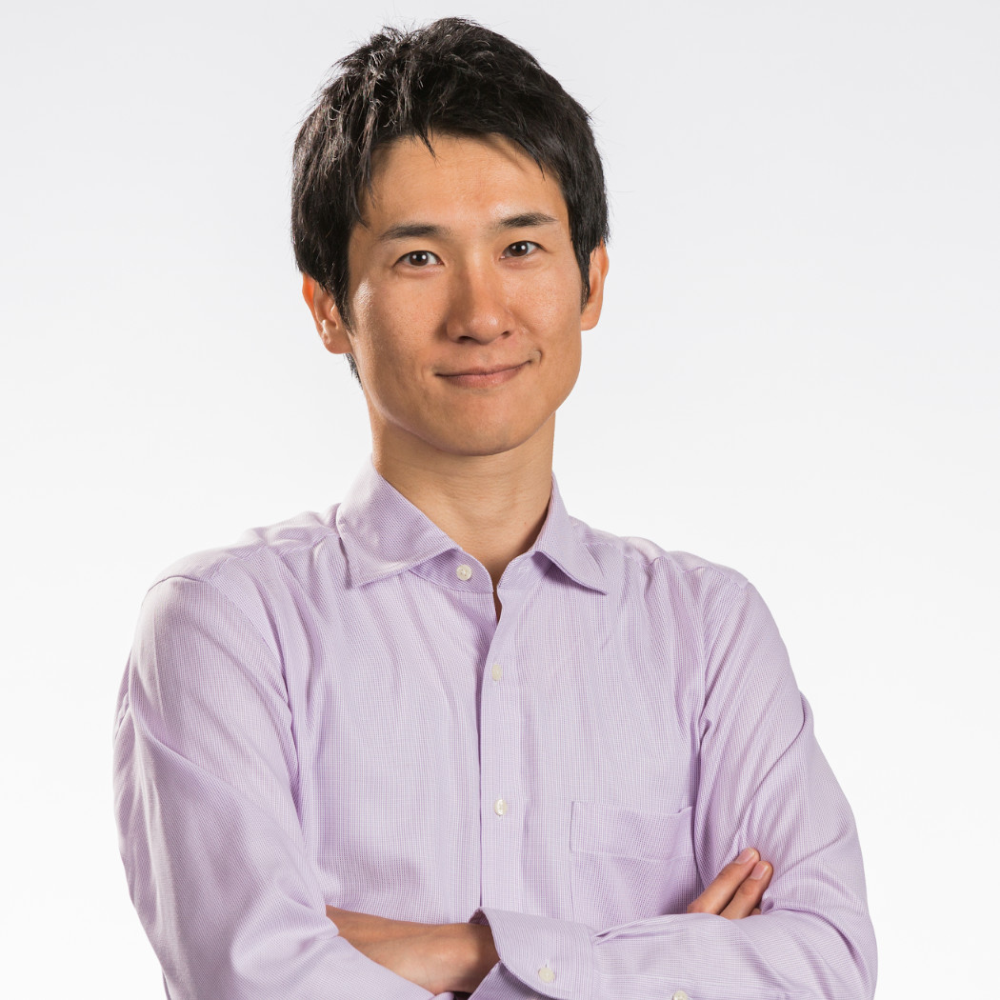

# Jetson AI Lab Research Group

The Jetson AI Lab Research Group is a global collective for advancing open-source Edge ML, open to anyone to join and collaborate with others from the community and leverage each other's work.  Our goal is using advanced AI for good in real-world applications in accessible and responsible ways.  By coordinating together as a group, we can keep up with the rapidly evolving pace of AI and more quickly arrive at deploying intelligent multimodal agents and autonomous robots into the field.

There are virtual [meetings](#meeting-schedule) that anyone is welcome to join, offline discussion on the [Jetson Projects](https://forums.developer.nvidia.com/c/agx-autonomous-machines/jetson-embedded-systems/jetson-projects/78){:target="_blank"} forum, and guidelines for upstreaming open-source [contributions](#contribution-guidelines). 

!!! abstract "Next Meeting"

    The first team meeting is on Wednesday, April 3rd at 9am PST - see the [calendar invite](#meeting-schedule) below or click [here](https://teams.microsoft.com/l/meetup-join/19%3ameeting_YzczZmJmZmItYzRiNi00ZWU0LWFmY2MtNTc0ZmM5NzA5NDVm%40thread.v2/0?context=%7b%22Tid%22%3a%2243083d15-7273-40c1-b7db-39efd9ccc17a%22%2c%22Oid%22%3a%221f165bb6-326c-4610-b292-af9159272b08%22%7d){:target="_blank"}  to attend! 

## Topics of Interest

These are some initial research topics for us to discuss and investigate. This list will vary over time as experiments evolve and the SOTA progresses:

<table>
  <tr>
    <td>• Controller LLMs for dynamic pipeline code generation</td>
    <td>• Fine-tuning LLM/VLM onboard Jetson AGX Orin 64GB</td>
  </tr>
  <tr>
    <td>• HomeAssistant.io integration for smart home [<a href="https://www.home-assistant.io" target="_blank">1</a>] [<a href="https://github.com/dusty-nv/jetson-containers/pull/442" target="_blank">2</a>]</td>
    <td>• Continuous multi-image VLM streaming and change detection</td>
  </tr>
  <tr>
    <td>• Recurrent LLM architectures (Mamba, RKVW, ect) [<a href="https://github.com/dusty-nv/jetson-containers/issues/447" target="_blank">1</a>]</td>
    <td>• Lightweight low-memory streaming ASR/TTS models</td>
  </tr>
  <tr>
    <td>• Diffusion models for image processing and enhancement</td>
    <td>• Time Series Forecasting with Transformers [<a href="https://huggingface.co/blog/autoformer" target="_blank">1</a>] [<a href="https://github.com/time-series-foundation-models/lag-llama" target="_blank">2</a>]</td>
  </tr>
  <tr>
    <td>• Guidance, grammars, and guardrails for constrained output</td>
    <td>• Inline LLM function calling / plugins from API definitions</td>
  </tr>
  <tr>
    <td>• ML DevOps, edge deployment, and orchestration</td>
    <td>• Robotics, IoT, and cyberphysical systems integration</td>
  </tr>
</table>

New topics can be raised to the group either during the meetings or on the [forums](https://forums.developer.nvidia.com/c/agx-autonomous-machines/jetson-embedded-systems/jetson-projects/78){:target="_blank"} (people are welcome to work on whatever they want of course)

## Contribution Guidelines

When experiments are successful, ideally the results will be packaged in such a way that they are easily reusable for others to integrate into their own projects:

* Open-source libraries & code on GitHub
* Models on [HuggingFace Hub](https://huggingface.co/models){:target="_blank"}
* Containers provided by [jetson-containers](https://github.com/dusty-nv/jetson-containers){:target="_blank"}
* Documentation / tutorials on Jetson AI Lab
* [Hackster.io](https://www.hackster.io/){:target="_blank"} for hardware-centric builds

Ongoing technical discussions can occur on the [Jetson Projects](https://forums.developer.nvidia.com/c/agx-autonomous-machines/jetson-embedded-systems/jetson-projects/78){:target="_blank"} forum (or GitHub Issues), with status updates given during the meetings.

## Meeting Schedule

We'll aim to meet monthly or bi-weekly as a team in virtual meetings that anyone is welcome to join and speak during.  We'll discuss the latest updates and experiments that we want to explore.  Please remain courteous to others during the calls.  We'll stick around after for anyone who has questions or didn't get the chance to be heard.

* Wednesday, April 3 at 9am PST (4/3/24)
	- Microsoft Teams - [Meeting Link](https://teams.microsoft.com/l/meetup-join/19%3ameeting_YzczZmJmZmItYzRiNi00ZWU0LWFmY2MtNTc0ZmM5NzA5NDVm%40thread.v2/0?context=%7b%22Tid%22%3a%2243083d15-7273-40c1-b7db-39efd9ccc17a%22%2c%22Oid%22%3a%221f165bb6-326c-4610-b292-af9159272b08%22%7d){:target="_blank"} 
	- Meeting ID: `223 573 467 074`  
	- Passcode: `6ybvCg` 
	- Outlook Invite:  [`Jetson AI Lab Research Group (4324).ics`](research/invites/Jetson AI Lab Research Group (4324).ics){:target="_blank"} 

The meetings will be recorded and posted so that anyone unable to attend live will be able to watch them after.

## Active Members

Below are shown some of the sustaining members of the group who have been working on generative AI in edge computing:

	

		

			<a href="https://www.linkedin.com/in/dustin-franklin-b3aaa173/" target="_blank"></img></a>
			<a href="https://www.linkedin.com/in/dustin-franklin-b3aaa173/" target="_blank"></img></a>
			<a href="https://www.youtube.com/@dusty-nv" target="_blank"></img></a>
			<a href="https://www.github.com/dusty-nv" target="_blank"></img></a>
			Dustin Franklin, NVIDIA 
			<small>
				Principal Engineer | Pittsburgh, PA 
				(<a href="https://github.com/dusty-nv/jetson-inference" target="_blank">jetson-inference</a>, <a href="https://github.com/dusty-nv/jetson-containers" target="_blank">jetson-containers</a>)
			</small>
		

	

	

		

			<a href="https://www.hackster.io/shahizat" target="_blank"></img></a>
			<a href="https://www.linkedin.com/in/shakhizat-nurgaliyev/" target="_blank"></img></a>
			<a href="https://www.hackster.io/shahizat" target="_blank"></img></a>
			Nurgaliyev Shakhizat 
			<small>
				Institute of Smart Systems and AI | Kazakhstan 
				(<a href="https://www.hackster.io/shahizat/ai-powered-application-for-the-blind-and-visually-impaired-df3f9e" target="_blank">Assistive Devices</a>, <a href="https://www.hackster.io/shahizat/vision2audio-giving-the-blind-an-understanding-through-ai-33f929" target="_blank">Vision2Audio</a>, <a href="https://www.hackster.io/shahizat/running-a-chatgpt-like-llm-llama2-on-a-nvidia-jetson-cluster-cbc7d4" target="_blank">HPEC Clusters</a>)
			</small>
		

	

	

		

			<a href="https://www.youtube.com/@kerseyfabs" target="_blank"></img></a>
			<a href="https://www.linkedin.com/in/kriskersey/" target="_blank"></img></a>
			<a href="https://www.youtube.com/@kerseyfabs" target="_blank"></img></a>
			Kris Kersey, <small>Kersey Fabrications</small> 
			<small>
				Embedded Software Engineer | Atlanta, GA 
				(<a href="https://www.youtube.com/@oasis-project" target="_blank">The OASIS Project</a>, AR/VR, 3D Fabrication)
			</small>
		

	

	

		

			<a href="https://www.linkedin.com/in/johnnycano/" target="_blank"></img></a>
			<a href="https://www.linkedin.com/in/johnnycano/" target="_blank"></img></a>
			<a href="https://github.com/johnnynunez" target="_blank"></img></a>
			Johnny Núñez Cano 
			<small>
				PhD Researcher in CV/AI | Barcelona, Spain 
				(Recurrent LLMs, Pose & Behavior Analysis)
			</small>
		

	

	

		

			<a href="https://www.linkedin.com/in/doruk-sonmez/" target="_blank"></img></a> 
			<a href="https://www.linkedin.com/in/doruk-sonmez/" target="_blank"></img></a>
			<a href="https://github.com/doruksonmez" target="_blank"></img></a>
			Doruk Sönmez, <a href="https://openzeka.com/en/" target="_blank">Open Zeka</a> 
			<small>
				Intelligent Video Analytics Engineer | Turkey 
				(NVIDIA DLI Certified Instructor, IVA, VLM)
			</small>
		

	

	

		

			<a href="https://github.com/kingardor" target="_blank"></img></a> 
			<a href="https://www.linkedin.com/in/akashjames/" target="_blank"></img></a>
			<a href="https://www.youtube.com/channel/UCgJZkbxrBpbuHv4jOFuR8zQ" target="_blank"></img></a>
			<a href="https://github.com/kingardor" target="_blank"></img></a>
			Akash James, <a href="https://www.sparkcognition.com/" target="_blank"><small>Spark Cognition</small></a> 
			<small>
				AI Architect, UC Berkeley Researcher | Oakland 
				(NVIDIA AI Ambassador, <a href="https://www.youtube.com/channel/UCgJZkbxrBpbuHv4jOFuR8zQ" target="_blank">Personal Assistants</a>)
			</small>
		

	

	

		

			<a href="https://www.linkedin.com/in/mieszkosyty/" target="_blank"></img></a> 
			<a href="https://www.linkedin.com/in/mieszkosyty/" target="_blank"></img></a>
			<a href="https://github.com/ms1design" target="_blank"></img></a>
			Mieszko Syty, MS/1 Design 
			<small>
				AI/ML Engineer | Warsaw, Poland 
				(LLM, Home Assistants, ML DevOps)
			</small>
		

	
	
	

		

			<a href="https://jetsonhacks.com/" target="_blank"></img></a> 
			<a href="https://www.youtube.com/@JetsonHacks" target="_blank"></img></a>
			<a href="https://github.com/jetsonhacks" target="_blank"></img></a>
			Jim Benson, <a href="https://jetsonhacks.com/" target="_blank">JetsonHacks</a> 
			<small>
				DIY Extraordinaire | Los Angeles, CA 
				(AI in Education, <a href="https://racecarj.com/" target="_blank">RACECAR/J</a>)
			</small>
		

	

	

		

			<a href="https://www.linkedin.com/in/chitoku-yato-01ba304/" target="_blank"></img></a> 
			<a href="https://www.linkedin.com/in/chitoku-yato-01ba304/" target="_blank"></img></a>
			<a href="https://github.com/tokk-nv" target="_blank"></img></a>
			Chitoku Yato, NVIDIA 
			<small>
				Jetson AI DevTech | Santa Clara, CA 
				(<a href="https://jetbot.org/master/" target="_blank">JetBot</a>, <a href="https://github.com/NVIDIA-AI-IOT/jetracer" target="_blank">JetRacer</a>, <a href="https://nvidia-ai-iot.github.io/jetson-min-disk/" target="_blank">MinDisk</a>, Containers)
			</small>
		

	

	

		

			<a href="https://www.linkedin.com/in/danasheahen/" target="_blank"></img></a> 
			<a href="https://www.linkedin.com/in/danasheahen/" target="_blank"></img></a>
			Dana Sheahen, NVIDIA 
			<small>
				DLI Curriculum Developer | Santa Clara, CA 
				(AI in Education, <a href="https://developer.nvidia.com/embedded/learn/jetson-ai-certification-programs" target="_blank">Jetson AI Fundamentals</a>)
			</small>
		

	
	
	

		

			<a href="https://www.linkedin.com/in/sammy-ochoa/" target="_blank"></img></a> 
			<a href="https://www.linkedin.com/in/sammy-ochoa/" target="_blank"></img></a>
			<a href="https://github.com/NVIDIA-AI-IOT/mmj_genai" target="_blank"></img></a>
			Sammy Ochoa, NVIDIA 
			<small>
				Jetson AI DevTech | Austin, TX 
				(<a href="https://developer.nvidia.com/metropolis-microservices" target="_blank">Metropolis Microservices</a>)
			</small>
		

	

	

		

			<a href="https://www.linkedin.com/in/john-w-213126183/" target="_blank"></img></a> 
			<a href="https://www.linkedin.com/in/john-w-213126183/" target="_blank"></img></a>
			<a href="https://github.com/jaybdub" target="_blank"></img></a>
			John Welsh, NVIDIA 
			<small>
				(<a href="https://www.jetson-ai-lab.com/vit/tutorial_nanoowl.html" target="_blank">NanoOWL</a>, <a href="https://www.jetson-ai-lab.com/vit/tutorial_nanosam.html" target="_blank">NanoSAM</a>, <a href="https://jetbot.org/master/" target="_blank">JetBot</a>, <a href="https://github.com/NVIDIA-AI-IOT/jetracer" target="_blank">JetRacer</a>, <a href="https://github.com/NVIDIA-AI-IOT/torch2trt" target="_blank">torch2trt</a>, <a href="https://github.com/NVIDIA-AI-IOT/trt_pose" target="_blank">trt_pose</a>, <a href="https://github.com/NVIDIA-AI-IOT/jetson-intro-to-distillation" target="_blank">Knowledge Distillation</a>)
			</small>
		

	

	

		

			<a href="https://www.davesarmoury.com/" target="_blank"></img></a> 
			<a href="https://www.linkedin.com/in/dave-niewinski-b5691132/" target="_blank"></img></a>
			<a href="https://www.youtube.com/davesarmoury" target="_blank"></img></a>
			<a href="https://github.com/dniewinski" target="_blank"></img></a>
			Dave Niewinski 
			<small>
				<a href="https://www.davesarmoury.com/" target="_blank">Dave's Armoury</a> | Waterloo, Ontario 
				(<a href="https://youtu.be/yNcKTZsHyfA" target="_blank">GLaDOS</a>, <a href="https://youtu.be/yNozb8ljpgI" target="_blank">Fetch</a>, <a href="https://youtu.be/h0uvkaR6fvo" target="_blank">Offroad La-Z-Boy</a>, <a href="https://www.youtube.com/watch?v=agUdUvgV-A8" target="_blank">KUKA Bot</a>)
			</small>
		

	

	

		

			<a href="https://rebotnix.com/" target="_blank"></img></a> 
			<a href="https://www.linkedin.com/in/gary-hilgemann-84423a6b/" target="_blank"></img></a>
			<a href="https://www.youtube.com/channel/UCJv_UknY5ueEjbko2M2Iv4Q" target="_blank"></img></a>
			<a href="https://github.com/rebotnix" target="_blank"></img></a>
			Gary Hilgemann, <a href="https://rebotnix.com/" target="_blank">REBOTNIX</a> 
			<small>
				CEO & AI Roboticist | Lünen, Germany 
				(<a href="https://rebotnix.com/gustav/" target="_blank">GUSTAV</a>, <a href="https://rebotnix.com/spike/" target="_blank">SPIKE</a>, <a href="https://rebotnix.com/visiontools/" target="_blank">VisionTools</a>, <a href="https://rebotnix.com/genai/" target="_blank">GenAI</a>)
			</small>
		

	

	

		

			<a href="https://www.seeedstudio.com/tag/nvidia.html" target="_blank"></img></a> 
			<a href="https://www.linkedin.com/in/elaine1994/" target="_blank"></img></a>
			<a href="https://www.youtube.com/channel/UCJv_UknY5ueEjbko2M2Iv4Q" target="_blank"></img></a>
			<a href="https://github.com/Seeed-Projects" target="_blank"></img></a>
			Elaine Wu, <a href="https://www.seeedstudio.com/tag/nvidia.html" target="_blank">Seeed Studio</a> 
			<small>
				AI & Robotics Partnerships | Shenzhen, China 
				(<a href="https://www.seeedstudio.com/Nvidia-Jetson-c-2016.html" target="_blank">reComputer</a>, <a href="https://wiki.seeedstudio.com/YOLOv8-TRT-Jetson/" target="_blank">YOLOv8</a>, <a href="https://github.com/Seeed-Projects/LocalJARVIS" target="_blank">LocalJARVIS</a>, <a href="https://wiki.seeedstudio.com/Local_Voice_Chatbot/" target="_blank">Voice Bot</a>)
			</small>
		

	

	

		

			<a href="https://www.linkedin.com/in/pattydelafuente/" target="_blank"></img></a> 
			<a href="https://www.linkedin.com/in/pattydelafuente/" target="_blank"></img></a>
			Patty Delafuente, NVIDIA 
			<small>
				Data Scientist & UMBC PhD Student | MD 
				(AI in Education, <a href="https://www.nvidia.com/en-us/training/teaching-kits/" target="_blank">DLI Robotics Teaching Kit</a>)
			</small>
		

	

Anyone is welcome to join this group after contributing, and open a PR against the [site repo](https://github.com/NVIDIA-AI-IOT/jetson-generative-ai-playground){:target="_blank"} with their info 😊
