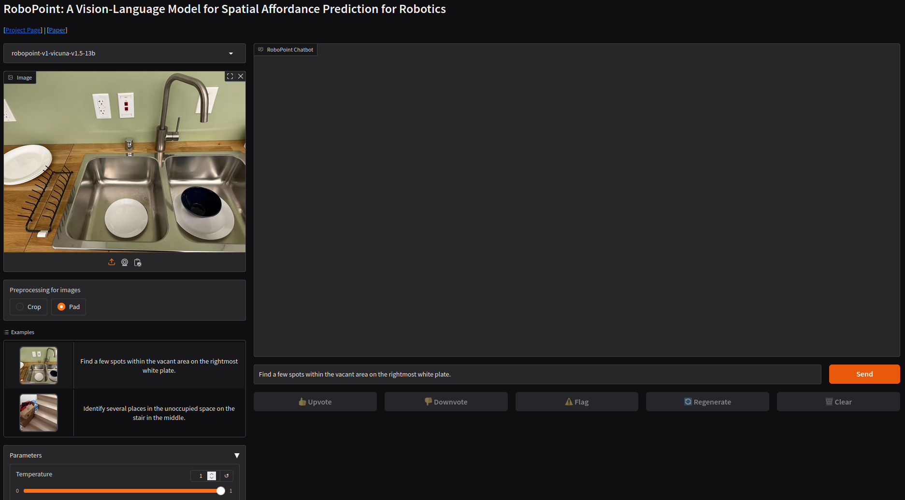

# Tutorial - RoboPoint VLM for robotic manipulation

[RoboPoint](https://robo-point.github.io/) is a general model that enables several downstream applications such as robot navigation, manipulation, and augmented reality (AR) assistance. 


This tutorial provides a demo application for robotic manipulation using a Vision-Language Model (VLM) pipeline combined with a Large Language Model (LLM) to articulate manipulators using natural language. The RoboPoint inference pipeline generates 2D action points, which can be projected to 3D targets using depth maps or renowned algorithms like OpenCV [solvePNP](https://docs.opencv.org/4.x/d5/d1f/calib3d_solvePnP.html). The computed 3D targets can be fed into motion planning and deployed to real hardware or simulation environments like Isaac Sim. Future phases will include ROS2 integration with an Isaac Sim pipeline and the implementation of quantization methods.

In this tutorial we will guide you through:

:white_check_mark: Setting up the environment using jetson-containers   
:white_check_mark: Connecting a [Boston Dynamics Spot with Arm](https://bostondynamics.com/products/spot/arm/){:target="_blank"} to RoboPoint VLM  
:white_check_mark: Issuing commands using natural language prompts  
:white_check_mark: Executing pick-and-place operations  

## RoboPoint VLM for embodied AI

From rearranging objects on a table to putting groceries into shelves, robots must plan precise action points to perform tasks accurately and reliably. In spite of the recent adoption of vision language models (VLMs) to control robot behavior, VLMs struggle to precisely articulate robot actions using language. We introduce an automatic synthetic data generation pipeline that instruction-tunes VLMs to robotic domains and needs. 

### RoboPoint Pipeline


Source: [RoboPoint Paper](https://arxiv.org/pdf/2406.10721)

An RGB image is rendered from a procedurally generated 3D scene. We compute spatial relations from the camera's perspective and generate affordances by sampling points within object masks and object-surface intersections. These instruction-point pairs fine-tune the language model. During deployment, RoboPoint predicts 2D action points from an image and instruction, which are projected into 3D using a depth map. The robot then navigates to these 3D targets with a motion planner. For more information please refer the official [paper and project](https://robo-point.github.io)

!!! abstract "Credits"
    Thank you to University of Washington, NVIDIA, Allen Institute for Artificial Intelligence and Universidad Catolica San Pablo for publishing their great research. 

### Advantages of the proposed architecture

One key advantage of this architecture is its efficiency. The process of projecting 2D action points into 3D poses is both fast and computationally lightweight. This ensures smooth robotic manipulation, enabling rapid execution of even complex, long-term, and sequential commands.

## 1. Setting up the environment with `jetson-containers`

!!! abstract "What you need"

    1. One of the following Jetson devices:

        <span class="blobDarkGreen4">Jetson AGX Orin (64GB)</span>
        <span class="blobDarkGreen5">Jetson AGX Orin (32GB)</span>
	   
    2. Running the following version of [JetPack](https://developer.nvidia.com/embedded/jetpack):

        <span class="blobPink2">JetPack 6 (L4T r36.x)</span>

    3. <span class="markedYellow">NVMe SSD **highly recommended**</span> for storage speed and space

        - `25GB` for `robopoint-v1-vicuna-v1.5-13b` LLM
        - `12GB` for `robopoint` container image

    4. Clone and setup [`jetson-containers`](https://github.com/dusty-nv/jetson-containers/blob/master/docs/setup.md){:target="_blank"}:
    
		```bash
		git clone https://github.com/dusty-nv/jetson-containers
		bash jetson-containers/install.sh
		``` 
    
    5. Download Model from [`huggingface`](https://huggingface.co/wentao-yuan/robopoint-v1-vicuna-v1.5-13b){:target="_blank"}:

        ```bash
        # Make sure you have git-lfs installed (https://git-lfs.com)
        git lfs install
        git clone https://huggingface.co/wentao-yuan/robopoint-v1-vicuna-v1.5-13b /data/models
        ``` 
    6. Run the RoboPoint Container with the model properly mounted

        ```bash
		jetson-containers run --volume /data/models:/data/models $(autotag robopoint)
		``` 

## 2. Gradio Demo Application

The project includes a Gradio demo application, packaged within the provided container. To access the interface and execute commands, simply open a web browser and navigate to `http://jetson-ip:7860/`. You should see a Gradio WebApp with Demo Examples as shown here.



## 3. Boston Dynamics Spot Deployment

Connect the RoboPoint VLM to a Boston Dynamics Spot with Arm for mobile manipulation scenarios. The inference is performed using the Gradio API. The results are then parsed, projected into 3D and sent to the inverse kinematics (IK) solver of the Boston Dynamics Spot API. The required steps are outlined below.
!!! warning "Disclaimer:  Use at your own risk"
    Please note that controlling the robot to grasp an object involves moving parts that may cause damage or harm to people or property. Ensure that the operating environment is clear of obstacles and that all personnel maintain a safe distance from the robot during operation. Always follow safety guidelines and protocols provided by the robot manufacturer.

!!! abstract "What we will do"

    1. Setup your Python Spot SDK environment: [`Spot SDK`](https://dev.bostondynamics.com/docs/python/quickstart){:target="_blank"}
	   
    2. Deploy the  [`RoboPoint jetson-container`](#1-setting-up-the-environment-with-jetson-containers) 

    3. Use the RoboPoint [Spot example](https://github.com/mschweig/RoboPoint/tree/master/examples){:target="_blank"} to execute the following steps:

        ```bash
        pip3 install -r requirements.txt
        python3 robopoint_spot_example.py -i frontleft -l "pick the object next to the ball" -g "http://jetson-ip:7860"
        ```

        a. Connect to the robot and acquire a lease to control the robot

        b. Use the gradio inference API to predict 2D action points

        c. Project the 2D action points to a 3D pose using the robots API
        
        d. Run the motion planning

        e. Execute the grasp command

!!! example "Work in Progress"

    - ROS2 Integration
    - Isaac Sim Integration
    - Ask questions in [`#vla`](https://discord.gg/BmqNSK4886){:target="_blank"} on Discord or [`jetson-containers/issues`](https://github.com/dusty-nv/jetson-containers/issues){:target="_blank"}


## Optional: Gradio Inference API 

The Gradio inference API enables seamless command execution for other robots or testing purposes. It simplifies integration and allows for quick deployment across different robotic platforms.

```python
client = Client("http://jetson-ip:7860/")

result = client.predict(
    api_name="/load_demo_refresh_model_list"
)

result = client.predict(
    text="<<<request>>>",
    image=handle_file("test.jpg"),
    image_process_mode="Pad",
    api_name="/add_text_1"
)

result = client.predict(
    model_selector="robopoint-v1-vicuna-v1.5-13b",
    temperature=1,
    top_p=0.7,
    max_new_tokens=512,
    api_name="/http_bot_2"
)
```
