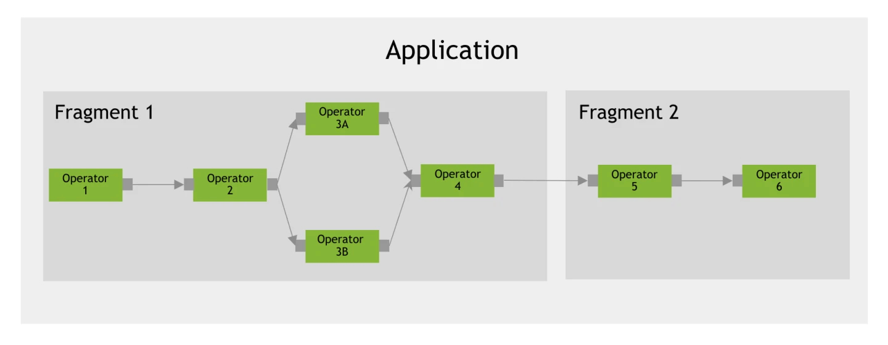
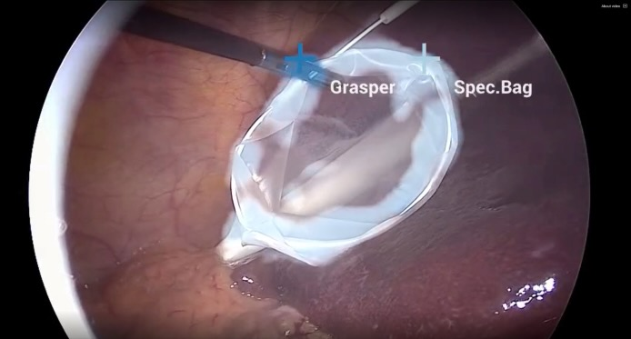

# Tutorial - Holoscan SDK

The [Holoscan SDK](https://github.com/nvidia-holoscan/holoscan-sdk) is part of NVIDIA [Holoscan](https://nvidia.com/en-us/clara/holoscan/), the AI sensor processing platform that combines hardware systems for low-latency sensor and network connectivity, optimized libraries for data processing and AI, and core microservices to run streaming, imaging, and other applications, from embedded to edge to cloud.


### Holoscan SDK - Core Concepts
A Holoscan SDK `Application` is composed of `Fragments`, each of which runs a graph of `Operators`. The implementation of that graph is sometimes referred to as a pipeline or workflow, which can be visualized below:


## Holoscan SDK - Getting Started on Jetson
The best place to get started using the Holoscan SDK is the [HoloHub](https://github.com/nvidia-holoscan/holohub) repo. This is a central repository for the NVIDIA Holoscan AI sensor processing community to share apps and extensions.

So, let's walk through how to run the Surgical Tool Tracking example application from HoloHub!

!!! abstract "What you need"

    1. One of the following Jetson devices:

        <span class="blobDarkGreen4">Jetson AGX Orin (64GB)</span>
        <span class="blobDarkGreen5">Jetson AGX Orin (32GB)</span>
        <span class="blobLightGreen3">Jetson Orin NX (16GB)</span>
        <span class="blobLightGreen4">Jetson Orin Nano (8GB)</span>

    2. Running one of the following versions of [JetPack](https://developer.nvidia.com/embedded/jetpack):

        <span class="blobPink2">JetPack 6 (L4T r36.x)</span>
	   
    3. Sufficient storage space (preferably with NVMe SSD).

        - `13.7 GB` for `efficientvit` container image
        - `850 Mb` for Tool Tracking ONNX model + example video
	   
    4. Clone and setup [`jetson-containers`](https://github.com/dusty-nv/jetson-containers/blob/master/docs/setup.md){:target="_blank"}:
    
		```bash
		git clone https://github.com/dusty-nv/jetson-containers
		bash jetson-containers/install.sh
		``` 

## Launching a Holoscan-compatible Container

Use the `jetson-containers run` and `autotag` commands to automatically pull or build the Holoscan container.
> Use the `-v` option to mount HoloHub's `./build` and `./data` directories to the local Holoscan package directory so builds and data are cached across runs

```
jetson-containers run \
    -v ./packages/holoscan/holohub/data:/opt/nvidia/holohub/data \
    -v ./packages/holoscan/holohub/build:/opt/nvidia/holohub/build \
    $(autotag holoscan)
```

## Running HoloHub's Endoscopy Tool Tracking App
An example application from HoloHub is the [Endoscopy Tool Tracking](https://github.com/nvidia-holoscan/holohub/tree/main/applications/endoscopy_tool_tracking) application. This sample application demonstrates how the Holoscan SDK can be used to build an efficient pipeline that streams a video feed, preprocesses the data, runs inference using TensorRT, post-processes the data, and renders the video feed with the inference overlays.


### Building The App
The Holoscan SDK uses CMake to build C++ applications and also leverages CMake to pull and build app dependencies. So, regardless of whether an application is implemented using C++ or Python, many apps will still require that you "build" them first.

The Endoscopy Tool Tracking App has both a Python and C++ implementation. Building this app creates the C++ application program, pulls in an example video, and builds the TensorRT engine used for inference.

Go to the HoloHub directory
```bash
cd /opt/nvidia/holohub
```
Build the app using the 'run' script
```bash
./run build endoscopy_tool_tracking
```

### Running The Python App

First, add the Holoscan SDK and the HoloHub build directory to your PYTHONPATH environment variable.
```bash
export HOLOHUB_BUILD_PATH=/opt/nvidia/holohub/build/endoscopy_tool_tracking
export PYTHONPATH=$PYTHONPATH:$HOLOHUB_BUILD_PATH/python/lib:/opt/nvidia/holoscan/python/lib
```
Next, run the application using Python!
```bash
python3 /opt/nvidia/holohub/applications/endoscopy_tool_tracking/python/endoscopy_tool_tracking.python --data /opt/nvidia/holohub/data/endoscopy/
```

Shortly after launching the application, you will see the HoloViz window that visualizes the sample video and the model's outputs:


### Running The C++ App
The C++ app can be run using the run script by specifying the app name:
```bash
./run launch endoscopy_tool_tracking
```

### Next Steps
Congratulations! You've successfully run a Holoscan SDK application!

To dive deeper into the Holoscan SDK, explore the SDK's documentation on [Core Concepts](https://docs.nvidia.com/holoscan/sdk-user-guide/holoscan_core.html), [Holoscan by Example](https://docs.nvidia.com/holoscan/sdk-user-guide/holoscan_by_example.html), and [Creating an Application](https://docs.nvidia.com/holoscan/sdk-user-guide/holoscan_create_app.html).