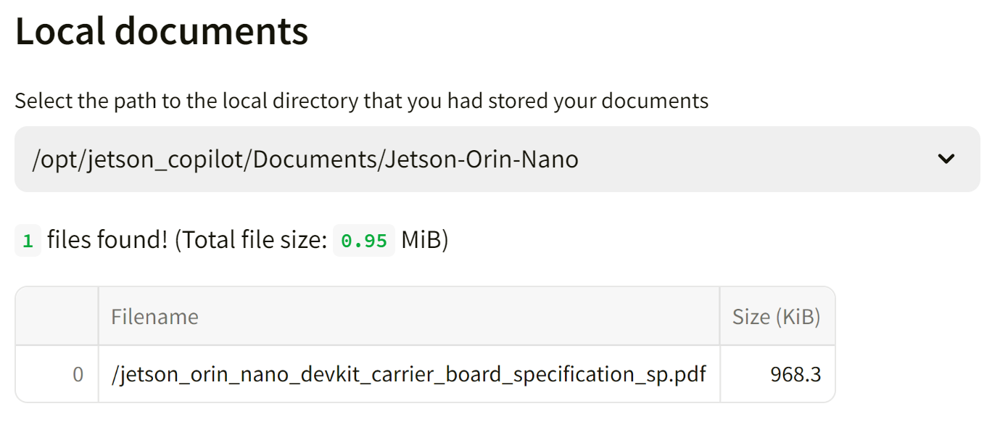

# Tutorial - Jetson Copilot


[Jetson Copilot](https://github.com/NVIDIA-AI-IOT/jetson-copilot/) is a reference application for a ***local*** AI assistant, which demonstrates;

- Running open-source LLMs (large language models) on device
- RAG (retrieval-augmented generation) to let LLM have access to your locally indexed knowledge

!!! abstract "What you need"

    1. One of the following Jetson devices:

        <span class="blobDarkGreen4">Jetson AGX Orin 64GB Developer Kit</span>
        <span class="blobDarkGreen5">Jetson AGX Orin (32GB) Developer Kit</span>
        <span class="blobLightGreen4">Jetson Orin Nano 8GB Developer Kit</span>

    2. Running one of the following versions of [JetPack](https://developer.nvidia.com/embedded/jetpack):

        <span class="blobPink1">JetPack 5 (L4T r35.x)</span>
        <span class="blobPink2">JetPack 6 (L4T r36.x)</span>

    3. Sufficient storage space (preferably with NVMe SSD).

        - `6 GB` for `jetrag` container image
        - About `4 GB` for downloading some default models (`llama3` and `mxbai-embed-large`)

!!! info

    To run Jetson Copilot, you do not need to have `jetson-containers` on your system. It uses the `jetrag` container image that is being managed and built on `jetson-containers`.

## 🏃 Getting started

### First time setup

If this is your first time to run Jetson Copilot on your Jetson, first run `setup.sh` to ensure you have all the necessary software installed and the environment set up. 

```bash
git clone https://github.com/NVIDIA-AI-IOT/jetson-copilot/
cd jetson-copilot
./setup_environment.sh
```

It will install the following, if not yet.

- Chromium web browser
- Docker

### How to start Jetson Copilot

```bash
cd jetson-copilot
./launch_jetson_copilot.sh
```

<iframe width="960" height="540" src="https://www.youtube.com/embed/bKkg7PwbxFM?si=Idd4pvEbRaqhEVO3" title="YouTube video player" frameborder="0" allow="accelerometer; autoplay; clipboard-write; encrypted-media; gyroscope; picture-in-picture; web-share" referrerpolicy="strict-origin-when-cross-origin" allowfullscreen></iframe>

This will start a Docker container and start a Ollama server and Streamlit app inside the container. It will shows the URL on the console in order to access the web app hosted on your Jetson.

With your web browser on Jetson, open the **Local URL** (`http://localhost:8501`).<br>Or on a PC connected on the same network as on your Jetson, access the **Network URL**.

```bash
Local URL: http://localhost:8501
Network URL: http://10.110.50.252:8501 
```

!!! info

    You will need the Internet connection on Jetson when it launches for the first time, as it will pull the container image (and download the default LLM and embedding model when web UI starts for the first time).

When you access the web UI for the first time, it will dowload the default LLM (`llama3`) and the embedding model (`mxbai-embed-large`).

!!! tips

    If you are on Ubuntu Desktop, a frameless Chromium window will pop up to access the web app, to make it look like an independent application.
    You need to close the window as stopping the container on the console won't shutdown Chromium.
    
    <iframe width="960" height="540" src="https://www.youtube.com/embed/ETOrY_guGMU?si=M268obwq3ccqZ-5N" title="YouTube video player" frameborder="0" allow="accelerometer; autoplay; clipboard-write; encrypted-media; gyroscope; picture-in-picture; web-share" referrerpolicy="strict-origin-when-cross-origin" allowfullscreen></iframe>

## 📖 How to use Jetson Copilot

### 0. Interact with the plain Llama3 (8b)

<iframe width="640" height="480" src="https://www.youtube.com/embed/0lM4JxGXwiA?si=kVEgwRRPpzjBcZz3" title="YouTube video player" frameborder="0" allow="accelerometer; autoplay; clipboard-write; encrypted-media; gyroscope; picture-in-picture; web-share" referrerpolicy="strict-origin-when-cross-origin" allowfullscreen></iframe>

You can use Jetson Copilot just to interact with a LLM withut enabling RAG feature.

By default, Llama3 (8b) model is downloaded when running for the first time and use as the default LLM.

You will be surprized how much a model like Llama3 is capable, but may soon find limitations as it does not have information prior to its cutoff date nor know anything about your specific subject matter.

### 1. Ask Jetson related question using pre-built index

<iframe width="640" height="480" src="https://www.youtube.com/embed/ySPysrJx3I8?si=UN9jbk6HLTUfClO-" title="YouTube video player" frameborder="0" allow="accelerometer; autoplay; clipboard-write; encrypted-media; gyroscope; picture-in-picture; web-share" referrerpolicy="strict-origin-when-cross-origin" allowfullscreen></iframe>

On the side panel, you can toggle "Use RAG" on to enable RAG pipeline.<br>
The LLM will have an access to a custom knowledge/index that is selected under "Index".

As a sample, a pre-build index "`_L4T_README`" is provided.<br>
This is built on all the README text files that supplied in the "L4T-README" folder on the Jetson desktop.

> It is mounted as `/media/<USER_NAME>/L4T-README/` once you execute `udisksctl mount -b /dev/disk/by-label/L4T-README`.

You can ask questions like:

```
What IP address does Jetson gets assigned when connected to a PC via a USB cable in USB Device Mode?
```

### 2. Build your own index based on your documents

<iframe width="960" height="560" src="https://www.youtube.com/embed/IlCC4sOlde4?si=uxpERoB6wwdXbdJX" title="YouTube video player" frameborder="0" allow="accelerometer; autoplay; clipboard-write; encrypted-media; gyroscope; picture-in-picture; web-share" referrerpolicy="strict-origin-when-cross-origin" allowfullscreen></iframe>

You can build your own index based on your local and/or online documents.

First, on the console (or on the desktop) create a directory under `Documents` directory to store your documents.

```
cd jetson-copilot
mkdir Documents/Jetson-Orin-Nano
cd Documents/Jetson-Orin-Nano
wget https://developer.nvidia.com/downloads/assets/embedded/secure/jetson/orin_nano/docs/jetson_orin_nano_devkit_carrier_board_specification_sp.pdf
```

Now back on the web UI, open the side bar, toggle on "Use RAG", then click on "**➕Build a new index**" to jump to a "**Build Index**" page.

Give a name for the Index you are to build. (e.g. "JON Carrier Board")<br>
Type in the field and hit `Enter` key, then it will check and show what path will be created for your index.

> 

And then from the drop select box under "**Local documents**", select the directory you created and saved your documents in. (e.g. `/opt/jetson_copilot/Documents/Jetson-Orin-Nano`).

It will show the summary of files found in the selected directory.

> 

If you want to rather only or additionally supply URLs for the online docuemnts to be ingested, fill the text area with one URL per a line.<br>
You can skip this if you are building your index only based on your local documents.

!!! info

    On the sidebar, make sure `mxbai-embed-large` is selected for the embedding model.

    Use of OpenAI embedding models is not well supported and needs more testing.

Finally, hit "**Build Index**" button.<br>
It will show the progress in the drop-down "status container", so you can check the status by clicking on it.<br>
Once done, it will show the summary of your index and time it took.

You can go back to the home screen to now select the index you just built.

### 3. Test different LLM or Embedding model

TODO

## 🏗️ Development

Streamlit based web app is very easy to develop.

On web UI, at the top-right of the screen to choose "**Always rerun**" to automatically update your app every time you change the source codes.

See [Streamlit Documentation](https://docs.streamlit.io/get-started/fundamentals/main-concepts#development-flow) for the detail.

### Manually run streamlit app inside the container

In case you make more fundamental changes, you can also manually run streamlit app.

```
cd jetson-copilot
./launch_dev.sh
```

Once in container;

```
streamlit run app.py
```

<iframe width="960" height="540" src="https://www.youtube.com/embed/gg1Dwgea1oc?si=qNyAZgD3fkC30BTY" title="YouTube video player" frameborder="0" allow="accelerometer; autoplay; clipboard-write; encrypted-media; gyroscope; picture-in-picture; web-share" referrerpolicy="strict-origin-when-cross-origin" allowfullscreen></iframe>

## 🧱 Directory structure

```
└── jetson-copilot
    ├── launch_jetson_copilot.sh
    ├── setup_environment.sh
    ├── Documents 
    │   └── your_abc_docs
    ├── Indexes
    │   ├── _L4T_README
    │   └── your_abc_index
    ├── logs
    │   ├── container.log
    │   └── ollama.log
    ├── ollama_models
    └── Streamlit_app
        ├── app.py
        ├── build_index.py
        └── download_model.py
```

Following directories inside the `jetson-copilot` directory are mounted in the Docker container.

| Directory Name | Description |
| -------------- | ----------- |
| `Docuemtns`    | Directory to store your documents to be indexed |
| `Indexes`      | Directory to store pre-built (or built-by-you) indexes for LLM to perform RAG on |
| `logs`         | Directory for the app to store log files |
| `ollama_models`| Directory for the ollama server to store download models |
| `stremlit_app` | Directory for Python scripts to make up the web app |

## 💫 Troubleshooting

If you find any issue, please check [GitHub Issues of the Jetson Copilot repo](https://github.com/NVIDIA-AI-IOT/jetson-copilot/issues).