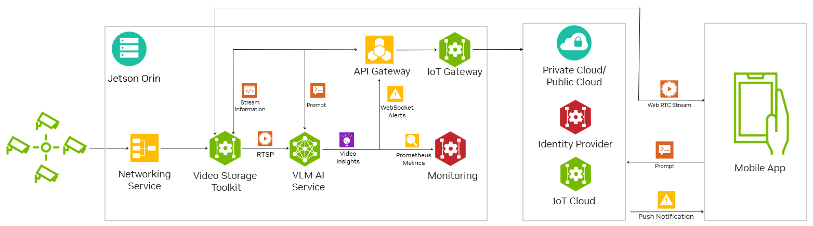

# Tutorial - Jetson Platform Services

Jetson Plaform Services (JPS) provide a platform to simplify development, deployment and management of Edge AI applications on NVIDIA Jetson. JPS is a modular & extensible architecture for developers to distill large complex applications into smaller modular microservice with APIs to integrate into other apps & services. At its core are a collection of AI services leveraging generative AI, deep learning, and analytics, which provide state of the art capabilities including video analytics, video understanding and summarization, text based prompting, zero shot detection and spatio temporal analysis of object movement. 

*VLM Alert Workflow built with JPS*

!!! abstract "What you need"

    1. One of the following Jetson devices:

        Jetson AGX Orin (64GB)
        Jetson AGX Orin (32GB)
        Jetson Orin NX (16GB)
        Jetson Orin Nano (8GB)

    2. Running one of the following versions of [JetPack](https://developer.nvidia.com/embedded/jetpack):

        JetPack 6 (L4T r36.x)
	   
    3. NVMe SSD **highly recommended** for storage speed and space

To get started with Jetson Platform Services, follow the quickstart guide to install and setup JPS. Then explore the reference workflows to learn how to use DeepStream, Analytics, Generative AI and more with JPS:

1) [Quick Start Guide](https://docs.nvidia.com/jetson/jps/setup/quick-start.html)  
2) [AI Powered Network Video Recorder](https://docs.nvidia.com/jetson/jps/setup/ai-nvr.html)  
3) [Zero Shot Detection with NanoOWL](https://docs.nvidia.com/jetson/jps/workflows/zero_shot_detection_workflow.html)  
4) [Visual Language Model Alerts](https://docs.nvidia.com/jetson/jps/workflows/vlm_workflow.html)   

The reference workflows demonstrate how to use the microservices provided in JPS to build full end to end systems on your Jetson. 

*VLM Alert Workflow Architecture*

View the links below to learn more about Jetson Platform Services:  
* [VLM Alert Blog](https://developer.nvidia.com/blog/develop-generative-ai-powered-visual-ai-agents-for-the-edge/)  
* [JPS Product Page](https://developer.nvidia.com/embedded/jetpack/jetson-platform-services-get-started)  
* [JPS Documentation](https://docs.nvidia.com/jetson/jps/moj-overview.html)  
* VLM Alert Demo Video

<iframe width="500" height="280" src="https://www.youtube.com/embed/0ZbDzaBfsrw" style="display: inline-block;" title="YouTube video player" frameborder="0" allow="accelerometer; autoplay; clipboard-write; encrypted-media; gyroscope; picture-in-picture; web-share" allowfullscreen></iframe>

