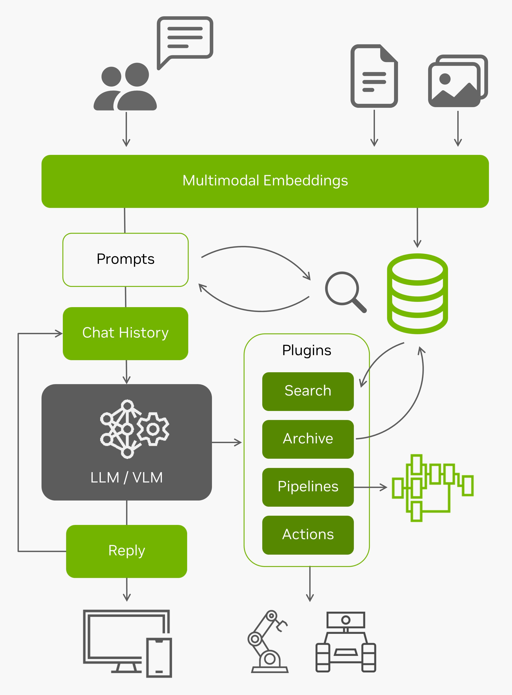

# Tutorial - Live LLaVA

!!! abstract "Recommended"

    Follow the [NanoVLM](tutorial_nano-vlm.md) tutorial first to familiarize yourself with vision/language models, and see [Agent Studio](agent_studio.md) for in interactive pipeline editor built from live VLMs.
    
This multimodal agent runs a vision-language model on a live camera feed or video stream, repeatedly applying the same prompts to it:

<a href="https://youtu.be/X-OXxPiUTuU" target="_blank"></a>

It uses models like [LLaVA](https://llava-vl.github.io/){:target="_blank"} or [VILA](https://github.com/Efficient-Large-Model/VILA){:target="_blank"} and has been quantized with 4-bit precision.  This runs an optimized multimodal pipeline from the [`NanoLLM`](https://dusty-nv.github.io/NanoLLM){:target="_blank"} library, including running the CLIP/SigLIP vision encoder in TensorRT, event filters and alerts, and multimodal RAG (see the [**NanoVLM**](tutorial_nano-vlm.md) page for benchmarks)



## Running the Live Llava Demo

!!! abstract "What you need"

    1. One of the following Jetson devices:

        <span class="blobDarkGreen4">Jetson AGX Orin (64GB)</span>
        <span class="blobDarkGreen5">Jetson AGX Orin (32GB)</span>
        <span class="blobLightGreen3">Jetson Orin NX (16GB)</span>
        <span class="blobLightGreen4">Jetson Orin Nano (8GB)</span><span title="Orin Nano 8GB can run Llava-7b, VILA-7b, and Obsidian-3B">⚠️</span>
	   
    2. Running one of the following versions of [JetPack](https://developer.nvidia.com/embedded/jetpack):

        <span class="blobPink2">JetPack 6 (L4T r36.x)</span>

    3. Sufficient storage space (preferably with NVMe SSD).

        - `22GB` for `nano_llm` container image
        - Space for models (`>10GB`)
		 
    4. Follow the chat-based [LLaVA](tutorial_llava.md) and [NanoVLM](tutorial_nano-vlm.md) tutorials first.

    5. Supported vision/language models:
    
        - [`liuhaotian/llava-v1.5-7b`](https://huggingface.co/liuhaotian/llava-v1.5-7b), [`liuhaotian/llava-v1.5-13b`](https://huggingface.co/liuhaotian/llava-v1.5-13b), [`liuhaotian/llava-v1.6-vicuna-7b`](https://huggingface.co/liuhaotian/llava-v1.6-vicuna-7b), [`liuhaotian/llava-v1.6-vicuna-13b`](https://huggingface.co/liuhaotian/llava-v1.6-vicuna-13b)
        - [`Efficient-Large-Model/VILA-2.7b`](https://huggingface.co/Efficient-Large-Model/VILA-2.7b),[`Efficient-Large-Model/VILA-7b`](https://huggingface.co/Efficient-Large-Model/VILA-7b), [`Efficient-Large-Model/VILA-13b`](https://huggingface.co/Efficient-Large-Model/VILA-13b)
        - [`Efficient-Large-Model/VILA1.5-3b`](https://huggingface.co/Efficient-Large-Model/VILA1.5-3b),[`Efficient-Large-Model/Llama-3-VILA1.5-8B`](https://huggingface.co/Efficient-Large-Model/Llama-3-VILA1.5-8b), [`Efficient-Large-Model/VILA1.5-13b`](https://huggingface.co/Efficient-Large-Model/VILA1.5-13b)
        - [`VILA-2.7b`](https://huggingface.co/Efficient-Large-Model/VILA-2.7b), [`VILA1.5-3b`](https://huggingface.co/Efficient-Large-Model/VILA1.5-3b), [`VILA-7b`](https://huggingface.co/Efficient-Large-Model/VILA-7b), [`Llava-7b`](https://huggingface.co/liuhaotian/llava-v1.6-vicuna-7b), and [`Obsidian-3B`](https://huggingface.co/NousResearch/Obsidian-3B-V0.5) can run on Orin Nano 8GB
        
		
The [VideoQuery](https://dusty-nv.github.io/NanoLLM/agents.html#video-query){:target="_blank"} agent applies prompts to the incoming video feed with the VLM.  Navigate your browser to `https://<IP_ADDRESS>:8050` after launching it with your camera (Chrome is recommended with `chrome://flags#enable-webrtc-hide-local-ips-with-mdns` disabled)

```bash
jetson-containers run $(autotag nano_llm) \
  python3 -m nano_llm.agents.video_query --api=mlc \
    --model Efficient-Large-Model/VILA1.5-3b \
    --max-context-len 256 \
    --max-new-tokens 32 \
    --video-input /dev/video0 \
    --video-output webrtc://@:8554/output
```

<!--<a href="https://youtu.be/wZq7ynbgRoE" target="_blank"> </a>-->

This uses [`jetson_utils`](https://github.com/dusty-nv/jetson-utils) for video I/O, and for options related to protocols and file formats, see [Camera Streaming and Multimedia](https://github.com/dusty-nv/jetson-inference/blob/master/docs/aux-streaming.md).  In the example above, it captures a V4L2 USB webcam connected to the Jetson (under the device `/dev/video0`) and outputs a WebRTC stream.

### Processing a Video File or Stream

The example above was running on a live camera, but you can also read and write a [video file or network stream](https://github.com/dusty-nv/jetson-inference/blob/master/docs/aux-streaming.md) by substituting the path or URL to the `--video-input` and `--video-output` command-line arguments like this:

```bash
jetson-containers run \
  -v /path/to/your/videos:/mount
  $(autotag nano_llm) \
    python3 -m nano_llm.agents.video_query --api=mlc \
      --model Efficient-Large-Model/VILA1.5-3b \
      --max-context-len 256 \
      --max-new-tokens 32 \
      --video-input /mount/my_video.mp4 \
      --video-output /mount/output.mp4 \
      --prompt "What does the weather look like?"
```

This example processes and pre-recorded video (in MP4, MKV, AVI, FLV formats with H.264/H.265 encoding), but it also can input/output live network streams like [RTP](https://github.com/dusty-nv/jetson-inference/blob/master/docs/aux-streaming.md#rtp){:target="_blank"}, [RTSP](https://github.com/dusty-nv/jetson-inference/blob/master/docs/aux-streaming.md#rtsp){:target="_blank"}, and [WebRTC](https://github.com/dusty-nv/jetson-inference/blob/master/docs/aux-streaming.md#webrtc){:target="_blank"} using Jetson's hardware-accelerated video codecs.

### NanoDB Integration

If you launch the [VideoQuery](https://github.com/dusty-nv/jetson-containers/blob/master/packages/llm/nano_llm/agents/video_query.py){:target="_blank"} agent with the `--nanodb` flag along with a path to your NanoDB database, it will perform reverse-image search on the incoming feed against the database by re-using the CLIP embeddings generated by the VLM.

To enable this mode, first follow the [**NanoDB tutorial**](tutorial_nanodb.md) to download, index, and test the database.  Then launch VideoQuery like this:

```bash
jetson-containers run $(autotag nano_llm) \
  python3 -m nano_llm.agents.video_query --api=mlc \
    --model Efficient-Large-Model/VILA1.5-3b \
    --max-context-len 256 \
    --max-new-tokens 32 \
    --video-input /dev/video0 \
    --video-output webrtc://@:8554/output \
    --nanodb /data/nanodb/coco/2017
```

You can also tag incoming images and add them to the database using the web UI, for one-shot recognition tasks:

## Video VILA

The VILA-1.5 family of models can understand multiple images per query, enabling video search/summarization, action & behavior analysis, change detection, and other temporal-based vision functions.  The [`vision/video.py`](https://github.com/dusty-nv/NanoLLM/blob/main/nano_llm/vision/video.py){:target="_blank"} example keeps a rolling history of frames:

``` bash
jetson-containers run $(autotag nano_llm) \
  python3 -m nano_llm.vision.video \
    --model Efficient-Large-Model/VILA1.5-3b \
    --max-images 8 \
    --max-new-tokens 48 \
    --video-input /data/my_video.mp4 \
    --video-output /data/my_output.mp4 \
    --prompt 'What changes occurred in the video?'
```

<a href="https://youtu.be/_7gughth8C0" target="_blank"></a>

## Python Code

For a simplified code example of doing live VLM streaming from Python, see [here](https://dusty-nv.github.io/NanoLLM/multimodal.html#code-example){:target="_blank"} in the NanoLLM docs. 

<iframe width="750" height="500" src="https://dusty-nv.github.io/NanoLLM/multimodal.html#code-example" title="Live VLM Code Example" frameborder="0" style="border: 2px solid #DDDDDD;" loading="lazy" sandbox></iframe>
  
You can use this to implement customized prompting techniques and integrate with other vision pipelines.  This code applies the same set of prompts to the latest image from the video feed.  See [here](https://github.com/dusty-nv/NanoLLM/blob/main/nano_llm/vision/video.py){:target="_blank"} for the version that does multi-image queries on video sequences.
  
## Walkthrough Videos

<div><iframe width="500" height="280" src="https://www.youtube.com/embed/wZq7ynbgRoE" style="display: inline-block;" title="YouTube video player" frameborder="0" allow="accelerometer; autoplay; clipboard-write; encrypted-media; gyroscope; picture-in-picture; web-share" allowfullscreen></iframe>
<iframe width="500" height="280" src="https://www.youtube.com/embed/8Eu6zG0eEGY" style="display: inline-block;" title="YouTube video player" frameborder="0" allow="accelerometer; autoplay; clipboard-write; encrypted-media; gyroscope; picture-in-picture; web-share" allowfullscreen></iframe></div>

