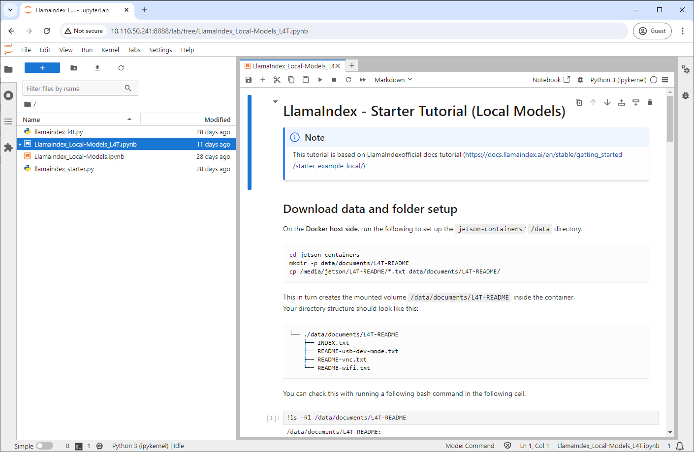

# Tutorial - LlamaIndex

Let's use [LlamaIndex](https://www.llamaindex.ai/), to realize RAG (Retrieval Augmented Generation) so that an LLM can work with your documents!

!!! abstract "What you need"

    1. One of the following Jetson devices:

        <span class="blobDarkGreen4">Jetson AGX Orin 64GB Developer Kit</span>
        <span class="blobDarkGreen5">Jetson AGX Orin (32GB) Developer Kit</span>
        <span class="blobLightGreen4">Jetson Orin Nano 8GB Developer Kit</span>

    2. Running one of the following versions of [JetPack](https://developer.nvidia.com/embedded/jetpack):

        <span class="blobPink1">JetPack 5 (L4T r35.x)</span>
        <span class="blobPink2">JetPack 6 (L4T r36.x)</span>

    3. <span class="markedYellow">NVMe SSD **highly recommended**</span> for storage speed and space

        - `5.5 GB` for `llama-index` container image
        - Space for checkpoints

    4. Clone and setup [`jetson-containers`](https://github.com/dusty-nv/jetson-containers/blob/master/docs/setup.md){:target="_blank"}:
    
		```bash
		git clone https://github.com/dusty-nv/jetson-containers
		bash jetson-containers/install.sh
		``` 

## How to start a container with samples

Use `run.sh` and `autotag` script to automatically pull or build a compatible container image.

```
jetson-containers run $(autotag llama-index:samples)
```

The container has a default run command (`CMD`) that will automatically start the Jupyter Lab server.

Open your browser and access `http://<IP_ADDRESS>:8888`.

> The default password for Jupyter Lab is `nvidia`.

You can follow along `LlamaIndex_Local-Models_L4T.ipynb` (which is based on the official LlamaIndex [tutorial](https://docs.llamaindex.ai/en/stable/getting_started/starter_example_local/)). 

