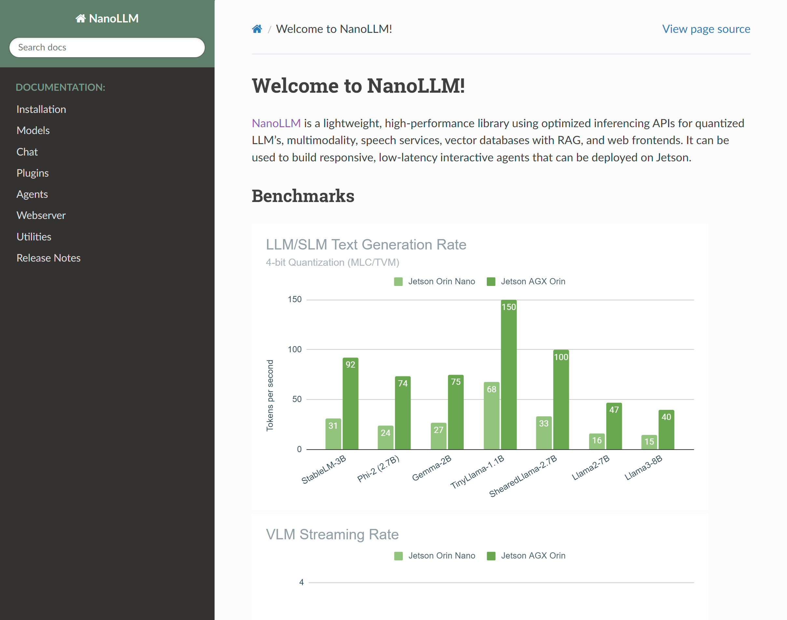

# NanoLLM - Optimized LLM Inference

[`NanoLLM`](https://dusty-nv.github.io/NanoLLM){:target="_blank"} is a lightweight, high-performance library using optimized inferencing APIs for quantized LLM’s, multimodality, speech services, vector databases with RAG, and web frontends like [Agent Studio](agent_studio.md).

<a href="https://dusty-nv.github.io/NanoLLM" target="_blank"></img></a>
<video controls autoplay muted style="max-width: 75%">
    <source src="images/agent_studio.mp4" type="video/mp4">
</video>

It provides <a href="tutorial_api-examples.html#nanollm" target="_blank">similar APIs</a> to HuggingFace, backed by highly-optimized inference libraries and quantization tools:

```python title="<a href='https://dusty-nv.github.io/NanoLLM' target='_blank'>NanoLLM Reference Documentation</a>"
from nano_llm import NanoLLM

model = NanoLLM.from_pretrained(
   "meta-llama/Meta-Llama-3-8B-Instruct",  # HuggingFace repo/model name, or path to HF model checkpoint
   api='mlc',                              # supported APIs are: mlc, awq, hf
   api_token='hf_abc123def',               # HuggingFace API key for authenticated models ($HUGGINGFACE_TOKEN)
   quantization='q4f16_ft'                 # q4f16_ft, q4f16_1, q8f16_0 for MLC, or path to AWQ weights
)

response = model.generate("Once upon a time,", max_new_tokens=128)

for token in response:
   print(token, end='', flush=True)
```

## Containers

To test a chat session with Llama from the command-line, install [`jetson-containers`](https://github.com/dusty-nv/jetson-containers){:target="_blank"} and run NanoLLM like this:

```
git clone https://github.com/dusty-nv/jetson-containers
bash jetson-containers/install.sh
```

=== "Llama CLI"

    ```bash
    jetson-containers run \
      --env HUGGINGFACE_TOKEN=hf_abc123def \
      $(autotag nano_llm) \
        python3 -m nano_llm.chat --api mlc \
          --model meta-llama/Meta-Llama-3-8B-Instruct \
          --prompt "Can you tell me a joke about llamas?"
    ```

=== "Agent Studio"

    ```	
    jetson-containers run \
      --env HUGGINGFACE_TOKEN=hf_abc123def \
      $(autotag nano_llm) \
        python3 -m nano_llm.studio
    ```

    


If you haven't already, request access to the [Llama models](https://huggingface.co/meta-llama){:target="_blank"} on HuggingFace and substitute your account's API token above.

## Resources

Here's an index of the various tutorials & examples using NanoLLM on Jetson AI Lab:

|      |                     |
| :---------- | :----------------------------------- |
| **[Benchmarks](./benchmarks.md){:target="_blank"}** | Benchmarking results for LLM, SLM, VLM using MLC/TVM backend. |
| **[API Examples](./tutorial_api-examples.md#nanollm){:target="_blank"}** | Python code examples for chat, completion, and multimodal. |
| **[Documentation](https://dusty-nv.github.io/NanoLLM){:target="_blank"}** | Reference documentation for the NanoLLM model and agent APIs. |
| **[Llamaspeak](./tutorial_llamaspeak.md){:target="_blank"}** | Talk verbally with LLMs using low-latency ASR/TTS speech models. |
| **[Small LLM (SLM)](./tutorial_slm.md){:target="_blank"}** | Focus on language models with reduced footprint (7B params and below) |
| **[Live LLaVA](./tutorial_live-llava.md){:target="_blank"}** | Realtime live-streaming vision/language models on recurring prompts. |
| **[Nano VLM](./tutorial_nano-vlm.md){:target="_blank"}** | Efficient multimodal pipeline with one-shot image tagging and RAG support. |
| **[Agent Studio](./agent_studio.md){:target="_blank"}** | Rapidly design and experiment with creating your own automation agents. |

<div><iframe width="500" height="280" src="https://www.youtube.com/embed/UOjqF3YCGkY" style="display: inline-block;" title="YouTube video player" frameborder="0" allow="accelerometer; autoplay; clipboard-write; encrypted-media; gyroscope; picture-in-picture; web-share" allowfullscreen></iframe>
<iframe width="500" height="280" src="https://www.youtube.com/embed/wZq7ynbgRoE" style="display: inline-block;" title="YouTube video player" frameborder="0" allow="accelerometer; autoplay; clipboard-write; encrypted-media; gyroscope; picture-in-picture; web-share" allowfullscreen></iframe>
</div>
<div><iframe width="500" height="280" src="https://www.youtube.com/embed/hswNSZTvEFE" style="display: inline-block;" title="YouTube video player" frameborder="0" allow="accelerometer; autoplay; clipboard-write; encrypted-media; gyroscope; picture-in-picture; web-share" allowfullscreen></iframe>
<iframe width="500" height="280" src="https://www.youtube.com/embed/_7gughth8C0" title="YouTube video player" frameborder="0" allow="accelerometer; autoplay; clipboard-write; encrypted-media; gyroscope; picture-in-picture; web-share" allowfullscreen></iframe>
<iframe width="500" height="280" src="https://www.youtube.com/embed/8Eu6zG0eEGY" style="display: inline-block;" title="YouTube video player" frameborder="0" allow="accelerometer; autoplay; clipboard-write; encrypted-media; gyroscope; picture-in-picture; web-share" allowfullscreen></iframe>
<iframe width="500" height="280" src="https://www.youtube.com/embed/9ozwh9EDGhU" title="YouTube video player" frameborder="0" allow="accelerometer; autoplay; clipboard-write; encrypted-media; gyroscope; picture-in-picture; web-share" allowfullscreen></iframe>

</div>  

