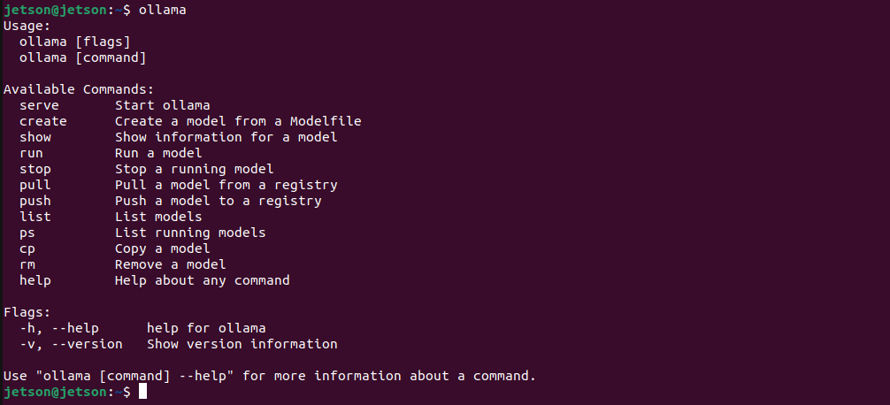

# Tutorial - Ollama

[Ollama](https://ollama.com){:target="_blank"} is a popular open-source tool that allows users to easily run a large language models (LLMs) locally on their own computer, serving as an accessible entry point to LLMs for many.

It now offers out-of-the-box support for the Jetson platform with CUDA support, enabling Jetson users to seamlessly install Ollama with a single command and start using it immediately.

In this tutorial, we introduce two installation methods: (1) the default native installation using the official Ollama installer, and (2) the Docker container method, which allows users to avoid making changes to their existing system.

</img>

* The `ollama` [client](#ollama-client) can run inside or outside container after starting the [server](#ollama-server).
* You can also run an [Open WebUI server](#open-webui) for supporting web clients.
* Supports the latest models like [gpt-oss](https://ollama.com/library/gpt-oss{:target="_blank"}!

## Ollama Server

!!! abstract "What you need"

    1. One of the following Jetson devices:

        <span class="blobDarkGreen3">Jetson AGX Thor</span>
        <span class="blobDarkGreen4">Jetson AGX Orin (64GB)</span>
        <span class="blobDarkGreen5">Jetson AGX Orin (32GB)</span>
        <span class="blobLightGreen3">Jetson Orin NX (16GB)</span>
        <span class="blobLightGreen3">Jetson Orin Nano (8GB)</span>

    2. Running one of the following versions of [JetPack](https://developer.nvidia.com/embedded/jetpack){:target="_blank"}:

        <span class="blobPink1">JetPack 5 (L4T r35.x)</span>
        <span class="blobPink2">JetPack 6 (L4T r36.x)</span>

    3. <span class="markedYellow">NVMe SSD **highly recommended**</span> for storage speed and space

        - `7GB` for `ollama` container image
        - Space for models (`>5GB`)


## (1) Native Install

!!! note

    Ollama native installer does not support Jetson AGX Thor Developer Kit yet.

    If you want to run Ollama on Jetson AGX Thor Developer Kit, checkout the following [Ollama container](#2-docker-container-for-ollama) approach.

Ollama's official installer already support Jetson and can easily install CUDA-supporting Ollama.

```bash
curl -fsSL https://ollama.com/install.sh | sh
```


It create a service to run `ollama serve` on start up, so you can start using `ollama` command right away.

### Example: Ollama usage

```bash
ollama
```



### Example: run a model on CLI

```bash
ollama run llama3.2:3b
```

## (2) Docker container for `ollama`


=== ":material-numeric-7-box: JetPack 7 (Jetson Thor)"

    You can use this Docker container built to run Ollama on Jetson Thor.

    ```bash
    mkdir ~/ollama-data/
    docker run --rm -it -v ${HOME}/ollama-data:/data ghcr.io/nvidia-ai-iot/ollama:r38.2.arm64-sbsa-cu130-24.04
    ```

    It will take some time to pull (download) the container image.

    Once in the container, you will see something like this.

    ```bash
    Starting ollama server


    OLLAMA_HOST   0.0.0.0
    OLLAMA_LOGS   /data/logs/ollama.log
    OLLAMA_MODELS /data/models/ollama/models


    ollama server is now started, and you can run commands here like 'ollama run gemma3'

    root@2a79cc8835d9:/#
    ```

    Try running a GPT OSS (20b parameter) model by issuing a command below.

    ```bash
    ollama run --verbose gpt-oss:20b
    ```

    It will download 14GB weight, so it takes some time here as well.

    Once ready, it will show something like this:

    ```bash
    root@2a79cc8835d9:/# ollama run --verbose gpt-oss:20b
    pulling manifest
    pulling b112e727c6f1: 100% ▕███████████████████████████████████████████▏  13 GB
    pulling fa6710a93d78: 100% ▕███████████████████████████████████████████▏ 7.2 KB
    pulling f60356777647: 100% ▕███████████████████████████████████████████▏  11 KB
    pulling d8ba2f9a17b3: 100% ▕███████████████████████████████████████████▏   18 B
    pulling 55c108d8e936: 100% ▕███████████████████████████████████████████▏  489 B
    verifying sha256 digest
    writing manifest
    success
    >>> Send a message (/? for help)
    ```

    Try any prompt and you will get something like this.

    ```bash
    root@c11344f6bbbc:/# ollama run --verbose gpt-oss:20b
    >>> why is the sky blue in one sentence
    Thinking...
    We need to answer: "why is the sky blue in one sentence". Just one sentence. Provide explanation: Rayleigh scattering of sunlight,
    shorter wavelengths scatter more. We'll produce a single sentence. Let's give a concise explanation.
    ...done thinking.

    The sky looks blue because the Earth's atmosphere scatters shorter-wavelength (blue) light from the sun more efficiently than longer
    wavelengths, a phenomenon called Rayleigh scattering.

    total duration:       3.504445244s
    load duration:        225.399151ms
    prompt eval count:    76 token(s)
    prompt eval duration: 673.487645ms
    prompt eval rate:     112.85 tokens/s
    eval count:           88 token(s)
    eval duration:        2.603822053s
    eval rate:            33.80 tokens/s
    >>> Send a message (/? for help)
    ```

    You can finish the session by typing `/bye`.

=== ":material-numeric-6-box-outline: JetPack 6 (Jetson Orin)"

    We can use `jetson-containers` to run Ollama.

    ```
    # models cached under jetson-containers/data
    jetson-containers run --name ollama $(autotag ollama)

    # models cached under your user's home directory
    docker run --runtime nvidia --rm --network=host -v ~/ollama:/ollama -e OLLAMA_MODELS=/ollama dustynv/ollama:r36.2.0
    ```

    Running either of these will start the local Ollama server as a daemon in the background.  It will save the models it downloads under your mounted `jetson-containers/data/models/ollama` directory (or another directory that you override with `OLLAMA_MODELS`)

    Start the Ollama command-line chat client with your desired [model](https://ollama.com/library){:target="_blank"} (for example: `llama3`, `phi3`, `mistral`)

    ```
    # if running inside the same container as launched above
    /bin/ollama run phi3

    # if launching a new container for the client in another terminal
    jetson-containers run $(autotag ollama) /bin/ollama run phi3
    ```

    Or you can install Ollama's [binaries](https://github.com/ollama/ollama/releases){:target="_blank"} for arm64 outside of container (without CUDA, which only the server needs)

    ```
    # download the latest ollama release for arm64 into /bin
    sudo wget https://github.com/ollama/ollama/releases/download/$(git ls-remote --refs --sort="version:refname" --tags https://github.com/ollama/ollama | cut -d/ -f3- | sed 's/-rc.*//g' | tail -n1)/ollama-linux-arm64 -O /bin/ollama
    sudo chmod +x /bin/ollama

    # use the client like normal outside container
    /bin/ollama run phi3
    ```

## Open WebUI

To run an [Open WebUI](https://github.com/open-webui/open-webui){:target="_blank"} server for client browsers to connect to, use the `open-webui` container:

```
docker run -it --rm --network=host --add-host=host.docker.internal:host-gateway ghcr.io/open-webui/open-webui:main
```

You can then navigate your browser to `http://JETSON_IP:8080`, and create a fake account to login (these credentials are only local)

</img>

Ollama uses llama.cpp for inference, which various API benchmarks and comparisons are provided for on the [Llava](./tutorial_llava.md){:target="_blank"} page.  It gets roughly half of peak performance versus the faster APIs like [NanoLLM](./tutorial_nano-llm.md), but is generally considered fast enough for text chat.
