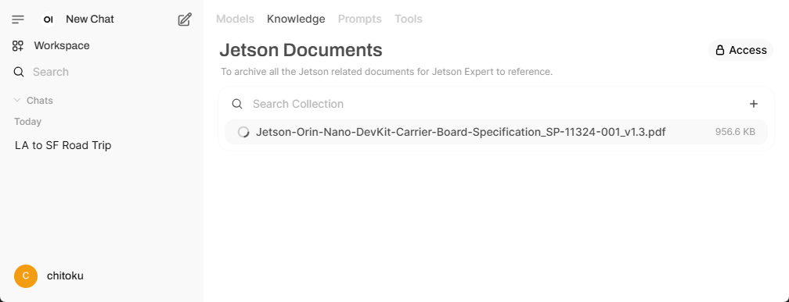
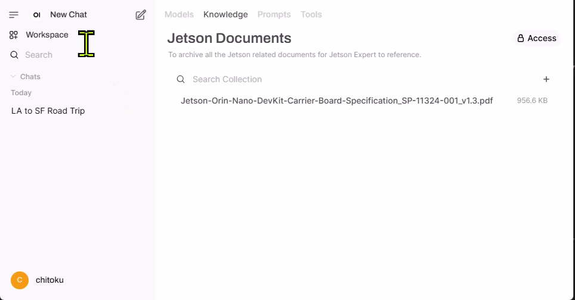

# Tutorial - Open WebUI

[Open WebUI](https://github.com/ollama/ollama){:target="_blank"} is a versatile, browser-based interface for running and managing large language models (LLMs) locally, offering Jetson developers an intuitive platform to experiment with LLMs on their devices.

It can work with Ollama as a backend as well as other backend that is compatible with OpenAI, which can also run well on Jetson.


## Ollama Server

!!! abstract "What you need"

    1. One of the following Jetson devices:

        <span class="blobDarkGreen4">Jetson AGX Orin (64GB)</span>
        <span class="blobDarkGreen5">Jetson AGX Orin (32GB)</span>
        <span class="blobLightGreen3">Jetson Orin NX (16GB)</span>
        <span class="blobLightGreen3">Jetson Orin Nano (8GB)</span>

    2. Running one of the following versions of [JetPack](https://developer.nvidia.com/embedded/jetpack){:target="_blank"}:

        <span class="blobPink1">JetPack 5 (L4T r35.x)</span>
        <span class="blobPink2">JetPack 6 (L4T r36.x)</span>

    3. <span class="markedYellow">NVMe SSD **highly recommended**</span> for storage speed and space

        - `7GB` for `open-webui` container image

```bash
sudo docker run -d --network=host \
    -v ${HOME}/open-webui:/app/backend/data \
    -e OLLAMA_BASE_URL=http://127.0.0.1:11434 \
    --name open-webui \
    --restart always \
    ghcr.io/open-webui/open-webui:main
```

## 🦙 Ollama backend

If you <a href="./tutorial_ollama.html">have installed Ollama</a>, you can just run the Open WebUI docker container without installing any other things.

```
sudo docker run -d --network=host \
    -v ${HOME}/open-webui:/app/backend/data \
    -e OLLAMA_BASE_URL=http://127.0.0.1:11434 \
    --name open-webui \
    --restart always \
    ghcr.io/open-webui/open-webui:main
```

### Case 2: Ollama container

If you have not natively installed Ollama, you can also run `Ollama` in container using `jetson-containers`, after executing the above command to run Open WebUI container.

```bash
jetson-containers run --name ollama $(autotag ollama)
```

> You need to have `jetson-containers` installed
>
> ```bash
> git clone https://github.com/dusty-nv/jetson-containers
> bash jetson-containers/install.sh
> ```

### Case 3: Docker Compose to launch both at the same time

You can save the following YML file and issue `docker compose up`.

=== "docker-compose.yml"

    ```yaml
    services:
    open-webui:
        image: ghcr.io/open-webui/open-webui:main
        container_name: open-webui
        network_mode: "host"
        environment:
        - OLLAMA_BASE_URL=http://127.0.0.1:11434
        volumes:
        - "${HOME}/open-webui:/app/backend/data"

    ollama:
        image: dustynv/ollama:r36.4.0
        container_name: ollama
        runtime: nvidia
        network_mode: "host"
        shm_size: "8g"
        volumes:
        - "/var/run/docker.sock:/var/run/docker.sock"
        - "${HOME}/data:/data"
        - "/etc/localtime:/etc/localtime:ro"
        - "/etc/timezone:/etc/timezone:ro"
        - "/run/jtop.sock:/run/jtop.sock"
    ```

Once you save the above YAML file in a directory, issue the following.

```bash
docker compose up
```

{.shadow}

## Basic Usage

### Step 1. Access through Web browser

Open a Web browser on a PC connected to the same network as your Jetson, and access the following address.

```
http://<IP_ADDR>:8080
```

You will see a initial web page like this.

{.shadow}

Click "**Get started :material-arrow-right-circle: **".

### Step 2. Complete the Account Creation Process

Follow the on-screen prompts to create an account.

{.shadow}

!!! note

    Note that **all account information stays local**, so privacy is maintained. You can use a random email address and password for this step as it is not verified or stored externally.

    However, make sure to remember the credentials, as you’ll need them to log in for future sessions.

    For more details, refer to the provided [information link](https://docs.openwebui.com/faq/#q-why-am-i-asked-to-sign-up-where-are-my-data-being-sent-to) or instructions on the screen.

Once you "**Create Admin Account**", you will be presented with the release notes for the latest version of Open WebUI. To proceed, click "**Okay, Let's Go!**" button.

{.shadow}

Once everything is set up, you should see the following UI appear.

{.shadow}

### Step 3. Download an SLM model

To download an SLM model, click the dropdown :material-chevron-down: next to the "Select a model" section. Type the name of the model you want to try in "🔎 **Search a model**" field.

{.shadow}

Once selected, you'll be prompted to download the model directly from Ollama.

{.shadow}

After the download, select the newly downloaded model from the list. In our case, it was the LLaMA 3.2:2B model.

{.shadow}

!!! tip

    After downloading your SLM model, you have the option to disconnect your Jetson unit from the internet. This allows you to validate that all subsequent interactions are powered exclusively by the local generative AI model, all running on this edge AI computer.

### Step 4. Start interacting with the model

You can now start interacting with the model, just like you would with any other LLM chatbot.

{.shadow}

## Usage - RAG

### Step 1. Create a knowledge base

To enable RAG, you need to create a knowledge base that the LLM can reference to answer queries.

Follow these steps to create a knowledge base:

- Open the Open WebUI interface.
- Click on Workspace.
- Select Knowledge from the top menu.
- Click the "➕" icon to create a new knowledge base.

{.shadow}

### Step 2. Add files to the knowledge base

After providing the necessary details and clicking "**Create Knowledge**", you will be redirected to the following page.

Here, you can add files or entire directories to build your knowledge base.

{.shadow}

Select a local PDF file or other document files to upload.

{.shadow}

{.shadow}

{.shadow}

### Step 3. Create a custom model with knowledge base access

To leverage the knowledge base for more accurate and context-aware responses, you need to create a model that can access this information. By linking the model to the knowledge base, the LLM can reference the stored data to provide more precise and relevant answers to user queries.

Follow these steps to create a model with knowledge base access

- Open the Open WebUI interface.
- Click on Workspace.
- Select Model from the top menu.
- Click the "➕" icon to create a new model.

{.shadow}

### Step 4. Configure the model

After clicking the "➕" icon, the following screen will appear.

{.shadow}

Here, you can configure the model with the following info:

| Field | What to do | Example |
| ----- | ---------- | ------- |
| **Model name** | Enter a name for your new model. | "**Jetson Expert**" |
| **Select a base model** :material-chevron-down: | Choose a base model from the list of models you've downloaded on your local Ollama server. | "`llama3.2:3b`" |
| **Select Knowledge** | Click the button and select the newly created knowledge base from the list. | "**Jetson Documents**" |

> {.shadow}

Once you enter necessary information, click "**Save & Create**" button.

{.shadow}

You will be taken back to the **Models** tab in the Workspace.

{.shadow}

### Step 5. Chat with your custom model

You can now navigate to the chat window and select the newly created model.

Use this model to ask questions related to the uploaded documents. This will help verify if the model can successfully retrieve information from the knowledge base.

{.shadow}

## Troubleshooting

### Open Web UI is not responding

Reload the page on your web browser.

### How to Create a New Account for Open WebUI (If You Forgot Your Password)

If you need to create a new account in Open WebUI (for example, if you forgot your password), follow these steps to reset the account:

#### Delete the existing Open WebUI data folder:

This will remove all existing user account data and settings. Run the following command:

```bash
sudo rm -rf ${HOME}/open-webui
```

#### Re-run the Docker container

This will recreate a fresh instance of Open WebUI, allowing you to create a new account.

```bash
sudo docker run -d --network=host \
    -v ${HOME}/open-webui:/app/backend/data \
    -e OLLAMA_BASE_URL=http://127.0.0.1:11434 \
    --name open-webui \
    --restart always \
    ghcr.io/open-webui/open-webui:main
```

#### How to Shut Down Open WebUI?

To gracefully stop and remove the Open WebUI container, run the following commands:

```bash
sudo docker stop open-webui
sudo docker rm open-webui
```

## Optional Setup: 🤖 MLC backend

Instead of running Open WebUI with Ollama backend, we can run models with more performant backend with MLC that are designed to run optimally on Jetson and can communicate to Open WebUI through OpenAI compatible API.

{.shadow}

### Case 1: Separate `docker run` commands

After running Open WebUI container with the following command, you can run the `docker run` command you find in the new [**Models**](./models.md) page.

=== "Open WebUI container"

    ```bash
    sudo docker run -d --network=host \
        -v ${HOME}/open-webui:/app/backend/data \
        -e OLLAMA_BASE_URL=http://127.0.0.1:11434 \
        --name open-webui \
        ghcr.io/open-webui/open-webui:main
    ```

=== "MLC container with LLama 3.1 8B"

    ```bash
    docker run -it --rm --gpus all \
    -p 9000:9000 \
    --pull always \
    -e DOCKER_PULL=on \
    -e HF_HUB_CACHE=/root/.cache/huggingface \
    -v /mnt/nvme/cache:/root/.cache \
    dustynv/mlc:r36.4.0 \
        sudonim serve \
        --model dusty-nv/Llama-3.1-8B-Instruct-q4f16_ft-MLC \
        --quantization q4f16_ft \
        --max-batch-size 1 \
        --host 0.0.0.0 \
        --port 9000
    ```

### Case 2: Docker compose

You can save the following YML file and issue `docker compose up`.

=== "compose.yml"

    ```yaml
    # Save as compose.yml and run 'docker compose up'
    services:
      llm_server:
        stdin_open: true
        tty: true
        deploy:
          resources:
            reservations:
              devices:
                - driver: nvidia
                  count: all
                  capabilities:
                    - gpu
        ports:
          - 9000:9000
        pull_policy: always
        environment:
          - DOCKER_PULL=on
          - HF_HUB_CACHE=/root/.cache/huggingface
        volumes:
          - /mnt/nvme/cache:/root/.cache
        image: dustynv/mlc:r36.4.0
        command: sudonim serve --model dusty-nv/Llama-3.1-8B-Instruct-q4f16_ft-MLC
          --quantization q4f16_ft --max-batch-size 1 --host 0.0.0.0 --port 9000
        healthcheck:
          test: ["CMD", "curl", "-f", "http://0.0.0.0:9000/v1/models"]
          interval: 20s
          timeout: 60s
          retries: 45
          start_period: 15s

      open-webui:
        image: ghcr.io/open-webui/open-webui:main
        container_name: open-webui
        restart: always
        network_mode: host
        environment:
          - ENABLE_OPENAI_API=True
          - OPENAI_API_BASE_URL=http://localhost:9000/v1
          - OPENAI_API_KEY=foo
        volumes:
          - "${HOME}/open-webui:/app/backend/data"
    ```

Once you save the above YAML file in a directory, issue the following.

```bash
docker compose up
```

{.shadow}

Note that it generates faster than Ollama (llama.cpp).

{.shadow}