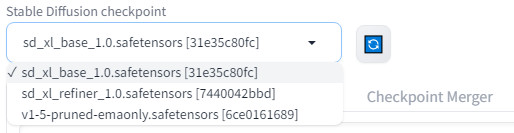
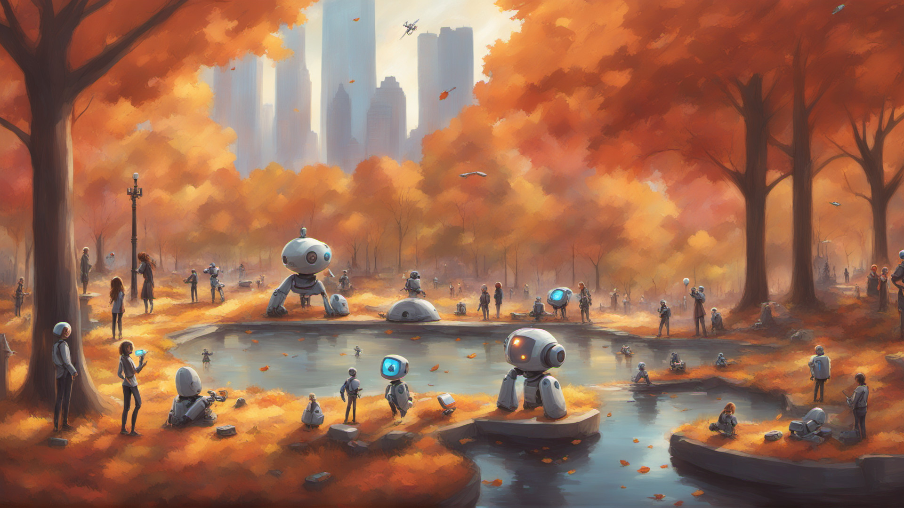

# Tutorial - Stable Diffusion XL

[Stable Diffusion XL](https://huggingface.co/stabilityai/stable-diffusion-xl-base-1.0) is a newer ensemble pipeline consisting of a base model and refiner that results in significantly enhanced and detailed image generation capabilities.  All told, SDXL 1.0 has 6.6 billion model parameters, in comparison to 0.98 billion for the original SD 1.5 model.


!!! abstract "What you need"

    1. One of the following Jetson devices (SDXL requires >= ~13GB memory)

        <span class="blobDarkGreen4">Jetson AGX Orin (64GB)</span>
        <span class="blobDarkGreen5">Jetson AGX Orin (32GB)</span>

    2. Running one of the following versions of [JetPack](https://developer.nvidia.com/embedded/jetpack):

        <span class="blobPink1">JetPack 5 (L4T r35.x)</span>
        <span class="blobPink2">JetPack 6 (L4T r36.x)</span>

    3. Sufficient storage space (preferably with NVMe SSD).

        - `6.8GB` for container image
        - `12.4GB` for SDXL models
	   
    4. Have followed the previous [`stable-diffusion-webui`](tutorial_stable-diffusion.md) tutorial and have the webserver container running.

## Downloading SDXL Models
    
Stable Diffusion XL is supported through AUTOMATIC1111's [`stable-diffusion-webui`](tutorial_stable-diffusion.md) with some additional settings.  First you need to download the SDXL models to your `jetson-containers` data directory (which is automatically mounted into the container)
    
```bash
# run these outside of container, and replace CONTAINERS_DIR with the path to the jetson-containers repo on your device
CONTAINERS_DIR=/path/to/your/jetson-containers
MODEL_DIR=$CONTAINERS_DIR/data/models/stable-diffusion/models/Stable-diffusion/

sudo chown -R $USER $MODEL_DIR

wget -P $MODEL_DIR https://huggingface.co/stabilityai/stable-diffusion-xl-base-1.0/resolve/main/sd_xl_base_1.0.safetensors
wget -P $MODEL_DIR https://huggingface.co/stabilityai/stable-diffusion-xl-refiner-1.0/resolve/main/sd_xl_refiner_1.0.safetensors
```

!!! tip ""

    It's assumed that you already have the [`stable-diffusion-webui`](tutorial_stable-diffusion.md) container and webserver running from the [previous tutorial](tutorial_stable-diffusion.md).

## SDXL Settings

After the models have finished downloading, click the 🔄 button to refresh the model list in the web UI.  Select `sd_xl_base_1.0.safetensors` from the **Stable Diffusion checkpoint** drop-down:



Then under the **Generation** tab, expand the **Refiner** section, and select `sd_xl_refiner_1.0.safetensors` from the drop-down:


Guidance on other relevant settings:

* Change the width/height to 1024x1024.  SDXL works best at higher resolutions, and using 512x512 often results in more simplistic/cartoonish content.  Changing image resolutions impacts the actual scene contents of the image, not just the details.
* The refiner's `Switch at` setting dictates the step at which the refiner takes over from the base model.  At this point, additional subject content will no longer be added to the scene, but rather its details further refined in the image.
* Typical `Sampling steps` are between 20-40 and `Switch at` is between 0.7-0.9.  This takes experimentation to find the best combination for the characteristics of your desired output.
* Extensive negative prompts are not as necessary in the same way as SD 1.5 was (e.g. `low quality, jpeg artifacts, blurry, ect`)
* `CFG Scale` controls how closely the model conforms to your prompt versus how creative it is.
    
When you get a good image, remember to save your random seed and settings so you can re-generate it later!

## Results


!!! tip ""

    <br/>
    *photograph of a friendly robot alongside a person climbing a mountain* (seed 1576166644, steps 25, switch @ 0.8, cfg scale 15)
    
!!! tip ""

    <br/>
    *a girl and a boy building a friendly robot in their basement workshop* (seed 642273464, steps 25, switch @ 0.9, cfg scale 7)

!!! tip ""

    <br/>
    *small friendly robots playing games with people, in a futuristic Tokyo central park gardens with cherry blossoms and water, coy fish swimming in the water, sunshine* (seed 642273464, steps 40, switch @ 0.8, cfg scale 7)

!!! tip ""

    <br/>
    *small friendly robots playing games with people in a futuristic New York City Central Park in autumn, water* (seed 642273464, steps 25, switch @ 0.8, cfg scale 7)
        
!!! tip ""

    **Want to explore using Python APIs to run diffusion models directly? See [`jetson-containers/stable-diffusion`](https://github.com/dusty-nv/jetson-containers/tree/master/packages/diffusion/stable-diffusion)**.