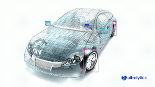
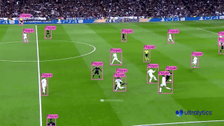
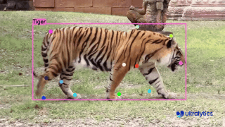
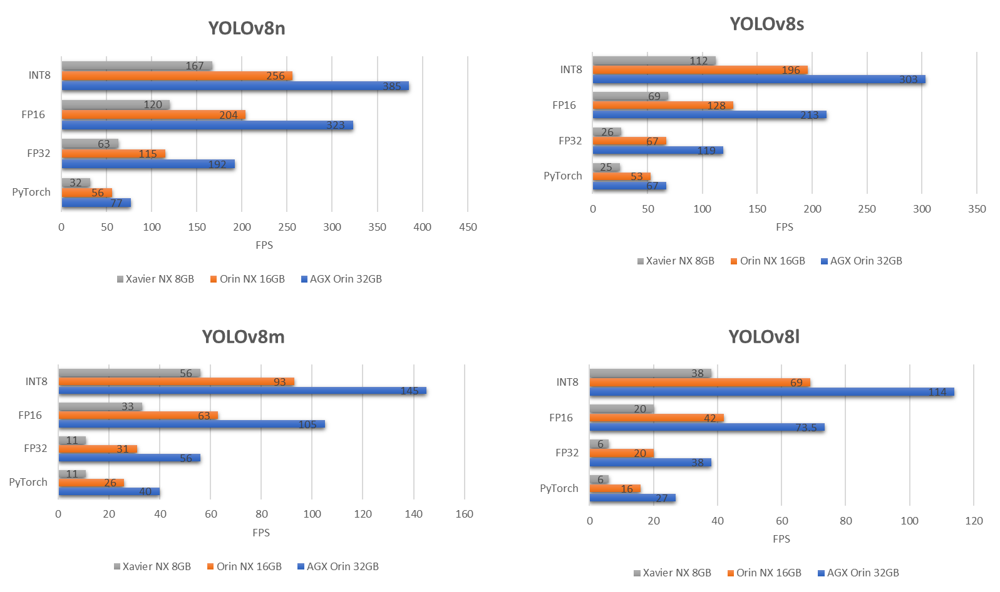

# Tutorial - Ultralytics YOLOv8

<a href="https://www.ultralytics.com/events/yolovision"></a>

Let's run [Ultralytics](https://www.ultralytics.com) YOLOv8 on Jetson with [NVIDIA TensorRT](https://developer.nvidia.com/tensorrt).

[Ultralytics](https://github.com/ultralytics/ultralytics) YOLOv8 is a cutting-edge, state-of-the-art (SOTA) model that builds upon the success of previous YOLO versions and introduces new features and improvements to further boost performance and flexibility. YOLOv8 is designed to be fast, accurate, and easy to use, making it an excellent choice for a wide range of object detection and tracking, instance segmentation, image classification and pose estimation tasks.

<div style="text-align: center;">
  
</div>

!!! abstract "What you need"

    1. One of the following Jetson devices:

        <span class="blobDarkGreen4">Jetson AGX Orin (64GB)</span>
        <span class="blobDarkGreen5">Jetson AGX Orin (32GB)</span>
        <span class="blobLightGreen3">Jetson Orin NX (16GB)</span>
        <span class="blobLightGreen4">Jetson Orin Nano (8GB)</span>
        <span class="blobLightGreen5">Jetson Nano (4GB)</span>

    2. Running one of the following versions of [JetPack](https://developer.nvidia.com/embedded/jetpack):

        <span class="blobPink1">JetPack 4 (L4T r32.x)</span>
        <span class="blobPink2">JetPack 5 (L4T r35.x)</span>
        <span class="blobPink3">JetPack 6 (L4T r36.x)</span>

## How to start

Execute the below commands according to the JetPack version to pull the corresponding Docker container and run on Jetson.

=== "JetPack 4"

    ```bash
    t=ultralytics/ultralytics:latest-jetson-jetpack4
    sudo docker pull $t && sudo docker run -it --ipc=host --runtime=nvidia $t
    ```

=== "JetPack 5"

    ```bash
    t=ultralytics/ultralytics:latest-jetson-jetpack5
    sudo docker pull $t && sudo docker run -it --ipc=host --runtime=nvidia $t
    ```

=== "JetPack 6"

    ```bash
    t=ultralytics/ultralytics:latest-jetson-jetpack6
    sudo docker pull $t && sudo docker run -it --ipc=host --runtime=nvidia $t
    ```

## Convert model to TensorRT and run inference

The YOLOv8n model in PyTorch format is converted to TensorRT to run inference with the exported model.

!!! Example

    === "Python"

        ```python
        from ultralytics import YOLO

        # Load a YOLOv8n PyTorch model
        model = YOLO("yolov8n.pt")

        # Export the model
        model.export(format="engine")  # creates 'yolov8n.engine'

        # Load the exported TensorRT model
        trt_model = YOLO("yolov8n.engine")

        # Run inference
        results = trt_model("https://ultralytics.com/images/bus.jpg")
        ```

    === "CLI"

        ```bash
        # Export a YOLOv8n PyTorch model to TensorRT format
        yolo export model=yolov8n.pt format=engine  # creates 'yolov8n.engine'

        # Run inference with the exported model
        yolo predict model=yolov8n.engine source='https://ultralytics.com/images/bus.jpg'
        ```

|                   Manufacturing                   |                        Sports                        |                   Wildlife                    |
| :-----------------------------------------------: | :--------------------------------------------------: | :-----------------------------------------: |
|  |  |  |
|           Vehicle Spare Parts Detection           |              Football Player Detection               |            Tiger pose Detection            |

!!! Note

    Visit the [Export page](https://docs.ultralytics.com/modes/export) to access additional arguments when exporting models to different model formats. Note that the default arguments require inference using fixed image dimensions when `dynamic=False`. To change the input source for inference, please refer to [Model Prediction](https://docs.ultralytics.com/modes/predict/#inference-sources) page. 

## Benchmarks

Benchmarks of the YOLOv8 variants with TensorRT were run by [Seeed Studio](https://www.seeedstudio.com/blog/2023/03/30/yolov8-performance-benchmarks-on-nvidia-jetson-devices/) on their [reComputer](https://www.seeedstudio.com/tag/nvidia.html) systems:



=== "Xavier NX 8GB"

    | Model   | PyTorch | FP32 | FP16 | INT8 |
    |---------|:-------:|:----:|:----:|:----:|
    | YOLOv8n |    32   |  63  |  120 |  167 |
    | YOLOv8s |    25   |  26  |  69  |  112 |
    | YOLOv8m |    11   |  11  |  33  |  56  |
    | YOLOv8l |    6    |   6  |  20  |  38  |
    
=== "Orin NX 16GB"

    | Model   | PyTorch | FP32 | FP16 | INT8 |
    |---------|:-------:|:----:|:----:|:----:|
    | YOLOv8n |    56   |  115 |  204 |  256 |
    | YOLOv8s |    53   |  67  |  128 |  196 |
    | YOLOv8m |    26   |  31  |  63  |  93  |
    | YOLOv8l |    16   |  20  |  42  |  69  |
 
=== "AGX Orin 32GB"

    | Model   | PyTorch | FP32 | FP16 | INT8 |
    |---------|:-------:|:----:|:----:|:----:|
    | YOLOv8n |    77   |  192 |  323 |  385 |
    | YOLOv8s |    67   |  119 |  213 |  303 |
    | YOLOv8m |    40   |  56  |  105 |  145 |
    | YOLOv8l |    27   |  38  | 73.5 |  114 |


* FP32/FP16/INT8 with TensorRT (frames per second)
* Original post with the benchmarks are found [here](https://www.seeedstudio.com/blog/2023/03/30/yolov8-performance-benchmarks-on-nvidia-jetson-devices/)
       
## Further reading

To learn more, visit our [comprehensive guide on running Ultralytics YOLOv8 on NVIDIA Jetson](https://docs.ultralytics.com/guides/nvidia-jetson) including benchmarks!

!!! Note

    Ultralytics YOLOv8 models are offered under `AGPL-3.0 License` which is an [OSI-approved](https://opensource.org/license) open-source license and is ideal for students and enthusiasts, promoting open collaboration and knowledge sharing. See the [LICENSE](https://github.com/ultralytics/ultralytics/blob/main/LICENSE) file for more details.

## One-Click Run Ultralytics YOLO on Jetson Orin - by Seeed Studio [jetson-examples](https://github.com/Seeed-Projects/jetson-examples)

### Quickstart ⚡
1. Install the package:
    ```sh
    pip install jetson-examples
    ```

2. Restart your reComputer:
    ```sh
    sudo reboot
    ```

3. Run Ultralytics YOLO on Jetson with one command:
    ```sh
    reComputer run ultralytics-yolo
    ```
4. Enter [`http://127.0.0.1:5001`](http://127.0.0.1:5001) or `http://device_ip:5001` in your browser to access the Web UI.
    <p align="center">
      
    </p>


For more details, please read: [Jetson-Example: Run Ultralytics YOLO Platform Service on NVIDIA Jetson Orin ](https://github.com/Seeed-Projects/jetson-examples/blob/main/reComputer/scripts/ultralytics-yolo/README.md).


## Follow Ultralytics to stay updated!

<div align="center">
  <br>
  <a href="https://github.com/ultralytics"></a>
  
  <a href="https://www.linkedin.com/company/ultralytics/"></a>
  
  <a href="https://twitter.com/ultralytics"></a>
  
  <a href="https://youtube.com/ultralytics?sub_confirmation=1"></a>
  
  <a href="https://www.tiktok.com/@ultralytics"></a>
  
  <a href="https://ultralytics.com/bilibili"></a>
  
  <a href="https://ultralytics.com/discord"></a>
</div>
