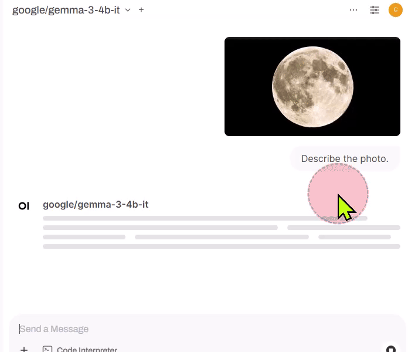

# Local VLM Microservices

Local VLM (Vision Language Model) microservices can unlock a **new class of applications** for VLMs at the edge, as it can enable capabilities and performance that cloud-hosted VLMs cannot achieve, especially when integrated with **local live video sources**.

In this module, we

1. first look at the example of local VML microservices and its applications, and then
1. experiment with the **"Augmented" VLM Microservice** that enables the efficient local video source ingestion and explore the applications

## 1. Local VLM Microservices

### Gemma-3-4b on Ollama

Google [launched Gemma 3 in March 2025](https://developers.googleblog.com/en/introducing-gemma3/), introducing multimodal support for models with over 4 billion parameters, enabling vision input alongside text processing.

Let's run the 4B model using Ollama.

=== "Ollama Docker Container"

    ```bash
    docker run -it --rm \
    --gpus all --network=host \
    -e OLLAMA_HOST="0.0.0.0:9000" \
    -e OLLAMA_MODEL=gemma3:4b \
    -e OLLAMA_CONTEXT_LENGTH=4096 \
    -e OLLAMA_LOGS=/root/.ollama/ollama.log \
    -v /mnt/nvme/cache:/root/.cache \
    -v /mnt/nvme/cache/ollama:/root/.ollama \
    dustynv/ollama:main-r36.4.0
    ```

=== "Ollama natively installed"

    !!! note

        This assumes you have installed `ollama` natively on your Jetson, as shown in this [tutorial section](../tutorial_ollama.html#1-native-install).

    ```bash
    ollama run gemma3:4b
    ```

### LLM - Text-only

#### Curl Request with Text-only

You can reuse the curl command we used in the [earlier tutorial](./microservices_intro.md).

```bash
curl http://0.0.0.0:9000/v1/chat/completions \
-H "Content-Type: application/json" \
-d '{
    "messages": [
    {
        "role": "system",
        "content": "You are a helpful assistant."
    },
    {
        "role": "user",
        "content": "Hello!"
    }
    ]
}'
```

You will see a response something like this.

``` { .json .no-copy }
{
"id": "chatcmpl-44f2b0d94e0e444e9fcdacfbe38728fc",
"object": "chat.completion",
"created": 1742065798,
"model": "google/gemma-3-4b-it",
"choices": [
    {
    "index": 0,
    "message": {
        "role": "assistant",
        "reasoning_content": null,
        "content": "Hello there! How can I help you today? 😊 \n\nDo you need me to:\n\n*   Answer a question?\n*   Brainstorm ideas?\n*   Write something?\n*   Just chat?\n\nLet me know what's on your mind!",
        "tool_calls": []
    },
    "logprobs": null,
    "finish_reason": "stop",
    "stop_reason": 106
    }
],
"usage": {
    "prompt_tokens": 18,
    "total_tokens": 75,
    "completion_tokens": 57,
    "prompt_tokens_details": null
},
"prompt_logprobs": null
}
```

### VLM - With Image

#### The "Vision API"

[OpenAI API Doc](https://platform.openai.com/docs/guides/images) shows how to use the vision capabilities through their API. This works with Ollama as well.

You make the request to the same `/v1/chat/completions` endpoint, but provides extra image information, either by putting a URL for an image file or by providing an image as a Base64-encoded data.

{ .shadow }

#### Curl Request with Image

You can test the `curl` commands in both styles against Ollama server.

You will see the response that shows that it processed the passed or encoded image.

=== "Passing a URL"

    ```bash
    curl --location --request POST http://0.0.0.0:9000/v1/chat/completions \
    --header "Content-Type: application/json" \
    --data '{
        "messages": [
        {
            "role": "user",
            "content": [
            {
                "type": "text",
                "text": "What is in this image?"
            },
            {
                "type": "image_url",
                "image_url": {
                    "url": "https://upload.wikimedia.org/wikipedia/commons/thumb/d/dd/Gfp-wisconsin-madison-the-nature-boardwalk.jpg/2560px-Gfp-wisconsin-madison-the-nature-boardwalk.jpg"
                }
            }
            ]
        }
        ],
        "max_tokens": 300
    }'
    ```

    ??? abstract "Example response"

        ``` {.json .no-copy}
        {
        "id": "chatcmpl-7055ee78ebd64a7895bdf9a5e22e495e",
        "object": "chat.completion",
        "created": 1742067887,
        "model": "google/gemma-3-4b-it",
        "choices": [
            {
            "index": 0,
            "message": {
                "role": "assistant",
                "reasoning_content": null,
                "content": "Here's a breakdown of what's in the image:\n\n*   **Wooden boardwalk:** A long, wooden walkway stretches into the image, leading into the grassy field.\n*   **Tall grass and reeds:** The foreground is dominated by very tall, green grass and reeds, creating a lush, natural environment.\n*   **Field/Wetland:** The boardwalk leads into a wide field, which appears to be a wetland or marsh area.\n*   **Trees and shrubs:** A line of trees and shrubs forms the distant horizon.\n*   **Sky:** A vibrant blue sky filled with fluffy white clouds.\n\nOverall, it’s a beautiful landscape shot of a serene wetland area, likely a nature preserve or park, with a boardwalk providing access to the area.",
                "tool_calls": []
            },
            "logprobs": null,
            "finish_reason": "stop",
            "stop_reason": 106
            }
        ],
        "usage": {
            "prompt_tokens": 275,
            "total_tokens": 435,
            "completion_tokens": 160,
            "prompt_tokens_details": null
        },
        "prompt_logprobs": null
        }
        ```

=== "Passing a Base64 encoded image"

    ```bash
    curl --location --request POST 'http://0.0.0.0:9000/v1/chat/completions' \
    --header 'Content-Type: application/json' \
    --data '{
        "messages": [
        {
            "role": "user",
            "content": [
            {
                "type": "text",
                "text": "Describe this icon."
            },
            {
                "type": "image_url",
                "image_url": {
                    "url": "data:image/png;base64,iVBORw0KGgoAAAANSUhEUgAAABAAAAAQCAYAAAAf8/9hAAAAAXNSR0IArs4c6QAAAYNJREFUOE9j3CEjU/efkbGakYGBjYEE8J+B4Rfj//+tjNtlZX+SqhlmD9iQHbKy/2EC3CoqDNxKSnB3fL5xg4GZi4uBS04OLvbxwgWGn69ewfkoBvBqazMYzJjBwCUvD1ZwKjQUrFmntxfM/3DuHMPF7GyGH0+fYjcAJGq+YQODgJERw59Pnxj2GRgwsAkKMtifOcPAyMjI8Gz9eobL+fkoIYXiAmQDXm7bxnAhIwOs2HLrVgY+XV3SDLhSWsrwdOVKsAEqJSUMynl5pBnw9vhxsDdAgF1cnEHAwIB4A5jY2BiOe3khAoqZmcHx3DmG1wcOEBcG744eZbjd3Y0SWHpTpjD8//uXOANutrQwfDhzBsUAqeBgBmE7O8IGGC1cyHA+KQlsGzJgExFhUK+pYbhcUIA7GkWdnBikwsIYHi1YwPD+xAkUhYLm5gzyiYkMT1evZni9dy/2hCRsY8PAwsfH8PPlS4YPZ8+iGMBvZMTAISHB8OfzZ4a3hw8jDKA8M1GYnQE8m7INTv0HFQAAAABJRU5ErkJggg=="
                }
            }
            ]
        }
        ],
        "max_tokens": 128
    }'
    ```

    ??? abstract "Example response"

        ``` {.json .no-copy}
        {
        "id": "chatcmpl-76126099d5ea4560b32ddc74a307a210",
        "object": "chat.completion",
        "created": 1742068087,
        "model": "google/gemma-3-4b-it",
        "choices": [
            {
            "index": 0,
            "message": {
                "role": "assistant",
                "reasoning_content": null,
                "content": "Okay, here’s a description of the icon:\n\nIt’s a stylized white \"H\" on a solid red background. The \"H\" appears to have a slight glow or halo effect around it, and it’s somewhat blurred or hazy, giving it a soft, diffused look. \n\nBased on this, it’s most likely the icon for **HBO** (Home Box Office), the television network.",
                "tool_calls": []
            },
            "logprobs": null,
            "finish_reason": "stop",
            "stop_reason": 106
            }
        ],
        "usage": {
            "prompt_tokens": 281,
            "total_tokens": 368,
            "completion_tokens": 87,
            "prompt_tokens_details": null
        },
        "prompt_logprobs": null
        }
        ```

#### Python Examples

As demonstrated on the [OpenAI Doc page](https://platform.openai.com/docs/guides/images?api-mode=chat&lang=python&format=url), you can do the same with Python scripts.

!!! note

    Make sure you have installed `openai` Python library.

    ```bash
    pip install openai
    ```

=== "Passing a URL"

    ```python
    from openai import OpenAI
    client = OpenAI(
        base_url = os.environ.get('OPENAI_BASE_URL', 'http://0.0.0.0:9000/v1'),
        api_key = 'foo',
    )

    response = client.chat.completions.create(
        model="google/gemma-3-4b-it",
        messages=[{
            "role": "user",
            "content": [
                {"type": "text", "text": "What's in this image?"},
                {
                    "type": "image_url",
                    "image_url": {
                        "url": "https://upload.wikimedia.org/wikipedia/commons/thumb/d/dd/Gfp-wisconsin-madison-the-nature-boardwalk.jpg/2560px-Gfp-wisconsin-madison-the-nature-boardwalk.jpg",
                    },
                },
            ],
        }],
    )

    print(response.choices[0].message.content)
    ```

=== "Passing a Base64 encoded image"

    ```python
    import os, requests, base64
    from openai import OpenAI

    client = OpenAI(
        base_url = os.environ.get('OPENAI_BASE_URL', 'http://0.0.0.0:9000/v1'),
        api_key = 'foo',
    )

    # Function to encode the image
    def encode_image(url, toBase64=True):
        """ Download + convert to base64, or pass through as image_url """
        if not toBase64:
            return url
        response = requests.get(url)
        if response.status_code != 200:
            raise ValueError(f"Failed to fetch image: {url} (HTTP {response.status_code})")

        content_type = response.headers.get('Content-Type', 'image/jpeg')  # Default to JPEG
        return f"data:{content_type};base64,{base64.b64encode(response.content).decode()}"

    # Path to your image
    image_base_url = 'https://raw.githubusercontent.com/dusty-nv/jetson-containers/refs/heads/dev/data/images/hoover.jpg'

    # Getting the Base64 string
    base64_image = encode_image(image_base_url)

    completion = client.chat.completions.create(
        model="google/gemma-3-4b-it",
        messages=[{
            "role": "user",
            "content": [
                { "type": "text", "text": "what's in this image?" },
                {
                    "type": "image_url",
                    "image_url": {
                        "url": base64_image,
                    },
                },
            ],
        }],
    )

    print(completion.choices[0].message.content)
    ```

### VLM usage in frameworks

#### Open WebUI

Let's take a look at how this VLM capability can be used in Open WebUI

1. As shown in the [earlier tutorial](microservices_intro.md#example-with-open-webui), launch the Open WebUI server.

    ??? abstract "`docker run` command to start Open WebUI server"

        ```bash
        docker run -it --rm \
            --name open-webui \
            --network=host \
            -e PORT=8080 \
            -e ENABLE_OPENAI_API=True \
            -e ENABLE_OLLAMA_API=False \
            -e OPENAI_API_BASE_URL=http://0.0.0.0:9000/v1 \
            -e OPENAI_API_KEY=foo \
            -e AUDIO_STT_ENGINE=openai \
            -e AUDIO_TTS_ENGINE=openai \
            -e AUDIO_STT_OPENAI_API_BASE_URL=http://0.0.0.0:8990/v1 \
            -e AUDIO_TTS_OPENAI_API_BASE_URL=http://0.0.0.0:8995/v1 \
            -v /mnt/nvme/cache/open-webui:/app/backend/data \
            -e DOCKER_PULL=always --pull always \
            -e HF_HUB_CACHE=/root/.cache/huggingface \
            -v /mnt/nvme/cache:/root/.cache \
            ghcr.io/open-webui/open-webui:main
        ```

2. On a web browser on a PC (that is on the same network as Jetson), access  `http://<JETSON_IP>:8080/`

3. Go through the sign-in process

4. In the chat box, click on :octicons-plus-16:(plus) icon and select "**:material-file-upload-outline: Upload Files**", and attach a local image.

5. Supply a text query (e.g. "Describe this image.") and hit "**:material-arrow-up-circle:(Send message)**" button.

    { .shadow }

6. Check the response.

    { .shadow }


#### n8n

## 2. Augmented VLM Microservice