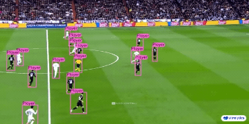

# Vision Transformers & Computer Vision

You can quickly run these realtime Vision Transformers (ViT) and computer vision models onboard your Jetson:

## [Efficient ViT](./tutorial_efficientvit.md)

{ width="300" }

## [NanoSAM](./tutorial_nanosam.md)

{ width="300" }

## [NanoOWL](./tutorial_nanoowl.md)

{ width="300" }

## [SAM](./tutorial_sam.md)

{ width="300" }

## [TAM](./tutorial_tam.md)

{ width="300" }

## [Ultralytics YOLOv8](../tutorial_ultralytics.md)

{ width="300" }

