> This guide supplements the official [Jetson Orin Nano Developer Kit Getting Started Guide](https://developer.nvidia.com/embedded/learn/get-started-jetson-orin-nano-devkit).

The NVIDIA® Jetson Orin Nano™ Developer Kit is a perfect kit to start your journey of local generative AI evaluation and development.

With the December 2024 software update (JetPack 6.1 (rev.1)), this advanced edge computer delivers up to 70% more performance, making it an even more powerful platform for the era of generative AI.

This guide explains the complete flow from opening the box, updating the firmware if needed, flashing the latest **JetPack 6.2** image on SD card, and the initial software setup, so that you will be ready for tutorials listed on this site and other AI projects.

---

## Check Your Inventory

The following items are needed or highly desired to set up your Jetson Orin Nano Developer Kit. If you don't have them in your inventory, arrange them and return to this guide once they are available.

### Storage

- ☐ microSD card (64GB or bigger)
- ☐ NVMe SSD (Optional, but highly recommended for following tutorials on this site)

### Means to Access Terminal

You need either of the following sets:

- ☐ DisplayPort cable, DisplayPort capable monitor and a USB keyboard
- ☐ DisplayPort to HDMI cable and HDMI capable monitor (or TV) and a USB keyboard
- ☐ [USB to TTL Serial cable](https://www.adafruit.com/product/954) (Advanced)

---

## Alternative Method: SDK Manager

In case you have an x86 PC running Ubuntu 22.04 or 20.04, then you can flash your Jetson Orin Nano Developer Kit with the latest firmware and JetPack all at once using **NVIDIA SDK Manager**.

Also, if you wish to not use a microSD card but rather use a large NVMe SSD for the OS and data, then you need to use SDK Manager to flash the latest JetPack on the NVMe SSD.

**Decision Flow:**
- Want to ditch microSD and only use NVMe SSD? → Use SDK Manager method
- Have x86 PC running Ubuntu 22.04/20.04? → Use SDK Manager method
- Otherwise → Use this microSD-only method

```mermaid
flowchart LR
    A(start) --> B{Want to ditch microSD<br>and only use NVMe SSD?}
    B --YES --> S[🛸 SDK Manager method]
    B --No --> C{Have x86 PC running<br> Ubuntu 22.04/20.04?}
    C --YES --> S
    C --No --> U[🚀 microSD-only method]

    style S stroke-width:3px, fill:#f3e9f2,stroke:#b544c4
    style U stroke-width:3px, fill:#d2e9e5,stroke:#0e7a71
```



See our [SDK Manager Setup Guide](/tutorials/initial-setup-sdk-manager) for that method.

---

## Overall Flow (microSD-only Method)

1. **Check if Jetson UEFI Firmware is newer than version 36.0**
2. If NO: Boot with JetPack 5.1.3 microSD card to schedule firmware update
3. Reboot (Firmware update to 5.0 during reboot)
4. Run QSPI updater
5. Reboot (QSPI update during reboot - Firmware 36.4.0)
6. **Boot with JetPack 6.2 microSD card** to schedule firmware update
7. Reboot (Firmware update to 36.4.3 during reboot)
8. **Unlock super performance**
9. 👍 Start developing on JetPack 6.2

```mermaid
flowchart TD
    A(start) --> B{1️⃣ Check if Jetson UEFI Firmware<br>is newer than version 36.0}
    B --YES --> O[6️⃣ Boot with JetPack 6.2 microSD card<br>to schedule firmware update]
    B --No --> C[2️⃣ Boot with JetPack 5.1.3 microSD card<br>to schedule firmware update]
    C --> D[3️⃣ Reboot] --> E{{Firmware update to 5.0 during reboot}}
    E --> F[4️⃣ Run QSPI updater] --> G[5️⃣ Reboot] --> H{{QSPI update during reboot - Firmware 36.4.0}}
    H --> O
    O --> P[7️⃣ Reboot]
    P --> Q{{Firmware update to 36.4.3 during reboot}}
    Q --> R[8️⃣ Unlock super performance]
    R --> S(👍 Start developing on JetPack 6.2)

    style C fill:#fee
    style D fill:#DEE,stroke:#333
    style E stroke-width:2px,stroke-dasharray: 5 5
    style F stroke-width:4px
    style G fill:#DEE,stroke:#333
    style H stroke-width:2px,stroke-dasharray: 5 5
    style O fill:#fee
    style P fill:#DEE,stroke:#333
    style Q stroke-width:2px,stroke-dasharray: 5 5
    style R fill:#f2d5ff
```



Note that it will undergo a total of **three (3)** reboot cycles.

---

## 1️⃣ Check if Jetson UEFI Firmware Version > 36.0

Your Jetson Orin Nano Developer Kit may have the latest firmware ("Jetson UEFI firmware" on QSPI-NOR flash memory) flashed at the factory.

If not, we need to go through a set of procedures to upgrade to the latest firmware. (Luckily, we can now do this all just on Jetson, meaning we don't need to use a host Ubuntu PC any more!)

### Monitor-attached Method

1. Connect your monitor and USB keyboard to your developer kit.
2. Turn on the developer kit by plugging in the bundled DC power supply
3. Repeatedly press `ESC` key on the keyboard, especially after NVIDIA logo boot splash screen first appears on the monitor
4. You should see UEFI setup menu screen
5. Check the third line from the top (below "Not specified"), which should be the version number of Jetson UEFI firmware

### Headless Method

1. Connect USB to TTL Serial cable onto the following pins on `J14` "button" header of carrier board located under the Jetson module:
   - `RXD` (Pin 3) ↔ Adafruit adaptor cable **Green**
   - `TXD` (Pin 4) ↔ Adafruit adaptor cable **White**
   - `GND` (Pin 7) ↔ Adafruit adaptor cable **Black**
2. On your PC, run your console monitor program and open the USB serial port.
3. Power on the developer kit by plugging in the bundled DC power supply
4. Repeatedly press `ESC` key on the keyboard
5. Check the third line from the top for the firmware version

---

## Determine if QSPI Update is Necessary

**If your firmware version is < 36.0:** You need to perform steps 2-5 below.

**If your firmware version is already 36.x:** Skip to step 6 (Boot with JetPack 6.x SD card).

---

## 2️⃣ Boot with JetPack 5.1.3 SD Card to Schedule Firmware Update

First, we need to run JetPack 5.1.3 to let its `nvidia-l4t-bootloader` package activate the firmware updater.

1. **Download SD card image** on to your PC from the official [JetPack 5.1.3 page](https://developer.nvidia.com/embedded/jetpack-sdk-513)

   > **Important:** Use the latest image with filename **`JP513-orin-nano-sd-card-image_b29.zip`**.

2. **Use Balena Etcher** to flash image to SD card

   If you don't have Balena Etcher, download from [Balena official site](https://etcher.balena.io/).

3. **Insert the flashed microSD card** into the slot on Jetson module

4. **Power-on** the Jetson Orin Nano Developer Kit with JetPack 5.1.3 SD card inserted

5. **Complete the initial software setup** (`oem-config`)

6. **Ensure firmware update is scheduled**

   Once Jetson boots into Jetson Linux system, a background service automatically runs to schedule a firmware update. Wait about 5 minutes after powering on to ensure the scheduling is done.

   You can verify with:
   ```bash
   sudo systemctl status nv-l4t-bootloader-config
   ```

---

## 3️⃣ Reboot and Observe Firmware Update to 5.0

1. **Reboot** your Jetson Orin Nano Developer Kit:
   ```bash
   sudo reboot
   ```

2. **Observe firmware update** during boot up process.

Once done, you will boot into JetPack 5.1.3 (again), with underlying firmware updated to `5.0-35550185`.

---

## 4️⃣ Run QSPI Updater Package

Now that your UEFI firmware is updated to 35.5.0 (= JetPack 5.1.3), it is capable of updating the entire QSPI content to make it ready for JetPack 6.x.

1. **Verify firmware version:**
   ```bash
   sudo nvbootctrl dump-slots-info
   ```

   You should see `Current version: 35.5.0`.

2. **Install QSPI Updater** (requires Internet):
   ```bash
   sudo apt-get install nvidia-l4t-jetson-orin-nano-qspi-updater
   ```

---

## 5️⃣ Reboot, Observe QSPI Update, and Power Off

1. **Reboot** to trigger QSPI update
2. **Observe update** during boot up
3. **Power off** by disconnecting the DC power supply

   > After QSPI update completes, the device will try to boot but get stuck since JetPack 5.1.3 SD card is no longer compatible. Simply power off and swap to JetPack 6.x SD card.

---

## 6️⃣ Boot with JetPack 6.x SD Card

1. **Download JetPack 6.2 image** from the official [JetPack page](https://developer.nvidia.com/embedded/jetpack)

2. **Use Balena Etcher** to flash image to SD card

3. **Insert the JetPack 6.2 microSD card** into the slot on Jetson module

4. **Power-on** by plugging the DC power supply

5. **Complete the initial software setup** (`oem-config`)

6. **Ensure firmware update is scheduled** - JetPack 6.2 will automatically schedule another firmware update.

---

## 7️⃣ Reboot and Observe Firmware Update to 36.4.3

1. **Reboot**:
   ```bash
   sudo reboot
   ```

2. **Observe firmware update** during boot up.

Once done, you will boot into JetPack 6.2 again, with the underlying firmware updated to `36.4.3`.

---

## 8️⃣ Unlock Super Performance

### Switch to MAXN SUPER Mode

Note that the default power mode on JetPack 6.2 on Jetson Orin Nano Developer Kit is **25W**.

To switch to the **MAXN SUPER** mode and unlock the unregulated performance:

1. Click on the current power mode (**25W**) by clicking the NVIDIA icon on the right side of the Ubuntu desktop's top bar.
2. Select **Power mode** from the menu.
3. Choose **MAXN SUPER** to enable maximum performance.

---

## 👍 Start Developing on JetPack 6.2

🎊 **Congratulations!**

Your Jetson Orin Nano Developer Kit is set up with JetPack 6.2 and you are ready to develop on JetPack 6.2.

---

## Next Steps

- [SSD + Docker Setup](/tutorials/ssd-docker-setup) - Install NVMe SSD and configure Docker
- [SDK Manager Setup](/tutorials/initial-setup-sdk-manager) - Alternative setup method for NVMe-only configurations
- [Introduction to GenAI](/tutorials/genai-on-jetson-llms-vlms) - Start running LLMs and VLMs

